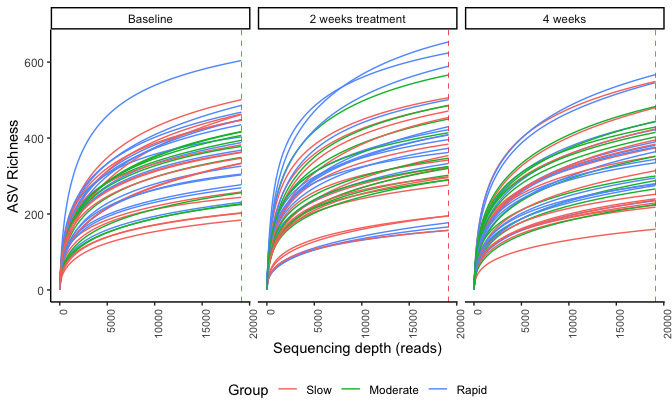

```r
load(here::here("phyloseq.RData"))
```


```r
physeq %>% 
  microViz::ps_mutate(Group = recode(Group, `1. Slow` = "Slow", `2. Intermediate`  = "Moderate",  `3. Fast` = "Rapid")) %>% 
  microViz::ps_mutate(Group = fct_relevel(Group, c("Slow", "Moderate",  "Rapid"))) %>% 
  microViz::ps_mutate(time = recode(time, T1 = "Baseline", T2  = "2 weeks treatment",  T3 = "4 weeks")) %>% 
  microViz::ps_mutate(time = fct_relevel(time, c("Baseline", "2 weeks treatment",  "4 weeks")))-> physeq
```


```r
'StudieIIcsv_metadata.xlsx' %>% 
  here::here() %>% 
  read_excel(col_types = c('numeric', 
                           'text', 'text', 'numeric','numeric','numeric','numeric','numeric',
                           'numeric','numeric'))  %>% 
  filter(group == 1) %>% 
  mutate(ID = paste0("D", ID)) -> study2m

study2m$ID%>% unique() %>%  length()
```

```
## [1] 40
```


```r
physeq %>% 
  sample_data() %>% 
  data.frame() %>% 
  rownames_to_column("tmp_id") %>% 
  left_join(study2m,
            join_by("id" == "ID")) %>% 
  column_to_rownames("tmp_id") -> sample_data(physeq)
```


```r
source("https://raw.githubusercontent.com/fconstancias/DivComAnalyses/master/R/phyloseq_normalisation.R") 
```

```
## Loading required package: scales
```

```
## 
## Attaching package: 'scales'
```

```
## The following object is masked from 'package:purrr':
## 
##     discard
```

```
## The following object is masked from 'package:readr':
## 
##     col_factor
```

```
## Loading required package: reshape2
```

```
## 
## Attaching package: 'reshape2'
```

```
## The following object is masked from 'package:tidyr':
## 
##     smiths
```

```r
tax_table(physeq) <- tax_table(physeq) %>% gsub(pattern=" ",replacement="") 


physeq %>% 
  phyloseq_get_strains() -> physeq
```

```
## Joining with `by = join_by(ASV)`
```


```r
source("https://raw.githubusercontent.com/fconstancias/DivComAnalyses/master/R/phyloseq_varia.R") 

physeq %>% 
  generate_color_palette(var = "Group",
                         pal = "npg",
                         print = FALSE) -> treat_pal
```

```
## Loading required package: ggpubr
```

```r
physeq %>% 
  generate_color_palette(var = "time",
                         pal = "jco",
                         print = FALSE) -> time_pal
```

```
## Loading required package: ggpubr
```

```r
# pal <- c("treat_pal", treat_pal,
#          "time_pal", time_pal)
```


```r
source("https://raw.githubusercontent.com/fconstancias/DivComAnalyses/master/R/phyloseq_normalisation.R") 

physeq %>%  sample_sums() %>%  min() -> min_lib

min_lib
```

```
## [1] 19140
```


```r
physeq %>%
  rarefy_even_depth(rngseed = 123,
                    sample.size = min_lib) -> physeq_rare # important to specify rngseed: random number generator for reproducibility
```

```
## `set.seed(123)` was used to initialize repeatable random subsampling.
```

```
## Please record this for your records so others can reproduce.
```

```
## Try `set.seed(123); .Random.seed` for the full vector
```

```
## ...
```

```
## 292OTUs were removed because they are no longer 
## present in any sample after random subsampling
```

```
## ...
```


```r
physeq_rare %>%
  phyloseq_rarefaction_curves(stepsize = 100, 
                              color_data = "Group", 
                              facet_data = NULL) -> pr
```

```
## Loading required package: ampvis2
```

```r
pr + geom_vline(xintercept = min_lib,
                color = "red",
                linetype = "dashed", size=0.25) +
  facet_wrap(. ~ time) + ylab("ASV Richness")   +  theme(legend.position = "bottom")  -> plot_rare
```

```
## Warning: Using `size` aesthetic for lines was deprecated in ggplot2 3.4.0.
## ℹ Please use `linewidth` instead.
## This warning is displayed once every 8 hours.
## Call `lifecycle::last_lifecycle_warnings()` to see where this warning was
## generated.
```

```r
plot_rare
```




```r
preprocess <- list("physeq" =physeq,"physeq_rare" =physeq_rare, "plot_rare" = plot_rare)
```


```r
save(physeq, physeq_rare, plot_rare, treat_pal, time_pal , file = here::here("save.RData"))
```


```r
sessionInfo()
```

```
## R version 4.3.3 (2024-02-29)
## Platform: x86_64-apple-darwin20 (64-bit)
## Running under: macOS Sonoma 14.4
## 
## Matrix products: default
## BLAS:   /Library/Frameworks/R.framework/Versions/4.3-x86_64/Resources/lib/libRblas.0.dylib 
## LAPACK: /Library/Frameworks/R.framework/Versions/4.3-x86_64/Resources/lib/libRlapack.dylib;  LAPACK version 3.11.0
## 
## locale:
## [1] en_US.UTF-8/en_US.UTF-8/en_US.UTF-8/C/en_US.UTF-8/en_US.UTF-8
## 
## time zone: Europe/Paris
## tzcode source: internal
## 
## attached base packages:
## [1] stats     graphics  grDevices utils     datasets  methods   base     
## 
## other attached packages:
##  [1] gdtools_0.3.7   ampvis2_2.8.7   reshape2_1.4.4  scales_1.3.0   
##  [5] readxl_1.4.3    phyloseq_1.46.0 lubridate_1.9.3 forcats_1.0.0  
##  [9] stringr_1.5.1   dplyr_1.1.4     purrr_1.0.2     readr_2.1.5    
## [13] tidyr_1.3.1     tibble_3.2.1    ggplot2_3.5.0   tidyverse_2.0.0
## [17] rgl_1.3.1      
## 
## loaded via a namespace (and not attached):
##   [1] RColorBrewer_1.1-3      rstudioapi_0.16.0       jsonlite_1.8.8         
##   [4] magrittr_2.0.3          farver_2.1.1            rmarkdown_2.26         
##   [7] ragg_1.3.0              zlibbioc_1.48.2         vctrs_0.6.5            
##  [10] multtest_2.58.0         RCurl_1.98-1.14         askpass_1.2.0          
##  [13] base64enc_0.1-3         rstatix_0.7.2           htmltools_0.5.8.1      
##  [16] speedyseq_0.5.3.9021    curl_5.2.1              broom_1.0.5            
##  [19] cellranger_1.1.0        Rhdf5lib_1.24.2         rhdf5_2.46.1           
##  [22] sass_0.4.9              bslib_0.7.0             htmlwidgets_1.6.4      
##  [25] plyr_1.8.9              plotly_4.10.4           cachem_1.0.8           
##  [28] uuid_1.2-0              igraph_2.0.3            mime_0.12              
##  [31] lifecycle_1.0.4         iterators_1.0.14        pkgconfig_2.0.3        
##  [34] Matrix_1.6-5            R6_2.5.1                fastmap_1.1.1          
##  [37] GenomeInfoDbData_1.2.11 shiny_1.8.1.1           digest_0.6.35          
##  [40] colorspace_2.1-0        S4Vectors_0.40.2        rprojroot_2.0.4        
##  [43] textshaping_0.3.7       stargazer_5.2.3         vegan_2.6-4            
##  [46] labeling_0.4.3          fansi_1.0.6             timechange_0.3.0       
##  [49] httr_1.4.7              abind_1.4-5             mgcv_1.9-1             
##  [52] compiler_4.3.3          here_1.0.1              fontquiver_0.2.1       
##  [55] withr_3.0.0             backports_1.4.1         carData_3.0-5          
##  [58] highr_0.10              ggsignif_0.6.4          MASS_7.3-60.0.1        
##  [61] openssl_2.1.2           devEMF_4.4-2            biomformat_1.30.0      
##  [64] ggsci_3.0.3             gfonts_0.2.0            permute_0.9-7          
##  [67] tools_4.3.3             ape_5.8                 zip_2.3.1              
##  [70] httpuv_1.6.15           glue_1.7.0              nlme_3.1-164           
##  [73] rhdf5filters_1.14.1     promises_1.3.0          grid_4.3.3             
##  [76] cluster_2.1.6           ade4_1.7-22             generics_0.1.3         
##  [79] gtable_0.3.5            tzdb_0.4.0              data.table_1.15.4      
##  [82] hms_1.1.3               xml2_1.3.6              car_3.1-2              
##  [85] utf8_1.2.4              XVector_0.42.0          BiocGenerics_0.48.1    
##  [88] ggrepel_0.9.5           foreach_1.5.2           pillar_1.9.0           
##  [91] later_1.3.2             splines_4.3.3           export_0.3.0           
##  [94] lattice_0.22-6          survival_3.5-8          tidyselect_1.2.1       
##  [97] rvg_0.3.3               fontLiberation_0.1.0    Biostrings_2.70.3      
## [100] knitr_1.45              fontBitstreamVera_0.1.1 IRanges_2.36.0         
## [103] crul_1.4.2              stats4_4.3.3            xfun_0.43              
## [106] Biobase_2.62.0          stringi_1.8.3           lazyeval_0.2.2         
## [109] yaml_2.3.8              evaluate_0.23           codetools_0.2-20       
## [112] httpcode_0.3.0          officer_0.6.5           microViz_0.12.1        
## [115] cli_3.6.2               systemfonts_1.0.6       xtable_1.8-4           
## [118] munsell_0.5.1           jquerylib_0.1.4         Rcpp_1.0.12            
## [121] GenomeInfoDb_1.38.8     parallel_4.3.3          bitops_1.0-7           
## [124] viridisLite_0.4.2       openxlsx_4.2.5.2        crayon_1.5.2           
## [127] flextable_0.9.5         rlang_1.1.3
```

