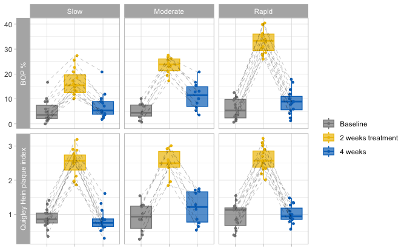
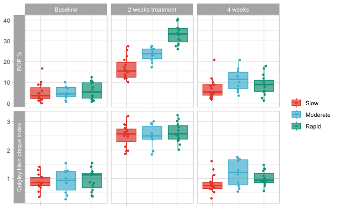

```r
load(here::here("save.RData"))
```

```
## Registered S3 method overwritten by 'gplots':
##   method         from     
##   reorder.factor DescTools
```


```r
physeq %>%
  sample_data() %>% 
  data.frame() %>% 
  select(- time) %>%
  pivot_longer(P1:B3, names_to = "name") %>% 
  # mutate(study = recode(study, study1 = "sugar rinsing", study2 = "oral hygene interuption")) %>%
  mutate(clinical_var = case_when(startsWith(name, "B") ~ "BOP %",
                                  startsWith(name, "P") ~ "Quigley Hein plaque index")) %>% 
  rename(period = "name") %>%
  mutate(period = str_replace_all(period, pattern = c("B|P"),replacement =  "p"))  %>%
  mutate(period = recode(period, p1 = "Baseline", p2 = "2 weeks treatment", p3 = "4 weeks" )) %>%
  mutate(period = factor(period, levels = c ("Baseline", "2 weeks treatment", "4 weeks"))) %>% 
  distinct(.keep_all = T) -> data

data %>% 
  DT::datatable()
```

```{=html}
<div class="datatables html-widget html-fill-item" id="htmlwidget-88f6841698b43c124623" style="width:100%;height:auto;"></div>
<script type="application/json" data-for="htmlwidget-88f6841698b43c124623">{"x":{"filter":"none","vertical":false,"data":[["1","2","3","4","5","6","7","8","9","10","11","12","13","14","15","16","17","18","19","20","21","22","23","24","25","26","27","28","29","30","31","32","33","34","35","36","37","38","39","40","41","42","43","44","45","46","47","48","49","50","51","52","53","54","55","56","57","58","59","60","61","62","63","64","65","66","67","68","69","70","71","72","73","74","75","76","77","78","79","80","81","82","83","84","85","86","87","88","89","90","91","92","93","94","95","96","97","98","99","100","101","102","103","104","105","106","107","108","109","110","111","112","113","114","115","116","117","118","119","120","121","122","123","124","125","126","127","128","129","130","131","132","133","134","135","136","137","138","139","140","141","142","143","144","145","146","147","148","149","150","151","152","153","154","155","156","157","158","159","160","161","162","163","164","165","166","167","168","169","170","171","172","173","174","175","176","177","178","179","180","181","182","183","184","185","186","187","188","189","190","191","192","193","194","195","196","197","198","199","200","201","202","203","204","205","206","207","208","209","210","211","212","213","214","215","216","217","218","219","220","221","222","223","224","225","226","227","228","229","230","231","232","233","234","235","236","237","238","239","240"],["D1","D1","D1","D1","D1","D1","D19","D19","D19","D19","D19","D19","D55","D55","D55","D55","D55","D55","D2","D2","D2","D2","D2","D2","D20","D20","D20","D20","D20","D20","D29","D29","D29","D29","D29","D29","D38","D38","D38","D38","D38","D38","D65","D65","D65","D65","D65","D65","D21","D21","D21","D21","D21","D21","D39","D39","D39","D39","D39","D39","D48","D48","D48","D48","D48","D48","D57","D57","D57","D57","D57","D57","D75","D75","D75","D75","D75","D75","D4","D4","D4","D4","D4","D4","D31","D31","D31","D31","D31","D31","D40","D40","D40","D40","D40","D40","D67","D67","D67","D67","D67","D67","D76","D76","D76","D76","D76","D76","D5","D5","D5","D5","D5","D5","D14","D14","D14","D14","D14","D14","D23","D23","D23","D23","D23","D23","D41","D41","D41","D41","D41","D41","D50","D50","D50","D50","D50","D50","D77","D77","D77","D77","D77","D77","D6","D6","D6","D6","D6","D6","D42","D42","D42","D42","D42","D42","D51","D51","D51","D51","D51","D51","D16","D16","D16","D16","D16","D16","D25","D25","D25","D25","D25","D25","D52","D52","D52","D52","D52","D52","D61","D61","D61","D61","D61","D61","D35","D35","D35","D35","D35","D35","D44","D44","D44","D44","D44","D44","D80","D80","D80","D80","D80","D80","D18","D18","D18","D18","D18","D18","D36","D36","D36","D36","D36","D36","D54","D54","D54","D54","D54","D54","D63","D63","D63","D63","D63","D63","D74","D74","D74","D74","D74","D74","D78","D78","D78","D78","D78","D78"],["placebo","placebo","placebo","placebo","placebo","placebo","placebo","placebo","placebo","placebo","placebo","placebo","placebo","placebo","placebo","placebo","placebo","placebo","placebo","placebo","placebo","placebo","placebo","placebo","placebo","placebo","placebo","placebo","placebo","placebo","placebo","placebo","placebo","placebo","placebo","placebo","placebo","placebo","placebo","placebo","placebo","placebo","placebo","placebo","placebo","placebo","placebo","placebo","placebo","placebo","placebo","placebo","placebo","placebo","placebo","placebo","placebo","placebo","placebo","placebo","placebo","placebo","placebo","placebo","placebo","placebo","placebo","placebo","placebo","placebo","placebo","placebo","placebo","placebo","placebo","placebo","placebo","placebo","placebo","placebo","placebo","placebo","placebo","placebo","placebo","placebo","placebo","placebo","placebo","placebo","placebo","placebo","placebo","placebo","placebo","placebo","placebo","placebo","placebo","placebo","placebo","placebo","placebo","placebo","placebo","placebo","placebo","placebo","placebo","placebo","placebo","placebo","placebo","placebo","placebo","placebo","placebo","placebo","placebo","placebo","placebo","placebo","placebo","placebo","placebo","placebo","placebo","placebo","placebo","placebo","placebo","placebo","placebo","placebo","placebo","placebo","placebo","placebo","placebo","placebo","placebo","placebo","placebo","placebo","placebo","placebo","placebo","placebo","placebo","placebo","placebo","placebo","placebo","placebo","placebo","placebo","placebo","placebo","placebo","placebo","placebo","placebo","placebo","placebo","placebo","placebo","placebo","placebo","placebo","placebo","placebo","placebo","placebo","placebo","placebo","placebo","placebo","placebo","placebo","placebo","placebo","placebo","placebo","placebo","placebo","placebo","placebo","placebo","placebo","placebo","placebo","placebo","placebo","placebo","placebo","placebo","placebo","placebo","placebo","placebo","placebo","placebo","placebo","placebo","placebo","placebo","placebo","placebo","placebo","placebo","placebo","placebo","placebo","placebo","placebo","placebo","placebo","placebo","placebo","placebo","placebo","placebo","placebo","placebo","placebo","placebo","placebo","placebo","placebo","placebo","placebo","placebo","placebo","placebo","placebo","placebo","placebo","placebo","placebo","placebo"],["Moderate","Moderate","Moderate","Moderate","Moderate","Moderate","Rapid","Rapid","Rapid","Rapid","Rapid","Rapid","Rapid","Rapid","Rapid","Rapid","Rapid","Rapid","Slow","Slow","Slow","Slow","Slow","Slow","Moderate","Moderate","Moderate","Moderate","Moderate","Moderate","Slow","Slow","Slow","Slow","Slow","Slow","Slow","Slow","Slow","Slow","Slow","Slow","Rapid","Rapid","Rapid","Rapid","Rapid","Rapid","Rapid","Rapid","Rapid","Rapid","Rapid","Rapid","Slow","Slow","Slow","Slow","Slow","Slow","Slow","Slow","Slow","Slow","Slow","Slow","Rapid","Rapid","Rapid","Rapid","Rapid","Rapid","Rapid","Rapid","Rapid","Rapid","Rapid","Rapid","Rapid","Rapid","Rapid","Rapid","Rapid","Rapid","Rapid","Rapid","Rapid","Rapid","Rapid","Rapid","Moderate","Moderate","Moderate","Moderate","Moderate","Moderate","Moderate","Moderate","Moderate","Moderate","Moderate","Moderate","Rapid","Rapid","Rapid","Rapid","Rapid","Rapid","Slow","Slow","Slow","Slow","Slow","Slow","Slow","Slow","Slow","Slow","Slow","Slow","Slow","Slow","Slow","Slow","Slow","Slow","Slow","Slow","Slow","Slow","Slow","Slow","Moderate","Moderate","Moderate","Moderate","Moderate","Moderate","Rapid","Rapid","Rapid","Rapid","Rapid","Rapid","Slow","Slow","Slow","Slow","Slow","Slow","Slow","Slow","Slow","Slow","Slow","Slow","Rapid","Rapid","Rapid","Rapid","Rapid","Rapid","Rapid","Rapid","Rapid","Rapid","Rapid","Rapid","Moderate","Moderate","Moderate","Moderate","Moderate","Moderate","Slow","Slow","Slow","Slow","Slow","Slow","Rapid","Rapid","Rapid","Rapid","Rapid","Rapid","Rapid","Rapid","Rapid","Rapid","Rapid","Rapid","Moderate","Moderate","Moderate","Moderate","Moderate","Moderate","Slow","Slow","Slow","Slow","Slow","Slow","Moderate","Moderate","Moderate","Moderate","Moderate","Moderate","Slow","Slow","Slow","Slow","Slow","Slow","Rapid","Rapid","Rapid","Rapid","Rapid","Rapid","Slow","Slow","Slow","Slow","Slow","Slow","Moderate","Moderate","Moderate","Moderate","Moderate","Moderate","Moderate","Moderate","Moderate","Moderate","Moderate","Moderate"],[1,1,1,1,1,1,1,1,1,1,1,1,1,1,1,1,1,1,1,1,1,1,1,1,1,1,1,1,1,1,1,1,1,1,1,1,1,1,1,1,1,1,1,1,1,1,1,1,1,1,1,1,1,1,1,1,1,1,1,1,1,1,1,1,1,1,1,1,1,1,1,1,1,1,1,1,1,1,1,1,1,1,1,1,1,1,1,1,1,1,1,1,1,1,1,1,1,1,1,1,1,1,1,1,1,1,1,1,1,1,1,1,1,1,1,1,1,1,1,1,1,1,1,1,1,1,1,1,1,1,1,1,1,1,1,1,1,1,1,1,1,1,1,1,1,1,1,1,1,1,1,1,1,1,1,1,1,1,1,1,1,1,1,1,1,1,1,1,1,1,1,1,1,1,1,1,1,1,1,1,1,1,1,1,1,1,1,1,1,1,1,1,1,1,1,1,1,1,1,1,1,1,1,1,1,1,1,1,1,1,1,1,1,1,1,1,1,1,1,1,1,1,1,1,1,1,1,1,1,1,1,1,1,1,1,1,1,1,1,1],["1","1","1","1","1","1","1","1","1","1","1","1","1","1","1","1","1","1","1","1","1","1","1","1","1","1","1","1","1","1","1","1","1","1","1","1","1","1","1","1","1","1","1","1","1","1","1","1","1","1","1","1","1","1","1","1","1","1","1","1","1","1","1","1","1","1","1","1","1","1","1","1","1","1","1","1","1","1","1","1","1","1","1","1","1","1","1","1","1","1","1","1","1","1","1","1","1","1","1","1","1","1","1","1","1","1","1","1","1","1","1","1","1","1","1","1","1","1","1","1","1","1","1","1","1","1","1","1","1","1","1","1","1","1","1","1","1","1","1","1","1","1","1","1","1","1","1","1","1","1","1","1","1","1","1","1","1","1","1","1","1","1","1","1","1","1","1","1","1","1","1","1","1","1","1","1","1","1","1","1","1","1","1","1","1","1","1","1","1","1","1","1","1","1","1","1","1","1","1","1","1","1","1","1","1","1","1","1","1","1","1","1","1","1","1","1","1","1","1","1","1","1","1","1","1","1","1","1","1","1","1","1","1","1","1","1","1","1","1","1"],["1","1","1","1","1","1","2","2","2","2","2","2","2","2","2","2","2","2","2","2","2","2","2","2","1","1","1","1","1","1","2","2","2","2","2","2","1","1","1","1","1","1","1","1","1","1","1","1","2","2","2","2","2","2","2","2","2","2","2","2","2","2","2","2","2","2","2","2","2","2","2","2","1","1","1","1","1","1","1","1","1","1","1","1","2","2","2","2","2","2","1","1","1","1","1","1","1","1","1","1","1","1","1","1","1","1","1","1","2","2","2","2","2","2","1","1","1","1","1","1","1","1","1","1","1","1","2","2","2","2","2","2","2","2","2","2","2","2","1","1","1","1","1","1","2","2","2","2","2","2","1","1","1","1","1","1","1","1","1","1","1","1","2","2","2","2","2","2","1","1","1","1","1","1","1","1","1","1","1","1","2","2","2","2","2","2","2","2","2","2","2","2","1","1","1","1","1","1","2","2","2","2","2","2","2","2","2","2","2","2","2","2","2","2","2","2","2","2","2","2","2","2","2","2","2","2","2","2","2","2","2","2","2","2","2","2","2","2","2","2"],[24,24,24,24,24,24,27,27,27,27,27,27,24,24,24,24,24,24,23,23,23,23,23,23,25,25,25,25,25,25,23,23,23,23,23,23,24,24,24,24,24,24,19,19,19,19,19,19,21,21,21,21,21,21,25,25,25,25,25,25,23,23,23,23,23,23,29,29,29,29,29,29,23,23,23,23,23,23,25,25,25,25,25,25,22,22,22,22,22,22,33,33,33,33,33,33,21,21,21,21,21,21,27,27,27,27,27,27,21,21,21,21,21,21,23,23,23,23,23,23,26,26,26,26,26,26,29,29,29,29,29,29,20,20,20,20,20,20,24,24,24,24,24,24,27,27,27,27,27,27,22,22,22,22,22,22,21,21,21,21,21,21,28,28,28,28,28,28,21,21,21,21,21,21,25,25,25,25,25,25,24,24,24,24,24,24,26,26,26,26,26,26,25,25,25,25,25,25,22,22,22,22,22,22,23,23,23,23,23,23,26,26,26,26,26,26,24,24,24,24,24,24,24,24,24,24,24,24,25,25,25,25,25,25,27,27,27,27,27,27],["Baseline","2 weeks treatment","4 weeks","Baseline","2 weeks treatment","4 weeks","Baseline","2 weeks treatment","4 weeks","Baseline","2 weeks treatment","4 weeks","Baseline","2 weeks treatment","4 weeks","Baseline","2 weeks treatment","4 weeks","Baseline","2 weeks treatment","4 weeks","Baseline","2 weeks treatment","4 weeks","Baseline","2 weeks treatment","4 weeks","Baseline","2 weeks treatment","4 weeks","Baseline","2 weeks treatment","4 weeks","Baseline","2 weeks treatment","4 weeks","Baseline","2 weeks treatment","4 weeks","Baseline","2 weeks treatment","4 weeks","Baseline","2 weeks treatment","4 weeks","Baseline","2 weeks treatment","4 weeks","Baseline","2 weeks treatment","4 weeks","Baseline","2 weeks treatment","4 weeks","Baseline","2 weeks treatment","4 weeks","Baseline","2 weeks treatment","4 weeks","Baseline","2 weeks treatment","4 weeks","Baseline","2 weeks treatment","4 weeks","Baseline","2 weeks treatment","4 weeks","Baseline","2 weeks treatment","4 weeks","Baseline","2 weeks treatment","4 weeks","Baseline","2 weeks treatment","4 weeks","Baseline","2 weeks treatment","4 weeks","Baseline","2 weeks treatment","4 weeks","Baseline","2 weeks treatment","4 weeks","Baseline","2 weeks treatment","4 weeks","Baseline","2 weeks treatment","4 weeks","Baseline","2 weeks treatment","4 weeks","Baseline","2 weeks treatment","4 weeks","Baseline","2 weeks treatment","4 weeks","Baseline","2 weeks treatment","4 weeks","Baseline","2 weeks treatment","4 weeks","Baseline","2 weeks treatment","4 weeks","Baseline","2 weeks treatment","4 weeks","Baseline","2 weeks treatment","4 weeks","Baseline","2 weeks treatment","4 weeks","Baseline","2 weeks treatment","4 weeks","Baseline","2 weeks treatment","4 weeks","Baseline","2 weeks treatment","4 weeks","Baseline","2 weeks treatment","4 weeks","Baseline","2 weeks treatment","4 weeks","Baseline","2 weeks treatment","4 weeks","Baseline","2 weeks treatment","4 weeks","Baseline","2 weeks treatment","4 weeks","Baseline","2 weeks treatment","4 weeks","Baseline","2 weeks treatment","4 weeks","Baseline","2 weeks treatment","4 weeks","Baseline","2 weeks treatment","4 weeks","Baseline","2 weeks treatment","4 weeks","Baseline","2 weeks treatment","4 weeks","Baseline","2 weeks treatment","4 weeks","Baseline","2 weeks treatment","4 weeks","Baseline","2 weeks treatment","4 weeks","Baseline","2 weeks treatment","4 weeks","Baseline","2 weeks treatment","4 weeks","Baseline","2 weeks treatment","4 weeks","Baseline","2 weeks treatment","4 weeks","Baseline","2 weeks treatment","4 weeks","Baseline","2 weeks treatment","4 weeks","Baseline","2 weeks treatment","4 weeks","Baseline","2 weeks treatment","4 weeks","Baseline","2 weeks treatment","4 weeks","Baseline","2 weeks treatment","4 weeks","Baseline","2 weeks treatment","4 weeks","Baseline","2 weeks treatment","4 weeks","Baseline","2 weeks treatment","4 weeks","Baseline","2 weeks treatment","4 weeks","Baseline","2 weeks treatment","4 weeks","Baseline","2 weeks treatment","4 weeks","Baseline","2 weeks treatment","4 weeks","Baseline","2 weeks treatment","4 weeks","Baseline","2 weeks treatment","4 weeks","Baseline","2 weeks treatment","4 weeks","Baseline","2 weeks treatment","4 weeks","Baseline","2 weeks treatment","4 weeks","Baseline","2 weeks treatment","4 weeks"],[1.018,1.845,1.619,7.738,25.595,15.476,0.869,2.548,0.899,5.357,27.381,2.381,0.595,3.095,0.732,6.548,35.714,8.929,0.857,2.476,0.744,1.786,10.119,5.357,1.25,2.929,1.75,10.119,26.786,13.095,1.137,2.565,0.637,1.19,16.071,3.571,1.298,2.899,0.887,8.929,17.262,8.333,0.839,2.19,0.899,1.19,30.357,17.857,1.131,2.899,0.869,10.714,40.476,16.667,0.357,2.119,0.304,2.381,15.476,7.143,0.792,1.958,0.851,1.19,11.905,4.167,1.548,2.696,1.351,3.571,27.976,5.952,1.417,3.012,1.274,10.714,39.881,13.69,0.4,2.327,0.5669999999999999,0.667,26,5.333,1.131,3.22,1.095,9.523999999999999,39.881,11.905,1.222,2.917,0.861,0.694,19.444,8.333,0.405,1.958,0.649,4.762,23.214,10.119,0.756,2.012,1.333,3.571,32.738,8.929,0.542,2.768,0.774,3.571,11.905,4.762,0.821,2.536,0.667,0,14.881,4.762,0.6850000000000001,2.702,0.756,8.929,22.619,10.119,1.411,2.875,1.613,2.381,18.452,11.905,0.845,2.375,0.75,4.167,24.405,3.571,1.202,2.5,1.482,12.5,36.31,10.119,1.036,1.976,0.524,5.952,10.119,8.929,0.768,2.625,0.839,2.381,13.69,2.976,1.25,2.804,1,2.976,30.952,8.929,1.161,2.339,1.006,1.786,28.571,7.738,0.512,2.595,1.149,4.167,20.833,5.357,1.018,3.19,1.125,16.667,27.381,20.833,0.375,2.577,0.792,7.738,33.333,4.167,0.519,2.568,0.944,1.852,33.951,1.235,0.274,2.458,0.542,1.19,17.262,6.548,1.042,2.649,1.321,10.119,25.595,8.929,0.854,2.389,1.285,2.778,22.917,16.667,0.732,1.863,0.732,4.762,13.095,1.786,1.179,2.423,0.845,10.119,35.119,8.333,0.869,2.5,0.631,4.762,20.833,2.381,1.274,3.006,1.673,7.143,26.19,20.833,1.545,2.532,1.712,7.692,27.564,12.821],["Quigley Hein plaque index","Quigley Hein plaque index","Quigley Hein plaque index","BOP %","BOP %","BOP %","Quigley Hein plaque index","Quigley Hein plaque index","Quigley Hein plaque index","BOP %","BOP %","BOP %","Quigley Hein plaque index","Quigley Hein plaque index","Quigley Hein plaque index","BOP %","BOP %","BOP %","Quigley Hein plaque index","Quigley Hein plaque index","Quigley Hein plaque index","BOP %","BOP %","BOP %","Quigley Hein plaque index","Quigley Hein plaque index","Quigley Hein plaque index","BOP %","BOP %","BOP %","Quigley Hein plaque index","Quigley Hein plaque index","Quigley Hein plaque index","BOP %","BOP %","BOP %","Quigley Hein plaque index","Quigley Hein plaque index","Quigley Hein plaque index","BOP %","BOP %","BOP %","Quigley Hein plaque index","Quigley Hein plaque index","Quigley Hein plaque index","BOP %","BOP %","BOP %","Quigley Hein plaque index","Quigley Hein plaque index","Quigley Hein plaque index","BOP %","BOP %","BOP %","Quigley Hein plaque index","Quigley Hein plaque index","Quigley Hein plaque index","BOP %","BOP %","BOP %","Quigley Hein plaque index","Quigley Hein plaque index","Quigley Hein plaque index","BOP %","BOP %","BOP %","Quigley Hein plaque index","Quigley Hein plaque index","Quigley Hein plaque index","BOP %","BOP %","BOP %","Quigley Hein plaque index","Quigley Hein plaque index","Quigley Hein plaque index","BOP %","BOP %","BOP %","Quigley Hein plaque index","Quigley Hein plaque index","Quigley Hein plaque index","BOP %","BOP %","BOP %","Quigley Hein plaque index","Quigley Hein plaque index","Quigley Hein plaque index","BOP %","BOP %","BOP %","Quigley Hein plaque index","Quigley Hein plaque index","Quigley Hein plaque index","BOP %","BOP %","BOP %","Quigley Hein plaque index","Quigley Hein plaque index","Quigley Hein plaque index","BOP %","BOP %","BOP %","Quigley Hein plaque index","Quigley Hein plaque index","Quigley Hein plaque index","BOP %","BOP %","BOP %","Quigley Hein plaque index","Quigley Hein plaque index","Quigley Hein plaque index","BOP %","BOP %","BOP %","Quigley Hein plaque index","Quigley Hein plaque index","Quigley Hein plaque index","BOP %","BOP %","BOP %","Quigley Hein plaque index","Quigley Hein plaque index","Quigley Hein plaque index","BOP %","BOP %","BOP %","Quigley Hein plaque index","Quigley Hein plaque index","Quigley Hein plaque index","BOP %","BOP %","BOP %","Quigley Hein plaque index","Quigley Hein plaque index","Quigley Hein plaque index","BOP %","BOP %","BOP %","Quigley Hein plaque index","Quigley Hein plaque index","Quigley Hein plaque index","BOP %","BOP %","BOP %","Quigley Hein plaque index","Quigley Hein plaque index","Quigley Hein plaque index","BOP %","BOP %","BOP %","Quigley Hein plaque index","Quigley Hein plaque index","Quigley Hein plaque index","BOP %","BOP %","BOP %","Quigley Hein plaque index","Quigley Hein plaque index","Quigley Hein plaque index","BOP %","BOP %","BOP %","Quigley Hein plaque index","Quigley Hein plaque index","Quigley Hein plaque index","BOP %","BOP %","BOP %","Quigley Hein plaque index","Quigley Hein plaque index","Quigley Hein plaque index","BOP %","BOP %","BOP %","Quigley Hein plaque index","Quigley Hein plaque index","Quigley Hein plaque index","BOP %","BOP %","BOP %","Quigley Hein plaque index","Quigley Hein plaque index","Quigley Hein plaque index","BOP %","BOP %","BOP %","Quigley Hein plaque index","Quigley Hein plaque index","Quigley Hein plaque index","BOP %","BOP %","BOP %","Quigley Hein plaque index","Quigley Hein plaque index","Quigley Hein plaque index","BOP %","BOP %","BOP %","Quigley Hein plaque index","Quigley Hein plaque index","Quigley Hein plaque index","BOP %","BOP %","BOP %","Quigley Hein plaque index","Quigley Hein plaque index","Quigley Hein plaque index","BOP %","BOP %","BOP %","Quigley Hein plaque index","Quigley Hein plaque index","Quigley Hein plaque index","BOP %","BOP %","BOP %","Quigley Hein plaque index","Quigley Hein plaque index","Quigley Hein plaque index","BOP %","BOP %","BOP %","Quigley Hein plaque index","Quigley Hein plaque index","Quigley Hein plaque index","BOP %","BOP %","BOP %","Quigley Hein plaque index","Quigley Hein plaque index","Quigley Hein plaque index","BOP %","BOP %","BOP %","Quigley Hein plaque index","Quigley Hein plaque index","Quigley Hein plaque index","BOP %","BOP %","BOP %"]],"container":"<table class=\"display\">\n  <thead>\n    <tr>\n      <th> <\/th>\n      <th>id<\/th>\n      <th>treatment<\/th>\n      <th>Group<\/th>\n      <th>all<\/th>\n      <th>group<\/th>\n      <th>sex<\/th>\n      <th>age<\/th>\n      <th>period<\/th>\n      <th>value<\/th>\n      <th>clinical_var<\/th>\n    <\/tr>\n  <\/thead>\n<\/table>","options":{"columnDefs":[{"className":"dt-right","targets":[4,7,9]},{"orderable":false,"targets":0},{"name":" ","targets":0},{"name":"id","targets":1},{"name":"treatment","targets":2},{"name":"Group","targets":3},{"name":"all","targets":4},{"name":"group","targets":5},{"name":"sex","targets":6},{"name":"age","targets":7},{"name":"period","targets":8},{"name":"value","targets":9},{"name":"clinical_var","targets":10}],"order":[],"autoWidth":false,"orderClasses":false}},"evals":[],"jsHooks":[]}</script>
```

```r
data %>% 
  group_by(period, clinical_var, Group) %>% 
  rstatix::get_summary_stats(value, type = "full") %>% 
  DT::datatable()
```

```{=html}
<div class="datatables html-widget html-fill-item" id="htmlwidget-f8f01f9129d65d1cd2d9" style="width:100%;height:auto;"></div>
<script type="application/json" data-for="htmlwidget-f8f01f9129d65d1cd2d9">{"x":{"filter":"none","vertical":false,"data":[["1","2","3","4","5","6","7","8","9","10","11","12","13","14","15","16","17","18"],["Slow","Moderate","Rapid","Slow","Moderate","Rapid","Slow","Moderate","Rapid","Slow","Moderate","Rapid","Slow","Moderate","Rapid","Slow","Moderate","Rapid"],["Baseline","Baseline","Baseline","Baseline","Baseline","Baseline","2 weeks treatment","2 weeks treatment","2 weeks treatment","2 weeks treatment","2 weeks treatment","2 weeks treatment","4 weeks","4 weeks","4 weeks","4 weeks","4 weeks","4 weeks"],["BOP %","BOP %","BOP %","Quigley Hein plaque index","Quigley Hein plaque index","Quigley Hein plaque index","BOP %","BOP %","BOP %","Quigley Hein plaque index","Quigley Hein plaque index","Quigley Hein plaque index","BOP %","BOP %","BOP %","Quigley Hein plaque index","Quigley Hein plaque index","Quigley Hein plaque index"],["value","value","value","value","value","value","value","value","value","value","value","value","value","value","value","value","value","value"],[15,10,15,15,10,15,15,10,15,15,10,15,15,10,15,15,10,15],[0,0.694,0.667,0.357,0.274,0.375,10.119,17.262,26,1.863,1.845,2.012,1.786,3.571,1.235,0.304,0.542,0.5669999999999999],[16.667,10.119,12.5,1.411,1.545,1.548,27.381,27.564,40.476,3.19,3.006,3.22,20.833,20.833,17.857,1.613,1.75,1.482],[3.571,4.464,5.357,0.857,0.9360000000000001,1.131,15.476,23.81,33.333,2.565,2.495,2.568,5.357,11.47,8.929,0.756,1.217,0.944],[2.083,3.125,2.414,0.75,0.595,0.675,12.5,21.354,29.464,2.298,2.378,2.381,3.869,6.994,5.642,0.652,0.778,0.857],[7.44,7.555,9.821999999999999,1.039,1.243,1.191,19.642,26.041,36.012,2.735,2.836,2.851,8.929,14.881,11.012,0.869,1.66,1.184],[5.357,4.43,7.408,0.289,0.648,0.515,7.142,4.687,6.548,0.437,0.458,0.47,5.06,7.887,5.37,0.217,0.882,0.327],[3.53,4.378,5.294,0.255,0.483,0.424,5.294,3.971,4.414,0.301,0.402,0.35,4.412,6.618,4.414,0.176,0.6840000000000001,0.224],[5,5.045,5.922,0.891,0.92,0.958,16.627,23.421,33.243,2.513,2.5,2.614,7.064,11.282,8.811,0.827,1.199,1.006],[4.482,3.072,4.029,0.276,0.42,0.368,5.402,3.376,4.707,0.383,0.391,0.342,4.866,5.482,4.786,0.321,0.475,0.256],[1.157,0.972,1.04,0.07099999999999999,0.133,0.095,1.395,1.068,1.215,0.099,0.124,0.08799999999999999,1.256,1.734,1.236,0.083,0.15,0.066],[2.482,2.198,2.231,0.153,0.3,0.204,2.991,2.415,2.607,0.212,0.28,0.189,2.695,3.922,2.65,0.178,0.34,0.142]],"container":"<table class=\"display\">\n  <thead>\n    <tr>\n      <th> <\/th>\n      <th>Group<\/th>\n      <th>period<\/th>\n      <th>clinical_var<\/th>\n      <th>variable<\/th>\n      <th>n<\/th>\n      <th>min<\/th>\n      <th>max<\/th>\n      <th>median<\/th>\n      <th>q1<\/th>\n      <th>q3<\/th>\n      <th>iqr<\/th>\n      <th>mad<\/th>\n      <th>mean<\/th>\n      <th>sd<\/th>\n      <th>se<\/th>\n      <th>ci<\/th>\n    <\/tr>\n  <\/thead>\n<\/table>","options":{"columnDefs":[{"className":"dt-right","targets":[5,6,7,8,9,10,11,12,13,14,15,16]},{"orderable":false,"targets":0},{"name":" ","targets":0},{"name":"Group","targets":1},{"name":"period","targets":2},{"name":"clinical_var","targets":3},{"name":"variable","targets":4},{"name":"n","targets":5},{"name":"min","targets":6},{"name":"max","targets":7},{"name":"median","targets":8},{"name":"q1","targets":9},{"name":"q3","targets":10},{"name":"iqr","targets":11},{"name":"mad","targets":12},{"name":"mean","targets":13},{"name":"sd","targets":14},{"name":"se","targets":15},{"name":"ci","targets":16}],"order":[],"autoWidth":false,"orderClasses":false}},"evals":[],"jsHooks":[]}</script>
```


```r
data %>%  
  ggplot(aes_string("period",
                    "value",
                    colour = "period",
                    fill = "period")) +
  geom_boxplot(outlier.colour = NA, alpha=0.7) +
  # ggbeeswarm::geom_beeswarm(size=1, alpha=0.2,
  #                           position=position_jitterdodge(dodge.width=0.9)) +
  geom_jitter(size=1, position = position_jitterdodge(dodge.width=1),
              aes_string(shape = NULL))  + facet_grid(clinical_var ~ Group, switch = "y",  scales = "free_y", space = "fixed") + theme(strip.placement = "outside") +   theme(axis.title.x=element_blank(),
                                                                                                                                                                              axis.text.x=element_blank(),
                                                                                                                                                                              axis.ticks.x=element_blank()) +  scale_color_manual(name = "", values = time_pal,
                                                                                                                                                                                                                                  na.value = "black") +
  scale_fill_manual(name = "", values = time_pal,
                    na.value = "black") +
  geom_line(aes(group=id), linetype = "dashed", color = "black", linewidth = 0.08) + theme_light() + ylab(NULL) + xlab(NULL)+ theme(
    axis.text.x = element_blank()) -> pmeta1
```

```
## Warning: `aes_string()` was deprecated in ggplot2 3.0.0.
## ℹ Please use tidy evaluation idioms with `aes()`.
## ℹ See also `vignette("ggplot2-in-packages")` for more information.
## This warning is displayed once every 8 hours.
## Call `lifecycle::last_lifecycle_warnings()` to see where this warning was
## generated.
```

```r
pmeta1
```




```r
pmeta1$data %>% 
  group_by(clinical_var) %>% 
  rstatix::pairwise_wilcox_test(formula = value ~ period, p.adjust.method = "BH", paired = TRUE, detailed = TRUE, ref.group = "Baseline") %>% 
  select(-'.y.') %>% 
  arrange(p) -> df_tmp
```


```r
df_tmp %>% 
  DT::datatable()
```

```{=html}
<div class="datatables html-widget html-fill-item" id="htmlwidget-eb7bf9ae65a438ffcde5" style="width:100%;height:auto;"></div>
<script type="application/json" data-for="htmlwidget-eb7bf9ae65a438ffcde5">{"x":{"filter":"none","vertical":false,"data":[["1","2","3","4"],["Quigley Hein plaque index","BOP %","BOP %","Quigley Hein plaque index"],[-1.62325,-19.04807890198787,-2.976518248285299,-0.06548752251246935],["Baseline","Baseline","Baseline","Baseline"],["2 weeks treatment","2 weeks treatment","4 weeks","4 weeks"],[40,40,40,40],[40,40,40,40],[0,0,105.5,299.5],[1.82e-12,3.71e-08,4.37e-05,0.209],[-1.7435,-22.02346555421799,-4.464477602061281,-0.1695504723131213],[-1.491,-16.66645372849594,-1.785462278508423,0.04153244965828087],["Wilcoxon","Wilcoxon","Wilcoxon","Wilcoxon"],["two.sided","two.sided","two.sided","two.sided"],[3.64e-12,7.42e-08,4.37e-05,0.209],["****","****","****","ns"]],"container":"<table class=\"display\">\n  <thead>\n    <tr>\n      <th> <\/th>\n      <th>clinical_var<\/th>\n      <th>estimate<\/th>\n      <th>group1<\/th>\n      <th>group2<\/th>\n      <th>n1<\/th>\n      <th>n2<\/th>\n      <th>statistic<\/th>\n      <th>p<\/th>\n      <th>conf.low<\/th>\n      <th>conf.high<\/th>\n      <th>method<\/th>\n      <th>alternative<\/th>\n      <th>p.adj<\/th>\n      <th>p.adj.signif<\/th>\n    <\/tr>\n  <\/thead>\n<\/table>","options":{"columnDefs":[{"className":"dt-right","targets":[2,5,6,7,8,9,10,13]},{"orderable":false,"targets":0},{"name":" ","targets":0},{"name":"clinical_var","targets":1},{"name":"estimate","targets":2},{"name":"group1","targets":3},{"name":"group2","targets":4},{"name":"n1","targets":5},{"name":"n2","targets":6},{"name":"statistic","targets":7},{"name":"p","targets":8},{"name":"conf.low","targets":9},{"name":"conf.high","targets":10},{"name":"method","targets":11},{"name":"alternative","targets":12},{"name":"p.adj","targets":13},{"name":"p.adj.signif","targets":14}],"order":[],"autoWidth":false,"orderClasses":false},"selection":{"mode":"multiple","selected":null,"target":"row","selectable":null}},"evals":[],"jsHooks":[]}</script>
```


```r
ggpubr::compare_means(formula = as.formula(paste0("value ~ ", paste0("period"))),
                      group.by = c("clinical_var", "Group"),
                      data = pmeta1$data ,
                      method = "wilcox.test",
                      p.adjust.method = "fdr") %>%
  select(-.y., -p.format, -p.signif) %>%
  arrange(p) %>%
  mutate(signif = ifelse(p.adj <= 0.05, 'SIGN', 'NS')) -> stat1

stat1 %>% 
  DT::datatable()
```

```{=html}
<div class="datatables html-widget html-fill-item" id="htmlwidget-03fa292edd786e5c6a03" style="width:100%;height:auto;"></div>
<script type="application/json" data-for="htmlwidget-03fa292edd786e5c6a03">{"x":{"filter":"none","vertical":false,"data":[["1","2","3","4","5","6","7","8","9","10","11","12","13","14","15","16","17","18"],["Quigley Hein plaque index","Quigley Hein plaque index","BOP %","BOP %","Quigley Hein plaque index","Quigley Hein plaque index","Quigley Hein plaque index","Quigley Hein plaque index","BOP %","BOP %","BOP %","BOP %","BOP %","BOP %","BOP %","Quigley Hein plaque index","Quigley Hein plaque index","Quigley Hein plaque index"],["Slow","Slow","Rapid","Rapid","Rapid","Rapid","Moderate","Moderate","Slow","Slow","Moderate","Moderate","Moderate","Slow","Rapid","Moderate","Slow","Rapid"],["Baseline","2 weeks treatment","2 weeks treatment","Baseline","Baseline","2 weeks treatment","Baseline","2 weeks treatment","Baseline","2 weeks treatment","Baseline","2 weeks treatment","Baseline","Baseline","Baseline","Baseline","Baseline","Baseline"],["2 weeks treatment","4 weeks","4 weeks","2 weeks treatment","2 weeks treatment","4 weeks","2 weeks treatment","4 weeks","2 weeks treatment","4 weeks","2 weeks treatment","4 weeks","4 weeks","4 weeks","4 weeks","4 weeks","4 weeks","4 weeks"],[1.28934500757877e-08,1.28934500757877e-08,3.349586435956621e-06,3.366427992646553e-06,3.383339412654218e-06,3.383339412654218e-06,1.082508822446903e-05,1.082508822446903e-05,2.271102299124884e-05,6.135444722470728e-05,0.0001816511460914653,0.000379127227011751,0.0125445738447033,0.1450462408385205,0.146216545314854,0.1654939487756825,0.3094743057014513,0.7873930187891653],[1.2e-07,1.2e-07,1e-05,1e-05,1e-05,1e-05,2.4e-05,2.4e-05,4.5e-05,0.00011,0.0003,0.00057,0.017,0.18,0.18,0.19,0.33,0.79],["Wilcoxon","Wilcoxon","Wilcoxon","Wilcoxon","Wilcoxon","Wilcoxon","Wilcoxon","Wilcoxon","Wilcoxon","Wilcoxon","Wilcoxon","Wilcoxon","Wilcoxon","Wilcoxon","Wilcoxon","Wilcoxon","Wilcoxon","Wilcoxon"],["SIGN","SIGN","SIGN","SIGN","SIGN","SIGN","SIGN","SIGN","SIGN","SIGN","SIGN","SIGN","SIGN","NS","NS","NS","NS","NS"]],"container":"<table class=\"display\">\n  <thead>\n    <tr>\n      <th> <\/th>\n      <th>clinical_var<\/th>\n      <th>Group<\/th>\n      <th>group1<\/th>\n      <th>group2<\/th>\n      <th>p<\/th>\n      <th>p.adj<\/th>\n      <th>method<\/th>\n      <th>signif<\/th>\n    <\/tr>\n  <\/thead>\n<\/table>","options":{"columnDefs":[{"className":"dt-right","targets":[5,6]},{"orderable":false,"targets":0},{"name":" ","targets":0},{"name":"clinical_var","targets":1},{"name":"Group","targets":2},{"name":"group1","targets":3},{"name":"group2","targets":4},{"name":"p","targets":5},{"name":"p.adj","targets":6},{"name":"method","targets":7},{"name":"signif","targets":8}],"order":[],"autoWidth":false,"orderClasses":false},"selection":{"mode":"multiple","selected":null,"target":"row","selectable":null}},"evals":[],"jsHooks":[]}</script>
```


```r
data %>%  
  ggplot(aes_string("Group",
                    "value",
                    colour = "Group",
                    fill = "Group")) +
  geom_boxplot(outlier.colour = NA, alpha=0.7) +
  # ggbeeswarm::geom_beeswarm(size=1, alpha=0.2,
  #                           position=position_jitterdodge(dodge.width=0.9)) +
  geom_jitter(size=1, position = position_jitterdodge(dodge.width=1),
              aes_string(shape = NULL))  + facet_grid(clinical_var ~ period, switch = "y",  scales = "free_y", space = "fixed") + theme(strip.placement = "outside") +   theme(axis.title.x=element_blank(),
                                                                                                                                                                               axis.text.x=element_blank(),
                                                                                                                                                                               axis.ticks.x=element_blank()) +  scale_color_manual(name = "", values = treat_pal,
                                                                                                                                                                                                                                   na.value = "black") +
  scale_fill_manual(name = "", values = treat_pal,
                    na.value = "black") +
  geom_line(aes(group=id), linetype = "dashed", color = "black", linewidth = 0.08) + theme_light() + ylab(NULL) + xlab(NULL) + theme(
    axis.text.x = element_blank()) -> pmeta2

pmeta2
```

```
## `geom_line()`: Each group consists of only one observation.
## ℹ Do you need to adjust the group aesthetic?
## `geom_line()`: Each group consists of only one observation.
## ℹ Do you need to adjust the group aesthetic?
## `geom_line()`: Each group consists of only one observation.
## ℹ Do you need to adjust the group aesthetic?
## `geom_line()`: Each group consists of only one observation.
## ℹ Do you need to adjust the group aesthetic?
## `geom_line()`: Each group consists of only one observation.
## ℹ Do you need to adjust the group aesthetic?
## `geom_line()`: Each group consists of only one observation.
## ℹ Do you need to adjust the group aesthetic?
```




```r
ggpubr::compare_means(formula = as.formula(paste0("value ~ ", paste0("Group"))),
                      group.by = c("clinical_var", "period"),
                      data = pmeta2$data ,
                      method = "wilcox.test",
                      p.adjust.method = "fdr") %>%
  select(-.y., -p.format, -p.signif) %>%
  arrange(p) %>%
  mutate(signif = ifelse(p.adj <= 0.05, 'SIGN', 'NS')) -> stat2

stat2 %>% 
  DT::datatable()
```

```{=html}
<div class="datatables html-widget html-fill-item" id="htmlwidget-f5ace9755f182bf1cbe7" style="width:100%;height:auto;"></div>
<script type="application/json" data-for="htmlwidget-f5ace9755f182bf1cbe7">{"x":{"filter":"none","vertical":false,"data":[["1","2","3","4","5","6","7","8","9","10","11","12","13","14","15","16","17","18"],["BOP %","BOP %","BOP %","Quigley Hein plaque index","BOP %","Quigley Hein plaque index","BOP %","BOP %","BOP %","Quigley Hein plaque index","Quigley Hein plaque index","Quigley Hein plaque index","Quigley Hein plaque index","BOP %","BOP %","Quigley Hein plaque index","Quigley Hein plaque index","Quigley Hein plaque index"],["2 weeks treatment","2 weeks treatment","2 weeks treatment","4 weeks","4 weeks","4 weeks","4 weeks","4 weeks","Baseline","4 weeks","Baseline","2 weeks treatment","2 weeks treatment","Baseline","Baseline","2 weeks treatment","Baseline","Baseline"],["Slow","Moderate","Slow","Slow","Slow","Slow","Slow","Moderate","Slow","Moderate","Slow","Moderate","Slow","Moderate","Slow","Slow","Slow","Moderate"],["Rapid","Rapid","Moderate","Rapid","Moderate","Moderate","Rapid","Rapid","Rapid","Rapid","Rapid","Rapid","Rapid","Rapid","Moderate","Moderate","Moderate","Rapid"],[4.531893537935788e-06,9.176696453524821e-05,0.003886641842729409,0.03263087572703409,0.04554192760852075,0.05450996708231867,0.252640179605531,0.3174038427614752,0.4058976453394301,0.4211255854224088,0.4678217753404765,0.5670578445649114,0.5896558053941626,0.6568451646712133,0.7385422937588922,0.7814703327779585,0.8243740123191792,1],[8.2e-05,0.00083,0.023,0.15,0.16,0.16,0.65,0.71,0.76,0.76,0.77,0.82,0.82,0.84,0.87,0.87,0.87,1],["Wilcoxon","Wilcoxon","Wilcoxon","Wilcoxon","Wilcoxon","Wilcoxon","Wilcoxon","Wilcoxon","Wilcoxon","Wilcoxon","Wilcoxon","Wilcoxon","Wilcoxon","Wilcoxon","Wilcoxon","Wilcoxon","Wilcoxon","Wilcoxon"],["SIGN","SIGN","SIGN","NS","NS","NS","NS","NS","NS","NS","NS","NS","NS","NS","NS","NS","NS","NS"]],"container":"<table class=\"display\">\n  <thead>\n    <tr>\n      <th> <\/th>\n      <th>clinical_var<\/th>\n      <th>period<\/th>\n      <th>group1<\/th>\n      <th>group2<\/th>\n      <th>p<\/th>\n      <th>p.adj<\/th>\n      <th>method<\/th>\n      <th>signif<\/th>\n    <\/tr>\n  <\/thead>\n<\/table>","options":{"columnDefs":[{"className":"dt-right","targets":[5,6]},{"orderable":false,"targets":0},{"name":" ","targets":0},{"name":"clinical_var","targets":1},{"name":"period","targets":2},{"name":"group1","targets":3},{"name":"group2","targets":4},{"name":"p","targets":5},{"name":"p.adj","targets":6},{"name":"method","targets":7},{"name":"signif","targets":8}],"order":[],"autoWidth":false,"orderClasses":false},"selection":{"mode":"multiple","selected":null,"target":"row","selectable":null}},"evals":[],"jsHooks":[]}</script>
```

```r
meta <- list(
  "plot_meta1" = pmeta1,
  "stat_meta1"= stat1,
  "plot_meta2" = pmeta2,
  "stat_meta2"= stat2)
```


```r
save(physeq, treat_pal, time_pal, physeq_rare, plot_rare, meta,file = here::here("save.RData"))
```


```r
sessionInfo()
```

```
## R version 4.3.3 (2024-02-29)
## Platform: x86_64-apple-darwin20 (64-bit)
## Running under: macOS Sonoma 14.4
## 
## Matrix products: default
## BLAS:   /Library/Frameworks/R.framework/Versions/4.3-x86_64/Resources/lib/libRblas.0.dylib 
## LAPACK: /Library/Frameworks/R.framework/Versions/4.3-x86_64/Resources/lib/libRlapack.dylib;  LAPACK version 3.11.0
## 
## locale:
## [1] en_US.UTF-8/en_US.UTF-8/en_US.UTF-8/C/en_US.UTF-8/en_US.UTF-8
## 
## time zone: Europe/Paris
## tzcode source: internal
## 
## attached base packages:
## [1] stats     graphics  grDevices utils     datasets  methods   base     
## 
## other attached packages:
##  [1] gdtools_0.3.7   phyloseq_1.46.0 lubridate_1.9.3 forcats_1.0.0  
##  [5] stringr_1.5.1   dplyr_1.1.4     purrr_1.0.2     readr_2.1.5    
##  [9] tidyr_1.3.1     tibble_3.2.1    ggplot2_3.5.0   tidyverse_2.0.0
## [13] rgl_1.3.1      
## 
## loaded via a namespace (and not attached):
##   [1] IRanges_2.36.0                  gld_2.6.6                      
##   [3] nnet_7.3-19                     DT_0.33                        
##   [5] Biostrings_2.70.3               TH.data_1.1-2                  
##   [7] vctrs_0.6.5                     energy_1.7-11                  
##   [9] digest_0.6.35                   png_0.1-8                      
##  [11] shape_1.4.6.1                   proxy_0.4-27                   
##  [13] Exact_3.2                       ggrepel_0.9.5                  
##  [15] httpcode_0.3.0                  permute_0.9-7                  
##  [17] MASS_7.3-60.0.1                 fontLiberation_0.1.0           
##  [19] reshape2_1.4.4                  foreach_1.5.2                  
##  [21] httpuv_1.6.15                   BiocGenerics_0.48.1            
##  [23] withr_3.0.0                     xfun_0.43                      
##  [25] ggfun_0.1.4                     ggpubr_0.6.0                   
##  [27] survival_3.5-8                  doRNG_1.8.6                    
##  [29] memoise_2.0.1                   crul_1.4.2                     
##  [31] ggbeeswarm_0.7.2                gmp_0.7-4                      
##  [33] systemfonts_1.0.6               ragg_1.3.0                     
##  [35] tidytree_0.4.6                  zoo_1.8-12                     
##  [37] GlobalOptions_0.1.2             gtools_3.9.5                   
##  [39] Formula_1.2-5                   promises_1.3.0                 
##  [41] httr_1.4.7                      rstatix_0.7.2                  
##  [43] rhdf5filters_1.14.1             rhdf5_2.46.1                   
##  [45] rstudioapi_0.16.0               generics_0.1.3                 
##  [47] base64enc_0.1-3                 curl_5.2.1                     
##  [49] S4Vectors_0.40.2                zlibbioc_1.48.2                
##  [51] ScaledMatrix_1.10.0             GenomeInfoDbData_1.2.11        
##  [53] SparseArray_1.2.4               xtable_1.8-4                   
##  [55] ade4_1.7-22                     doParallel_1.0.17              
##  [57] evaluate_0.23                   S4Arrays_1.2.1                 
##  [59] hms_1.1.3                       glmnet_4.1-8                   
##  [61] GenomicRanges_1.54.1            irlba_2.3.5.1                  
##  [63] colorspace_2.1-0                readxl_1.4.3                   
##  [65] magrittr_2.0.3                  later_1.3.2                    
##  [67] viridis_0.6.5                   ggtree_3.10.1                  
##  [69] lattice_0.22-6                  DECIPHER_2.30.0                
##  [71] scuttle_1.12.0                  matrixStats_1.3.0              
##  [73] class_7.3-22                    Hmisc_5.1-2                    
##  [75] pillar_1.9.0                    nlme_3.1-164                   
##  [77] iterators_1.0.14                decontam_1.22.0                
##  [79] caTools_1.18.2                  compiler_4.3.3                 
##  [81] beachmat_2.18.1                 plotROC_2.3.1                  
##  [83] stringi_1.8.3                   biomformat_1.30.0              
##  [85] DescTools_0.99.54               minqa_1.2.6                    
##  [87] SummarizedExperiment_1.32.0     plyr_1.8.9                     
##  [89] crayon_1.5.2                    abind_1.4-5                    
##  [91] scater_1.30.1                   gridGraphics_0.5-1             
##  [93] locfit_1.5-9.9                  bit_4.0.5                      
##  [95] mia_1.10.0                      rootSolve_1.8.2.4              
##  [97] sandwich_3.1-0                  textshaping_0.3.7              
##  [99] codetools_0.2-20                multcomp_1.4-25                
## [101] BiocSingular_1.18.0             openssl_2.1.2                  
## [103] flextable_0.9.5                 crosstalk_1.2.1                
## [105] bslib_0.7.0                     e1071_1.7-14                   
## [107] lmom_3.0                        GetoptLong_1.0.5               
## [109] plotly_4.10.4                   multtest_2.58.0                
## [111] mime_0.12                       MultiAssayExperiment_1.28.0    
## [113] splines_4.3.3                   metagenomeSeq_1.43.0           
## [115] circlize_0.4.16                 Rcpp_1.0.12                    
## [117] sparseMatrixStats_1.14.0        cellranger_1.1.0               
## [119] knitr_1.45                      blob_1.2.4                     
## [121] utf8_1.2.4                      here_1.0.1                     
## [123] clue_0.3-65                     ampvis2_2.8.7                  
## [125] lme4_1.1-35.3                   fs_1.6.3                       
## [127] checkmate_2.3.1                 DelayedMatrixStats_1.24.0      
## [129] Rdpack_2.6                      openxlsx_4.2.5.2               
## [131] expm_0.999-9                    ggsignif_0.6.4                 
## [133] gsl_2.1-8                       ggplotify_0.1.2                
## [135] Matrix_1.6-5                    statmod_1.5.0                  
## [137] tzdb_0.4.0                      pkgconfig_2.0.3                
## [139] tools_4.3.3                     cachem_1.0.8                   
## [141] stargazer_5.2.3                 rbibutils_2.2.16               
## [143] RSQLite_2.3.6                   viridisLite_0.4.2              
## [145] DBI_1.2.2                       numDeriv_2016.8-1.1            
## [147] export_0.3.0                    fastmap_1.1.1                  
## [149] rmarkdown_2.26                  scales_1.3.0                   
## [151] grid_4.3.3                      broom_1.0.5                    
## [153] sass_0.4.9                      officer_0.6.5                  
## [155] patchwork_1.2.0                 carData_3.0-5                  
## [157] rpart_4.1.23                    farver_2.1.1                   
## [159] mgcv_1.9-1                      yaml_2.3.8                     
## [161] MatrixGenerics_1.14.0           foreign_0.8-86                 
## [163] cli_3.6.2                       stats4_4.3.3                   
## [165] lifecycle_1.0.4                 askpass_1.2.0                  
## [167] Biobase_2.62.0                  mvtnorm_1.2-4                  
## [169] bluster_1.12.0                  backports_1.4.1                
## [171] BiocParallel_1.36.0             timechange_0.3.0               
## [173] gtable_0.3.5                    rjson_0.2.21                   
## [175] devEMF_4.4-2                    ANCOMBC_2.4.0                  
## [177] parallel_4.3.3                  ape_5.8                        
## [179] limma_3.58.1                    CVXR_1.0-12                    
## [181] jsonlite_1.8.8                  bitops_1.0-7                   
## [183] bit64_4.0.5                     yulab.utils_0.1.4              
## [185] vegan_2.6-4                     BiocNeighbors_1.20.2           
## [187] zip_2.3.1                       TreeSummarizedExperiment_2.10.0
## [189] jquerylib_0.1.4                 highr_0.10                     
## [191] lazyeval_0.2.2                  shiny_1.8.1.1                  
## [193] htmltools_0.5.8.1               rvg_0.3.3                      
## [195] glue_1.7.0                      gfonts_0.2.0                   
## [197] Wrench_1.20.0                   XVector_0.42.0                 
## [199] RCurl_1.98-1.14                 rprojroot_2.0.4                
## [201] treeio_1.26.0                   gridExtra_2.3                  
## [203] boot_1.3-30                     igraph_2.0.3                   
## [205] R6_2.5.1                        DESeq2_1.42.1                  
## [207] SingleCellExperiment_1.24.0     gplots_3.1.3.1                 
## [209] Rmpfr_0.9-5                     labeling_0.4.3                 
## [211] microbiomeMarker_1.8.0          cluster_2.1.6                  
## [213] rngtools_1.5.2                  Rhdf5lib_1.24.2                
## [215] aplot_0.2.2                     GenomeInfoDb_1.38.8            
## [217] nloptr_2.0.3                    DirichletMultinomial_1.44.0    
## [219] DelayedArray_0.28.0             tidyselect_1.2.1               
## [221] vipor_0.4.7                     htmlTable_2.4.2                
## [223] xml2_1.3.6                      fontBitstreamVera_0.1.1        
## [225] car_3.1-2                       rsvd_1.0.5                     
## [227] munsell_0.5.1                   KernSmooth_2.23-22             
## [229] fontquiver_0.2.1                data.table_1.15.4              
## [231] htmlwidgets_1.6.4               ComplexHeatmap_2.18.0          
## [233] RColorBrewer_1.1-3              rlang_1.1.3                    
## [235] uuid_1.2-0                      lmerTest_3.1-3                 
## [237] fansi_1.0.6                     beeswarm_0.4.0
```

