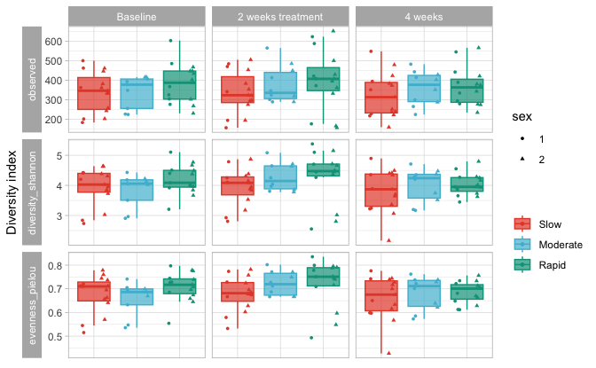
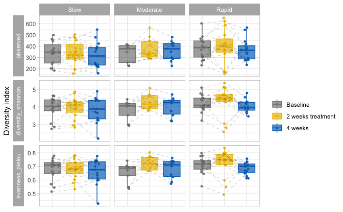

```r
load(here::here("save.RData"))
```


# Alpha-diversity:

## compute metrics:


```r
source("https://raw.githubusercontent.com/fconstancias/DivComAnalyses/master/R/phyloseq_alpha.R")

physeq_rare %>% 
  phyloseq_alphas() -> alphas
```

```
## Loading required package: metagMisc
```

```
## 
## Attaching package: 'metagMisc'
```

```
## The following object is masked from 'package:purrr':
## 
##     some
```

```
## Loading required package: microbiome
```

```
## 
## microbiome R package (microbiome.github.com)
##     
## 
## 
##  Copyright (C) 2011-2022 Leo Lahti, 
##     Sudarshan Shetty et al. <microbiome.github.io>
```

```
## 
## Attaching package: 'microbiome'
```

```
## The following object is masked from 'package:metagMisc':
## 
##     prevalence
```

```
## The following object is masked from 'package:ggplot2':
## 
##     alpha
```

```
## The following object is masked from 'package:base':
## 
##     transform
```

```
## Observed richness
```

```
## Other forms of richness
```

```
## Diversity
```

```
## Evenness
```

```
## Dominance
```

```
## Rarity
```


```r
alphas %>%
  plot_alphas(measure = c("observed", "diversity_shannon", "evenness_pielou"),
              x_group = "Group",
              colour_group = "Group",
              fill_group = "Group",
              shape_group = "sex",
              facet_group = "time",
              test_group = "Group",
              test_group_2 = "time") -> alpha_1
```

```
## Warning: `aes_string()` was deprecated in ggplot2 3.0.0.
## ℹ Please use tidy evaluation idioms with `aes()`.
## ℹ See also `vignette("ggplot2-in-packages")` for more information.
## This warning is displayed once every 8 hours.
## Call `lifecycle::last_lifecycle_warnings()` to see where this warning was
## generated.
```

```r
alpha_1$plot + 
  facet_grid(alphadiversiy~ time, switch = "y",  scales = "free_y", space = "fixed") + 
  theme(strip.placement = "outside") +
  theme(axis.title.x=element_blank(),axis.text.x=element_blank(), axis.ticks.x=element_blank()) + 
  scale_color_manual(name = "", values = treat_pal,na.value = "black") +
  scale_fill_manual(name = "", values = treat_pal,
                    na.value = "black") -> alpha_1$plot


alpha_1$plot
```




```r
alpha_1$stat %>% 
  DT::datatable()
```

```{=html}
<div class="datatables html-widget html-fill-item" id="htmlwidget-1db13bac3fcff6316a0c" style="width:100%;height:auto;"></div>
<script type="application/json" data-for="htmlwidget-1db13bac3fcff6316a0c">{"x":{"filter":"none","vertical":false,"data":[["1","2","3","4","5","6","7","8","9","10","11","12","13","14","15","16","17","18","19","20","21","22","23","24","25","26","27"],["diversity_shannon","evenness_pielou","evenness_pielou","observed","observed","observed","evenness_pielou","observed","diversity_shannon","observed","diversity_shannon","evenness_pielou","evenness_pielou","diversity_shannon","diversity_shannon","evenness_pielou","diversity_shannon","observed","observed","diversity_shannon","evenness_pielou","diversity_shannon","evenness_pielou","diversity_shannon","observed","evenness_pielou","observed"],["2 weeks treatment","2 weeks treatment","Baseline","2 weeks treatment","4 weeks","4 weeks","2 weeks treatment","Baseline","Baseline","Baseline","Baseline","Baseline","Baseline","2 weeks treatment","2 weeks treatment","2 weeks treatment","4 weeks","2 weeks treatment","2 weeks treatment","Baseline","4 weeks","4 weeks","4 weeks","4 weeks","Baseline","4 weeks","4 weeks"],["Slow","Slow","Moderate","Slow","Slow","Slow","Slow","Moderate","Moderate","Slow","Slow","Slow","Slow","Slow","Moderate","Moderate","Slow","Slow","Moderate","Slow","Slow","Slow","Slow","Moderate","Slow","Moderate","Moderate"],["Rapid","Rapid","Rapid","Rapid","Rapid","Moderate","Moderate","Rapid","Rapid","Rapid","Rapid","Rapid","Moderate","Moderate","Rapid","Rapid","Rapid","Moderate","Rapid","Moderate","Rapid","Moderate","Moderate","Rapid","Moderate","Rapid","Rapid"],[0.04533389909792265,0.0502223733334571,0.07318830382163266,0.1912636934396475,0.2328119093188184,0.2439807468834035,0.2608958748883369,0.2830261958738603,0.2895027472191289,0.2997046058214359,0.3045908160470848,0.3045908160470848,0.317547020888655,0.366907940625803,0.3969493018759407,0.4283838519805675,0.4609587492115655,0.4879066961167926,0.4879904149219378,0.6823841456699176,0.6826738075750567,0.6829513332272787,0.76465326301105,0.8065419302732534,0.8152525728410772,0.8489567909543679,0.9349582104528933],[0.66,0.66,0.66,0.66,0.66,0.66,0.66,0.66,0.66,0.66,0.66,0.66,0.66,0.6899999999999999,0.6899999999999999,0.6899999999999999,0.6899999999999999,0.6899999999999999,0.6899999999999999,0.84,0.84,0.84,0.88,0.88,0.88,0.88,0.93],["Wilcoxon","Wilcoxon","Wilcoxon","Wilcoxon","Wilcoxon","Wilcoxon","Wilcoxon","Wilcoxon","Wilcoxon","Wilcoxon","Wilcoxon","Wilcoxon","Wilcoxon","Wilcoxon","Wilcoxon","Wilcoxon","Wilcoxon","Wilcoxon","Wilcoxon","Wilcoxon","Wilcoxon","Wilcoxon","Wilcoxon","Wilcoxon","Wilcoxon","Wilcoxon","Wilcoxon"],["NS","NS","NS","NS","NS","NS","NS","NS","NS","NS","NS","NS","NS","NS","NS","NS","NS","NS","NS","NS","NS","NS","NS","NS","NS","NS","NS"]],"container":"<table class=\"display\">\n  <thead>\n    <tr>\n      <th> <\/th>\n      <th>alphadiversiy<\/th>\n      <th>time<\/th>\n      <th>group1<\/th>\n      <th>group2<\/th>\n      <th>p<\/th>\n      <th>p.adj<\/th>\n      <th>method<\/th>\n      <th>signif<\/th>\n    <\/tr>\n  <\/thead>\n<\/table>","options":{"columnDefs":[{"className":"dt-right","targets":[5,6]},{"orderable":false,"targets":0},{"name":" ","targets":0},{"name":"alphadiversiy","targets":1},{"name":"time","targets":2},{"name":"group1","targets":3},{"name":"group2","targets":4},{"name":"p","targets":5},{"name":"p.adj","targets":6},{"name":"method","targets":7},{"name":"signif","targets":8}],"order":[],"autoWidth":false,"orderClasses":false}},"evals":[],"jsHooks":[]}</script>
```


```r
alpha_1$plot$data %>% 
  select(sample_id_tmp,alphadiversiy,time, id, Group,  value) %>% 
  pivot_wider(names_from = alphadiversiy, values_from = value) %>% 
  DT::datatable()
```

```{=html}
<div class="datatables html-widget html-fill-item" id="htmlwidget-c50ca000f8b1c4f27ebb" style="width:100%;height:auto;"></div>
<script type="application/json" data-for="htmlwidget-c50ca000f8b1c4f27ebb">{"x":{"filter":"none","vertical":false,"data":[["1","2","3","4","5","6","7","8","9","10","11","12","13","14","15","16","17","18","19","20","21","22","23","24","25","26","27","28","29","30","31","32","33","34","35","36","37","38","39","40","41","42","43","44","45","46","47","48","49","50","51","52","53","54","55","56","57","58","59","60","61","62","63","64","65","66","67","68","69","70","71","72","73","74","75","76","77","78","79","80","81","82","83","84","85","86","87","88","89","90","91","92","93","94","95","96","97","98","99","100","101","102","103","104","105","106","107","108","109","110","111","112","113","114","115","116","117","118","119"],["MQ22090601","MQ220906148","MQ220906149","MQ220906151","MQ22090607","MQ220906153","MQ220906154","MQ220906156","MQ22090612","MQ220906157","MQ22090614","MQ22090615","MQ220906158","MQ22090617","MQ22090620","MQ22090621","MQ220906159","MQ22090624","MQ22090625","MQ22090626","MQ22090627","MQ22090629","MQ22090630","MQ220906160","MQ22090633","MQ22090636","MQ22090637","MQ22090640","MQ22090641","MQ22090644","MQ22090645","MQ22090650","MQ22090651","MQ22090655","MQ22090657","MQ22090659","MQ22090660","MQ22090661","MQ22090663","MQ22090665","MQ22090669","MQ22090672","MQ22090674","MQ22090675","MQ22090678","MQ22090682","MQ22090683","MQ22090686","MQ22090688","MQ22090689","MQ22090690","MQ22090692","MQ22090693","MQ22090696","MQ22090697","MQ220906100","MQ220906101","MQ220906102","MQ220906103","MQ220906104","MQ220906106","MQ220906107","MQ220906110","MQ220906111","MQ220906115","MQ220906116","MQ220906119","MQ220906121","MQ220906122","MQ220906125","MQ220906126","MQ220906133","MQ220906134","MQ220906138","MQ220906140","MQ220906142","MQ220906144","MQ220906145","MQ220906147","8100FL240302","8100FL240305","8100FL240308","8100FL240310","8100FL240311","8100FL240312","8100FL240402","8100FL240315","8100FL240318","8100FL240403","8100FL240322","8100FL240323","8100FL240325","8100FL240326","8100FL240328","8100FL240406","8100FL240331","8100FL240332","8100FL240333","8100FL240334","8100FL240335","8100FL240337","8100FL240407","8100FL240408","8100FL240340","8100FL240343","8100FL240410","8100FL240345","8100FL240347","8100FL240348","8100FL240350","8100FL240351","8100FL240357","8100FL240358","8100FL240362","8100FL240364","8100FL240365","8100FL240415","8100FL240366","8100FL240416"],["Baseline","Baseline","Baseline","Baseline","Baseline","Baseline","Baseline","Baseline","Baseline","Baseline","Baseline","Baseline","Baseline","Baseline","Baseline","Baseline","Baseline","Baseline","Baseline","Baseline","Baseline","Baseline","Baseline","Baseline","Baseline","Baseline","Baseline","Baseline","Baseline","Baseline","Baseline","Baseline","Baseline","Baseline","Baseline","Baseline","Baseline","Baseline","2 weeks treatment","2 weeks treatment","2 weeks treatment","2 weeks treatment","2 weeks treatment","2 weeks treatment","2 weeks treatment","2 weeks treatment","2 weeks treatment","2 weeks treatment","2 weeks treatment","2 weeks treatment","2 weeks treatment","2 weeks treatment","2 weeks treatment","2 weeks treatment","2 weeks treatment","2 weeks treatment","2 weeks treatment","2 weeks treatment","2 weeks treatment","2 weeks treatment","2 weeks treatment","2 weeks treatment","2 weeks treatment","2 weeks treatment","2 weeks treatment","2 weeks treatment","2 weeks treatment","2 weeks treatment","2 weeks treatment","2 weeks treatment","2 weeks treatment","2 weeks treatment","2 weeks treatment","2 weeks treatment","2 weeks treatment","2 weeks treatment","2 weeks treatment","2 weeks treatment","4 weeks","4 weeks","4 weeks","4 weeks","4 weeks","4 weeks","4 weeks","4 weeks","4 weeks","4 weeks","4 weeks","4 weeks","4 weeks","4 weeks","4 weeks","4 weeks","4 weeks","4 weeks","4 weeks","4 weeks","4 weeks","4 weeks","4 weeks","4 weeks","4 weeks","4 weeks","4 weeks","4 weeks","4 weeks","4 weeks","4 weeks","4 weeks","4 weeks","4 weeks","4 weeks","4 weeks","4 weeks","4 weeks","4 weeks","4 weeks","Baseline"],["D1","D19","D55","D2","D20","D29","D38","D65","D21","D39","D48","D57","D75","D4","D31","D40","D67","D76","D5","D14","D23","D41","D50","D77","D6","D42","D51","D16","D25","D52","D61","D35","D44","D80","D18","D36","D54","D63","D1","D19","D55","D2","D20","D29","D38","D65","D74","D21","D39","D48","D57","D75","D4","D31","D40","D67","D76","D5","D14","D23","D41","D50","D77","D6","D42","D51","D78","D16","D25","D52","D61","D35","D44","D80","D18","D36","D54","D63","D1","D19","D55","D2","D20","D29","D38","D65","D74","D21","D39","D48","D57","D75","D4","D31","D40","D67","D76","D5","D14","D23","D41","D50","D77","D6","D42","D51","D78","D16","D25","D52","D61","D35","D44","D80","D18","D36","D54","D63","D78"],["Moderate","Rapid","Rapid","Slow","Moderate","Slow","Slow","Rapid","Rapid","Slow","Slow","Rapid","Rapid","Rapid","Rapid","Moderate","Moderate","Rapid","Slow","Slow","Slow","Slow","Moderate","Rapid","Slow","Slow","Rapid","Rapid","Moderate","Slow","Rapid","Rapid","Moderate","Slow","Moderate","Slow","Rapid","Slow","Moderate","Rapid","Rapid","Slow","Moderate","Slow","Slow","Rapid","Moderate","Rapid","Slow","Slow","Rapid","Rapid","Rapid","Rapid","Moderate","Moderate","Rapid","Slow","Slow","Slow","Slow","Moderate","Rapid","Slow","Slow","Rapid","Moderate","Rapid","Moderate","Slow","Rapid","Rapid","Moderate","Slow","Moderate","Slow","Rapid","Slow","Moderate","Rapid","Rapid","Slow","Moderate","Slow","Slow","Rapid","Moderate","Rapid","Slow","Slow","Rapid","Rapid","Rapid","Rapid","Moderate","Moderate","Rapid","Slow","Slow","Slow","Slow","Moderate","Rapid","Slow","Slow","Rapid","Moderate","Rapid","Moderate","Slow","Rapid","Rapid","Moderate","Slow","Moderate","Slow","Rapid","Slow","Moderate"],[394,448,231,462,349,333,184,277,388,382,258,403,486,604,448,227,225,326,447,363,463,244,407,305,334,202,368,435,256,501,468,303,378,203,416,347,269,362,347,166,157,454,325,506,157,422,290,396,298,296,362,589,624,653,414,302,177,384,342,485,324,486,409,354,195,373,450,501,290,471,430,408,566,322,320,195,333,276,444,422,275,374,300,480,218,295,288,364,240,223,376,390,546,381,225,266,443,384,352,395,252,352,280,424,229,335,403,235,415,549,567,278,483,314,429,160,344,237,417],[4.429724184461747,4.377384167322795,3.667669523737707,4.02800356895049,4.056942478875262,3.850329579462924,2.841722670840418,4.086567173539046,3.845529276774736,4.627787182564296,3.952203333970741,4.670512674222194,4.506337532814361,5.104234933447659,4.021218453519832,2.905932744324881,2.964006541597984,3.206991731613017,4.638721111483681,4.199945163801711,4.423827749758777,3.821415975993072,4.024347933128341,3.920289157420895,3.725642541407736,2.73419804292166,4.398662270737045,4.491103150365826,3.506527904562096,4.413898049298131,4.767019014005856,3.979963749981667,4.183957244705677,3.028219204890777,4.219003172223355,4.309510702550582,3.964759962845635,4.384042523308944,4.253162132369621,2.802797932083858,3.017735523173641,4.146776296647985,3.973264179700979,4.868542852674502,2.927275209594592,4.703065688032603,3.777557563133226,4.712492968704398,3.840697638407336,3.877795017151478,4.658844412382357,5.098670151849571,5.37767843748469,5.152350244759294,4.649828382267849,3.806624389610969,2.552955323635931,4.310530476041843,4.251150011183285,4.784662783774134,4.380155855364336,4.636376570944192,4.265192662786358,4.084346016121784,2.806987873125944,4.447696989722083,4.709221967838664,4.447895757644017,4.036969064876421,4.103455768084695,4.488855864229286,4.473770766746338,5.083554036917645,3.945957894939697,3.856008650634235,3.176196421487445,4.364708726055916,3.529817151563533,4.275070397872906,4.248720190314434,3.936343432272073,4.409470525440221,4.20767278561969,4.492688312014843,3.22291194881327,3.873327019901343,3.5206418903744,3.950208431936378,3.701907879152122,3.066066493491642,4.168330859819806,3.655255502804672,4.551116683617257,3.734138607288533,3.169700797677927,3.197679573642828,3.950831953021067,4.399939679315929,4.35244518966934,3.888138249816251,3.870079894704398,3.745058247467368,3.448069696934225,4.33889149923157,3.245541096851401,4.269036455442579,4.371749179209948,3.625295464072756,4.352540260075081,4.895462789371429,4.795675679719867,4.012336588394787,4.710059517417389,3.64298084707046,4.474809473306498,2.166344505987765,4.283591567498056,3.366346481692117,4.140867434039952],[0.7412088499639532,0.7170405287569671,0.6739044518113749,0.6565008504441598,0.6928937052833357,0.6629192699912374,0.5449199765680967,0.7266277476987143,0.6451142144116527,0.7783784339606055,0.711729173160645,0.7785567701863797,0.7284490075882779,0.7970915578824401,0.658698550536999,0.535660740644758,0.5472584186939363,0.5541815450087717,0.7601272547514831,0.7125310708977916,0.7207599345450827,0.6951608208768706,0.6697408970673329,0.685327882555718,0.6411206587330298,0.5150829232407127,0.7445159989748392,0.7392341320780759,0.632356302331313,0.7100173273850918,0.7753181417835363,0.6965610548228743,0.7049758777155223,0.5699419929955177,0.6995893484981137,0.7367535338992979,0.7086621085228879,0.7441118923150938,0.727120187778026,0.5482794654689367,0.5968332314820599,0.6777885611192214,0.6869613196193699,0.7819022212924082,0.5789424253263618,0.7780085283155113,0.666249893859756,0.7878559822587587,0.6741503623742041,0.6814674974890683,0.790754540647766,0.7993617869119295,0.8355426970621108,0.7949223070241355,0.7716448395077836,0.6666094108249203,0.4932151223466404,0.7243806761956058,0.7285840454395653,0.7736978633851757,0.7577149623397496,0.7494698049838625,0.7092442112926708,0.6958833530779827,0.5323322791801082,0.7510999052157469,0.7708350175763861,0.7154861809352552,0.7120024423289446,0.6667019296633273,0.7402729004645621,0.7442308979037816,0.802000250244561,0.6833358164383107,0.6684802481425731,0.6023509742816238,0.7514809999213039,0.6280365468403537,0.7013112588934415,0.7028480488593203,0.7008196281859136,0.7443079225857542,0.7376986770298091,0.7277039140010678,0.5985541654752395,0.6810873579016606,0.6216963552410104,0.6698499853658061,0.6754518826966924,0.5670370062358311,0.7029712782826648,0.6126660410202308,0.7220992893798347,0.6283467388984372,0.5852367131871888,0.5727020126463649,0.6483608298771973,0.7394058104536204,0.7422781309612957,0.6503115133327109,0.6999058733649783,0.6386926693228395,0.6119251897169118,0.7172037464690598,0.5972961249634169,0.7342519112832029,0.7287540273290196,0.6640239363740518,0.7220204317813292,0.7760599861849877,0.7563728568032883,0.7129720546811058,0.7621434991819326,0.6336287771595013,0.7382399203948938,0.4268512931488546,0.7334111248017285,0.6156381595673684,0.6863597306264465]],"container":"<table class=\"display\">\n  <thead>\n    <tr>\n      <th> <\/th>\n      <th>sample_id_tmp<\/th>\n      <th>time<\/th>\n      <th>id<\/th>\n      <th>Group<\/th>\n      <th>observed<\/th>\n      <th>diversity_shannon<\/th>\n      <th>evenness_pielou<\/th>\n    <\/tr>\n  <\/thead>\n<\/table>","options":{"columnDefs":[{"className":"dt-right","targets":[5,6,7]},{"orderable":false,"targets":0},{"name":" ","targets":0},{"name":"sample_id_tmp","targets":1},{"name":"time","targets":2},{"name":"id","targets":3},{"name":"Group","targets":4},{"name":"observed","targets":5},{"name":"diversity_shannon","targets":6},{"name":"evenness_pielou","targets":7}],"order":[],"autoWidth":false,"orderClasses":false}},"evals":[],"jsHooks":[]}</script>
```


```r
alphas %>%
  plot_alphas(measure = c("observed", "diversity_shannon", "evenness_pielou"),
              x_group = "time",
              colour_group = "time",
              fill_group = "time",
              shape_group = NULL,
              facet_group = "Group",
              test_group = "time",
              test_group_2 = "Group") -> alpha_2

alpha_2$plot + facet_grid(alphadiversiy~ Group, switch = "y",  scales = "free_y", space = "fixed") + theme(strip.placement = "outside") +   theme(axis.title.x=element_blank(),
                                                                                                                                                  axis.text.x=element_blank(),
                                                                                                                                                  axis.ticks.x=element_blank()) +  scale_color_manual(name = "", values = time_pal,
                                                                                                                                                                                                      na.value = "black") +
  scale_fill_manual(name = "", values = time_pal,
                    na.value = "black") +
  geom_line(aes(group=id), linetype = "dashed", color = "black", linewidth = 0.08) -> alpha_2$plot


alpha_2$plot
```




```r
alpha_2$plot$data %>% 
  select(sample_id_tmp,alphadiversiy,time, id, Group,  value) %>% 
  pivot_wider(names_from = alphadiversiy, values_from = value) %>% 
  DT::datatable()
```

```{=html}
<div class="datatables html-widget html-fill-item" id="htmlwidget-be455a8ab867818a4d5b" style="width:100%;height:auto;"></div>
<script type="application/json" data-for="htmlwidget-be455a8ab867818a4d5b">{"x":{"filter":"none","vertical":false,"data":[["1","2","3","4","5","6","7","8","9","10","11","12","13","14","15","16","17","18","19","20","21","22","23","24","25","26","27","28","29","30","31","32","33","34","35","36","37","38","39","40","41","42","43","44","45","46","47","48","49","50","51","52","53","54","55","56","57","58","59","60","61","62","63","64","65","66","67","68","69","70","71","72","73","74","75","76","77","78","79","80","81","82","83","84","85","86","87","88","89","90","91","92","93","94","95","96","97","98","99","100","101","102","103","104","105","106","107","108","109","110","111","112","113","114","115","116","117","118","119"],["MQ22090601","MQ220906148","MQ220906149","MQ220906151","MQ22090607","MQ220906153","MQ220906154","MQ220906156","MQ22090612","MQ220906157","MQ22090614","MQ22090615","MQ220906158","MQ22090617","MQ22090620","MQ22090621","MQ220906159","MQ22090624","MQ22090625","MQ22090626","MQ22090627","MQ22090629","MQ22090630","MQ220906160","MQ22090633","MQ22090636","MQ22090637","MQ22090640","MQ22090641","MQ22090644","MQ22090645","MQ22090650","MQ22090651","MQ22090655","MQ22090657","MQ22090659","MQ22090660","MQ22090661","MQ22090663","MQ22090665","MQ22090669","MQ22090672","MQ22090674","MQ22090675","MQ22090678","MQ22090682","MQ22090683","MQ22090686","MQ22090688","MQ22090689","MQ22090690","MQ22090692","MQ22090693","MQ22090696","MQ22090697","MQ220906100","MQ220906101","MQ220906102","MQ220906103","MQ220906104","MQ220906106","MQ220906107","MQ220906110","MQ220906111","MQ220906115","MQ220906116","MQ220906119","MQ220906121","MQ220906122","MQ220906125","MQ220906126","MQ220906133","MQ220906134","MQ220906138","MQ220906140","MQ220906142","MQ220906144","MQ220906145","MQ220906147","8100FL240302","8100FL240305","8100FL240308","8100FL240310","8100FL240311","8100FL240312","8100FL240402","8100FL240315","8100FL240318","8100FL240403","8100FL240322","8100FL240323","8100FL240325","8100FL240326","8100FL240328","8100FL240406","8100FL240331","8100FL240332","8100FL240333","8100FL240334","8100FL240335","8100FL240337","8100FL240407","8100FL240408","8100FL240340","8100FL240343","8100FL240410","8100FL240345","8100FL240347","8100FL240348","8100FL240350","8100FL240351","8100FL240357","8100FL240358","8100FL240362","8100FL240364","8100FL240365","8100FL240415","8100FL240366","8100FL240416"],["Baseline","Baseline","Baseline","Baseline","Baseline","Baseline","Baseline","Baseline","Baseline","Baseline","Baseline","Baseline","Baseline","Baseline","Baseline","Baseline","Baseline","Baseline","Baseline","Baseline","Baseline","Baseline","Baseline","Baseline","Baseline","Baseline","Baseline","Baseline","Baseline","Baseline","Baseline","Baseline","Baseline","Baseline","Baseline","Baseline","Baseline","Baseline","2 weeks treatment","2 weeks treatment","2 weeks treatment","2 weeks treatment","2 weeks treatment","2 weeks treatment","2 weeks treatment","2 weeks treatment","2 weeks treatment","2 weeks treatment","2 weeks treatment","2 weeks treatment","2 weeks treatment","2 weeks treatment","2 weeks treatment","2 weeks treatment","2 weeks treatment","2 weeks treatment","2 weeks treatment","2 weeks treatment","2 weeks treatment","2 weeks treatment","2 weeks treatment","2 weeks treatment","2 weeks treatment","2 weeks treatment","2 weeks treatment","2 weeks treatment","2 weeks treatment","2 weeks treatment","2 weeks treatment","2 weeks treatment","2 weeks treatment","2 weeks treatment","2 weeks treatment","2 weeks treatment","2 weeks treatment","2 weeks treatment","2 weeks treatment","2 weeks treatment","4 weeks","4 weeks","4 weeks","4 weeks","4 weeks","4 weeks","4 weeks","4 weeks","4 weeks","4 weeks","4 weeks","4 weeks","4 weeks","4 weeks","4 weeks","4 weeks","4 weeks","4 weeks","4 weeks","4 weeks","4 weeks","4 weeks","4 weeks","4 weeks","4 weeks","4 weeks","4 weeks","4 weeks","4 weeks","4 weeks","4 weeks","4 weeks","4 weeks","4 weeks","4 weeks","4 weeks","4 weeks","4 weeks","4 weeks","4 weeks","Baseline"],["D1","D19","D55","D2","D20","D29","D38","D65","D21","D39","D48","D57","D75","D4","D31","D40","D67","D76","D5","D14","D23","D41","D50","D77","D6","D42","D51","D16","D25","D52","D61","D35","D44","D80","D18","D36","D54","D63","D1","D19","D55","D2","D20","D29","D38","D65","D74","D21","D39","D48","D57","D75","D4","D31","D40","D67","D76","D5","D14","D23","D41","D50","D77","D6","D42","D51","D78","D16","D25","D52","D61","D35","D44","D80","D18","D36","D54","D63","D1","D19","D55","D2","D20","D29","D38","D65","D74","D21","D39","D48","D57","D75","D4","D31","D40","D67","D76","D5","D14","D23","D41","D50","D77","D6","D42","D51","D78","D16","D25","D52","D61","D35","D44","D80","D18","D36","D54","D63","D78"],["Moderate","Rapid","Rapid","Slow","Moderate","Slow","Slow","Rapid","Rapid","Slow","Slow","Rapid","Rapid","Rapid","Rapid","Moderate","Moderate","Rapid","Slow","Slow","Slow","Slow","Moderate","Rapid","Slow","Slow","Rapid","Rapid","Moderate","Slow","Rapid","Rapid","Moderate","Slow","Moderate","Slow","Rapid","Slow","Moderate","Rapid","Rapid","Slow","Moderate","Slow","Slow","Rapid","Moderate","Rapid","Slow","Slow","Rapid","Rapid","Rapid","Rapid","Moderate","Moderate","Rapid","Slow","Slow","Slow","Slow","Moderate","Rapid","Slow","Slow","Rapid","Moderate","Rapid","Moderate","Slow","Rapid","Rapid","Moderate","Slow","Moderate","Slow","Rapid","Slow","Moderate","Rapid","Rapid","Slow","Moderate","Slow","Slow","Rapid","Moderate","Rapid","Slow","Slow","Rapid","Rapid","Rapid","Rapid","Moderate","Moderate","Rapid","Slow","Slow","Slow","Slow","Moderate","Rapid","Slow","Slow","Rapid","Moderate","Rapid","Moderate","Slow","Rapid","Rapid","Moderate","Slow","Moderate","Slow","Rapid","Slow","Moderate"],[394,448,231,462,349,333,184,277,388,382,258,403,486,604,448,227,225,326,447,363,463,244,407,305,334,202,368,435,256,501,468,303,378,203,416,347,269,362,347,166,157,454,325,506,157,422,290,396,298,296,362,589,624,653,414,302,177,384,342,485,324,486,409,354,195,373,450,501,290,471,430,408,566,322,320,195,333,276,444,422,275,374,300,480,218,295,288,364,240,223,376,390,546,381,225,266,443,384,352,395,252,352,280,424,229,335,403,235,415,549,567,278,483,314,429,160,344,237,417],[4.429724184461747,4.377384167322795,3.667669523737707,4.02800356895049,4.056942478875262,3.850329579462924,2.841722670840418,4.086567173539046,3.845529276774736,4.627787182564296,3.952203333970741,4.670512674222194,4.506337532814361,5.104234933447659,4.021218453519832,2.905932744324881,2.964006541597984,3.206991731613017,4.638721111483681,4.199945163801711,4.423827749758777,3.821415975993072,4.024347933128341,3.920289157420895,3.725642541407736,2.73419804292166,4.398662270737045,4.491103150365826,3.506527904562096,4.413898049298131,4.767019014005856,3.979963749981667,4.183957244705677,3.028219204890777,4.219003172223355,4.309510702550582,3.964759962845635,4.384042523308944,4.253162132369621,2.802797932083858,3.017735523173641,4.146776296647985,3.973264179700979,4.868542852674502,2.927275209594592,4.703065688032603,3.777557563133226,4.712492968704398,3.840697638407336,3.877795017151478,4.658844412382357,5.098670151849571,5.37767843748469,5.152350244759294,4.649828382267849,3.806624389610969,2.552955323635931,4.310530476041843,4.251150011183285,4.784662783774134,4.380155855364336,4.636376570944192,4.265192662786358,4.084346016121784,2.806987873125944,4.447696989722083,4.709221967838664,4.447895757644017,4.036969064876421,4.103455768084695,4.488855864229286,4.473770766746338,5.083554036917645,3.945957894939697,3.856008650634235,3.176196421487445,4.364708726055916,3.529817151563533,4.275070397872906,4.248720190314434,3.936343432272073,4.409470525440221,4.20767278561969,4.492688312014843,3.22291194881327,3.873327019901343,3.5206418903744,3.950208431936378,3.701907879152122,3.066066493491642,4.168330859819806,3.655255502804672,4.551116683617257,3.734138607288533,3.169700797677927,3.197679573642828,3.950831953021067,4.399939679315929,4.35244518966934,3.888138249816251,3.870079894704398,3.745058247467368,3.448069696934225,4.33889149923157,3.245541096851401,4.269036455442579,4.371749179209948,3.625295464072756,4.352540260075081,4.895462789371429,4.795675679719867,4.012336588394787,4.710059517417389,3.64298084707046,4.474809473306498,2.166344505987765,4.283591567498056,3.366346481692117,4.140867434039952],[0.7412088499639532,0.7170405287569671,0.6739044518113749,0.6565008504441598,0.6928937052833357,0.6629192699912374,0.5449199765680967,0.7266277476987143,0.6451142144116527,0.7783784339606055,0.711729173160645,0.7785567701863797,0.7284490075882779,0.7970915578824401,0.658698550536999,0.535660740644758,0.5472584186939363,0.5541815450087717,0.7601272547514831,0.7125310708977916,0.7207599345450827,0.6951608208768706,0.6697408970673329,0.685327882555718,0.6411206587330298,0.5150829232407127,0.7445159989748392,0.7392341320780759,0.632356302331313,0.7100173273850918,0.7753181417835363,0.6965610548228743,0.7049758777155223,0.5699419929955177,0.6995893484981137,0.7367535338992979,0.7086621085228879,0.7441118923150938,0.727120187778026,0.5482794654689367,0.5968332314820599,0.6777885611192214,0.6869613196193699,0.7819022212924082,0.5789424253263618,0.7780085283155113,0.666249893859756,0.7878559822587587,0.6741503623742041,0.6814674974890683,0.790754540647766,0.7993617869119295,0.8355426970621108,0.7949223070241355,0.7716448395077836,0.6666094108249203,0.4932151223466404,0.7243806761956058,0.7285840454395653,0.7736978633851757,0.7577149623397496,0.7494698049838625,0.7092442112926708,0.6958833530779827,0.5323322791801082,0.7510999052157469,0.7708350175763861,0.7154861809352552,0.7120024423289446,0.6667019296633273,0.7402729004645621,0.7442308979037816,0.802000250244561,0.6833358164383107,0.6684802481425731,0.6023509742816238,0.7514809999213039,0.6280365468403537,0.7013112588934415,0.7028480488593203,0.7008196281859136,0.7443079225857542,0.7376986770298091,0.7277039140010678,0.5985541654752395,0.6810873579016606,0.6216963552410104,0.6698499853658061,0.6754518826966924,0.5670370062358311,0.7029712782826648,0.6126660410202308,0.7220992893798347,0.6283467388984372,0.5852367131871888,0.5727020126463649,0.6483608298771973,0.7394058104536204,0.7422781309612957,0.6503115133327109,0.6999058733649783,0.6386926693228395,0.6119251897169118,0.7172037464690598,0.5972961249634169,0.7342519112832029,0.7287540273290196,0.6640239363740518,0.7220204317813292,0.7760599861849877,0.7563728568032883,0.7129720546811058,0.7621434991819326,0.6336287771595013,0.7382399203948938,0.4268512931488546,0.7334111248017285,0.6156381595673684,0.6863597306264465]],"container":"<table class=\"display\">\n  <thead>\n    <tr>\n      <th> <\/th>\n      <th>sample_id_tmp<\/th>\n      <th>time<\/th>\n      <th>id<\/th>\n      <th>Group<\/th>\n      <th>observed<\/th>\n      <th>diversity_shannon<\/th>\n      <th>evenness_pielou<\/th>\n    <\/tr>\n  <\/thead>\n<\/table>","options":{"columnDefs":[{"className":"dt-right","targets":[5,6,7]},{"orderable":false,"targets":0},{"name":" ","targets":0},{"name":"sample_id_tmp","targets":1},{"name":"time","targets":2},{"name":"id","targets":3},{"name":"Group","targets":4},{"name":"observed","targets":5},{"name":"diversity_shannon","targets":6},{"name":"evenness_pielou","targets":7}],"order":[],"autoWidth":false,"orderClasses":false},"selection":{"mode":"multiple","selected":null,"target":"row","selectable":null}},"evals":[],"jsHooks":[]}</script>
```


```r
alpha_2$stat %>% 
  DT::datatable()
```

```{=html}
<div class="datatables html-widget html-fill-item" id="htmlwidget-4067f691ce24a972e7bb" style="width:100%;height:auto;"></div>
<script type="application/json" data-for="htmlwidget-4067f691ce24a972e7bb">{"x":{"filter":"none","vertical":false,"data":[["1","2","3","4","5","6","7","8","9","10","11","12","13","14","15","16","17","18","19","20","21","22","23","24","25","26","27"],["evenness_pielou","diversity_shannon","evenness_pielou","evenness_pielou","evenness_pielou","diversity_shannon","evenness_pielou","diversity_shannon","diversity_shannon","diversity_shannon","evenness_pielou","observed","diversity_shannon","observed","observed","observed","observed","diversity_shannon","evenness_pielou","evenness_pielou","observed","observed","observed","observed","diversity_shannon","diversity_shannon","evenness_pielou"],["Rapid","Rapid","Moderate","Rapid","Rapid","Moderate","Moderate","Rapid","Moderate","Rapid","Moderate","Rapid","Moderate","Moderate","Rapid","Moderate","Moderate","Slow","Slow","Slow","Rapid","Slow","Slow","Slow","Slow","Slow","Slow"],["2 weeks treatment","2 weeks treatment","Baseline","Baseline","Baseline","Baseline","2 weeks treatment","Baseline","Baseline","Baseline","Baseline","2 weeks treatment","2 weeks treatment","Baseline","Baseline","Baseline","2 weeks treatment","Baseline","Baseline","2 weeks treatment","Baseline","Baseline","2 weeks treatment","Baseline","2 weeks treatment","Baseline","Baseline"],["4 weeks","4 weeks","2 weeks treatment","2 weeks treatment","4 weeks","2 weeks treatment","4 weeks","4 weeks","4 weeks","2 weeks treatment","4 weeks","4 weeks","4 weeks","4 weeks","4 weeks","2 weeks treatment","4 weeks","4 weeks","4 weeks","4 weeks","2 weeks treatment","4 weeks","4 weeks","2 weeks treatment","4 weeks","2 weeks treatment","2 weeks treatment"],[0.02349614666351035,0.03671754164197571,0.09471952196410402,0.1736088998844231,0.1872684014030137,0.2428067288748404,0.2474506917231376,0.2495561945549413,0.2775119617224881,0.3045908160470848,0.3562320032908269,0.372458504310987,0.3930481283422461,0.5134443375257332,0.5896972055949142,0.5954494752210774,0.6230455308379079,0.6235942787120372,0.712965124764759,0.712965124764759,0.7399938739946228,0.7437020653759808,0.7556829896574375,0.8682114641097,0.870194456435353,0.9024622750544232,0.9674172975431788],[0.5,0.5,0.82,0.82,0.82,0.82,0.82,0.82,0.82,0.82,0.82,0.82,0.82,0.89,0.89,0.89,0.89,0.89,0.89,0.89,0.89,0.89,0.89,0.9399999999999999,0.9399999999999999,0.9399999999999999,0.97],["Wilcoxon","Wilcoxon","Wilcoxon","Wilcoxon","Wilcoxon","Wilcoxon","Wilcoxon","Wilcoxon","Wilcoxon","Wilcoxon","Wilcoxon","Wilcoxon","Wilcoxon","Wilcoxon","Wilcoxon","Wilcoxon","Wilcoxon","Wilcoxon","Wilcoxon","Wilcoxon","Wilcoxon","Wilcoxon","Wilcoxon","Wilcoxon","Wilcoxon","Wilcoxon","Wilcoxon"],["NS","NS","NS","NS","NS","NS","NS","NS","NS","NS","NS","NS","NS","NS","NS","NS","NS","NS","NS","NS","NS","NS","NS","NS","NS","NS","NS"]],"container":"<table class=\"display\">\n  <thead>\n    <tr>\n      <th> <\/th>\n      <th>alphadiversiy<\/th>\n      <th>Group<\/th>\n      <th>group1<\/th>\n      <th>group2<\/th>\n      <th>p<\/th>\n      <th>p.adj<\/th>\n      <th>method<\/th>\n      <th>signif<\/th>\n    <\/tr>\n  <\/thead>\n<\/table>","options":{"columnDefs":[{"className":"dt-right","targets":[5,6]},{"orderable":false,"targets":0},{"name":" ","targets":0},{"name":"alphadiversiy","targets":1},{"name":"Group","targets":2},{"name":"group1","targets":3},{"name":"group2","targets":4},{"name":"p","targets":5},{"name":"p.adj","targets":6},{"name":"method","targets":7},{"name":"signif","targets":8}],"order":[],"autoWidth":false,"orderClasses":false},"selection":{"mode":"multiple","selected":null,"target":"row","selectable":null}},"evals":[],"jsHooks":[]}</script>
```


```r
alpha_save <- list("alpha_1" =alpha_1, "alpha_2" = alpha_2)
```


```r
save(physeq, treat_pal, time_pal, physeq_rare ,alpha_save, plot_rare, meta, file = here::here("save.RData"))
```


```r
sessionInfo()
```

```
## R version 4.3.3 (2024-02-29)
## Platform: x86_64-apple-darwin20 (64-bit)
## Running under: macOS Sonoma 14.4
## 
## Matrix products: default
## BLAS:   /Library/Frameworks/R.framework/Versions/4.3-x86_64/Resources/lib/libRblas.0.dylib 
## LAPACK: /Library/Frameworks/R.framework/Versions/4.3-x86_64/Resources/lib/libRlapack.dylib;  LAPACK version 3.11.0
## 
## locale:
## [1] en_US.UTF-8/en_US.UTF-8/en_US.UTF-8/C/en_US.UTF-8/en_US.UTF-8
## 
## time zone: Europe/Paris
## tzcode source: internal
## 
## attached base packages:
## [1] stats     graphics  grDevices utils     datasets  methods   base     
## 
## other attached packages:
##  [1] gdtools_0.3.7     microbiome_1.24.0 metagMisc_0.5.0   phyloseq_1.46.0  
##  [5] lubridate_1.9.3   forcats_1.0.0     stringr_1.5.1     dplyr_1.1.4      
##  [9] purrr_1.0.2       readr_2.1.5       tidyr_1.3.1       tibble_3.2.1     
## [13] ggplot2_3.5.0     tidyverse_2.0.0   rgl_1.3.1        
## 
## loaded via a namespace (and not attached):
##   [1] RColorBrewer_1.1-3      rstudioapi_0.16.0       jsonlite_1.8.8         
##   [4] magrittr_2.0.3          farver_2.1.1            rmarkdown_2.26         
##   [7] ragg_1.3.0              zlibbioc_1.48.2         vctrs_0.6.5            
##  [10] multtest_2.58.0         RCurl_1.98-1.14         askpass_1.2.0          
##  [13] base64enc_0.1-3         rstatix_0.7.2           htmltools_0.5.8.1      
##  [16] curl_5.2.1              broom_1.0.5             Rhdf5lib_1.24.2        
##  [19] rhdf5_2.46.1            sass_0.4.9              bslib_0.7.0            
##  [22] htmlwidgets_1.6.4       plyr_1.8.9              plotly_4.10.4          
##  [25] cachem_1.0.8            uuid_1.2-0              igraph_2.0.3           
##  [28] mime_0.12               lifecycle_1.0.4         iterators_1.0.14       
##  [31] pkgconfig_2.0.3         Matrix_1.6-5            R6_2.5.1               
##  [34] fastmap_1.1.1           GenomeInfoDbData_1.2.11 shiny_1.8.1.1          
##  [37] digest_0.6.35           colorspace_2.1-0        S4Vectors_0.40.2       
##  [40] rprojroot_2.0.4         textshaping_0.3.7       crosstalk_1.2.1        
##  [43] stargazer_5.2.3         ggpubr_0.6.0            vegan_2.6-4            
##  [46] labeling_0.4.3          fansi_1.0.6             timechange_0.3.0       
##  [49] httr_1.4.7              abind_1.4-5             mgcv_1.9-1             
##  [52] compiler_4.3.3          here_1.0.1              fontquiver_0.2.1       
##  [55] withr_3.0.0             backports_1.4.1         carData_3.0-5          
##  [58] highr_0.10              ggsignif_0.6.4          MASS_7.3-60.0.1        
##  [61] openssl_2.1.2           devEMF_4.4-2            biomformat_1.30.0      
##  [64] gfonts_0.2.0            permute_0.9-7           tools_4.3.3            
##  [67] ape_5.8                 zip_2.3.1               httpuv_1.6.15          
##  [70] glue_1.7.0              nlme_3.1-164            rhdf5filters_1.14.1    
##  [73] promises_1.3.0          grid_4.3.3              Rtsne_0.17             
##  [76] cluster_2.1.6           reshape2_1.4.4          ade4_1.7-22            
##  [79] generics_0.1.3          ampvis2_2.8.7           gtable_0.3.5           
##  [82] tzdb_0.4.0              data.table_1.15.4       hms_1.1.3              
##  [85] xml2_1.3.6              car_3.1-2               utf8_1.2.4             
##  [88] XVector_0.42.0          BiocGenerics_0.48.1     ggrepel_0.9.5          
##  [91] foreach_1.5.2           pillar_1.9.0            later_1.3.2            
##  [94] splines_4.3.3           export_0.3.0            lattice_0.22-6         
##  [97] survival_3.5-8          tidyselect_1.2.1        rvg_0.3.3              
## [100] fontLiberation_0.1.0    Biostrings_2.70.3       knitr_1.45             
## [103] fontBitstreamVera_0.1.1 IRanges_2.36.0          crul_1.4.2             
## [106] stats4_4.3.3            xfun_0.43               Biobase_2.62.0         
## [109] DT_0.33                 stringi_1.8.3           lazyeval_0.2.2         
## [112] yaml_2.3.8              evaluate_0.23           codetools_0.2-20       
## [115] httpcode_0.3.0          officer_0.6.5           cli_3.6.2              
## [118] systemfonts_1.0.6       xtable_1.8-4            munsell_0.5.1          
## [121] jquerylib_0.1.4         Rcpp_1.0.12             GenomeInfoDb_1.38.8    
## [124] parallel_4.3.3          bitops_1.0-7            viridisLite_0.4.2      
## [127] scales_1.3.0            openxlsx_4.2.5.2        crayon_1.5.2           
## [130] flextable_0.9.5         rlang_1.1.3
```

