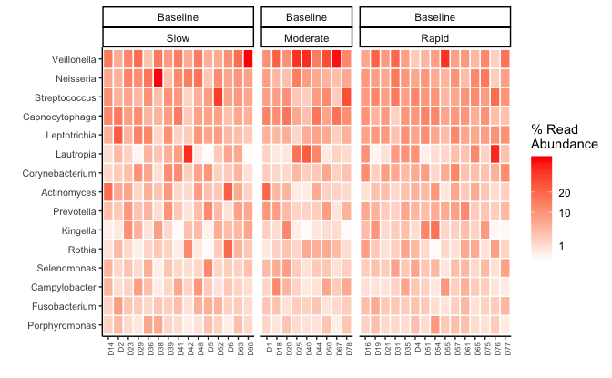
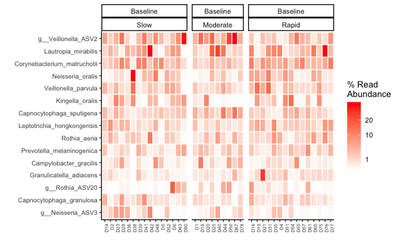
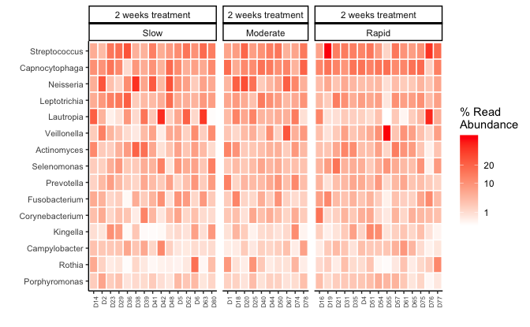
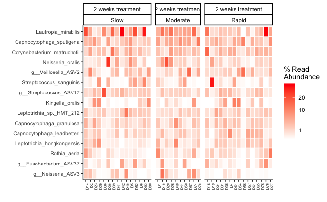
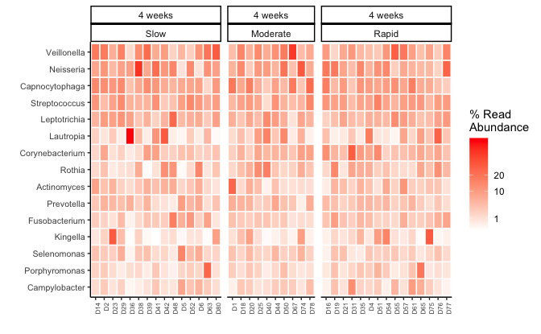
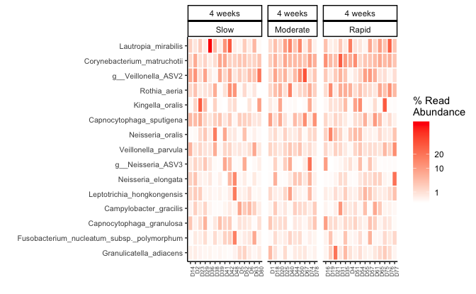

```r
load(here::here("save.RData"))
```

T1


```r
physeq_rare %>% 
    physeq_sel_tax_table(c("Kingdom", "Phylum", "Class", "Order", "Family", "Genus", "Species")) %>% 
  subset_samples(time == "Baseline") -> physeq_tax_only
```

```
## Warning: Using an external vector in selections was deprecated in tidyselect 1.1.0.
## ℹ Please use `all_of()` or `any_of()` instead.
##   # Was:
##   data %>% select(tax_sel)
## 
##   # Now:
##   data %>% select(all_of(tax_sel))
## 
## See <https://tidyselect.r-lib.org/reference/faq-external-vector.html>.
## This warning is displayed once every 8 hours.
## Call `lifecycle::last_lifecycle_warnings()` to see where this warning was
## generated.
```


```r
# 
# physeq_tax_only %>% 
#   transform_sample_counts(function(x) x/sum(x) * 100) %>% 
#   phyloseq_ampvis_heatmap(ntax = 4,
#                           group_by = "SampleID",
#                           transform = "identity",
#                           tax_aggregate = "Class",
#                           facet_by = c("time", "Group")) -> p_heat_class

physeq_tax_only %>% 
  transform_sample_counts(function(x) x/sum(x) * 100) %>% 
  phyloseq_ampvis_heatmap(ntax = 15,
                          group_by = "id",
                          transform = "identity",
                          tax_aggregate = "Genus",
                          plot_values = FALSE,
                          facet_by = c("time", "Group"))  -> p_heat_gen_t1
```

```
## Loading required package: ampvis2
```

```
## 414 OTUs with 0 total abundance across all samples have been removed.
```

```r
physeq_tax_only %>% 
  transform_sample_counts(function(x) x/sum(x) * 100) %>% 
  phyloseq_ampvis_heatmap(ntax = 15,
                          transform = "identity",
                          tax_aggregate = "Species",
                          group_by = "id",
                          plot_values = FALSE,
                          facet_by = c("time", "Group"))  -> p_heat_sp_t1
```

```
## 414 OTUs with 0 total abundance across all samples have been removed.
```

```r
p_heat_gen_t1
```




```r
p_heat_sp_t1
```




```r
p_heat_sp_t1
```


T2


```r
physeq_rare %>% 
    physeq_sel_tax_table(c("Kingdom", "Phylum", "Class", "Order", "Family", "Genus", "Species")) %>% 
  subset_samples(time == "2 weeks treatment") -> physeq_tax_only
```


```r
# 
# physeq_tax_only %>% 
#   transform_sample_counts(function(x) x/sum(x) * 100) %>% 
#   phyloseq_ampvis_heatmap(ntax = 4,
#                           group_by = "SampleID",
#                           transform = "identity",
#                           tax_aggregate = "Class",
#                           facet_by = c("time", "Group")) -> p_heat_class

physeq_tax_only %>% 
  transform_sample_counts(function(x) x/sum(x) * 100) %>% 
  phyloseq_ampvis_heatmap(ntax = 15,
                          group_by = "id",
                          transform = "identity",
                          tax_aggregate = "Genus",
                          plot_values = FALSE,
                          facet_by = c("time", "Group"))  -> p_heat_gen_t2
```

```
## 294 OTUs with 0 total abundance across all samples have been removed.
```

```r
physeq_tax_only %>% 
  transform_sample_counts(function(x) x/sum(x) * 100) %>% 
  phyloseq_ampvis_heatmap(ntax = 15,
                          transform = "identity",
                          tax_aggregate = "Species",
                          group_by = "id",
                          plot_values = FALSE,
                          facet_by = c("time", "Group"))  -> p_heat_sp_t2
```

```
## 294 OTUs with 0 total abundance across all samples have been removed.
```

```r
p_heat_gen_t2
```




```r
p_heat_sp_t2
```




T3


```r
physeq_rare %>% 
    physeq_sel_tax_table(c("Kingdom", "Phylum", "Class", "Order", "Family", "Genus", "Species")) %>% 
  subset_samples(time == "4 weeks") -> physeq_tax_only
```


```r
# 
# physeq_tax_only %>% 
#   transform_sample_counts(function(x) x/sum(x) * 100) %>% 
#   phyloseq_ampvis_heatmap(ntax = 4,
#                           group_by = "SampleID",
#                           transform = "identity",
#                           tax_aggregate = "Class",
#                           facet_by = c("time", "Group")) -> p_heat_class

physeq_tax_only %>% 
  transform_sample_counts(function(x) x/sum(x) * 100) %>% 
  phyloseq_ampvis_heatmap(ntax = 15,
                          group_by = "id",
                          transform = "identity",
                          tax_aggregate = "Genus",
                          plot_values = FALSE,
                          facet_by = c("time", "Group"))  -> p_heat_gen_t3
```

```
## 377 OTUs with 0 total abundance across all samples have been removed.
```

```r
physeq_tax_only %>% 
  transform_sample_counts(function(x) x/sum(x) * 100) %>% 
  phyloseq_ampvis_heatmap(ntax = 15,
                          transform = "identity",
                          tax_aggregate = "Species",
                          group_by = "id",
                          plot_values = FALSE,
                          facet_by = c("time", "Group"))  -> p_heat_sp_t3
```

```
## 377 OTUs with 0 total abundance across all samples have been removed.
```

```r
p_heat_gen_t3
```




```r
p_heat_sp_t3
```




```r
# ggpubr::ggarrange(p_heat_gen + ylab(NULL) + 
#                     theme(axis.title.x=element_blank(),
#                           axis.text.x=element_blank(),
#                           axis.ticks.x=element_blank(),
#                           legend.position = "none"),
#                   # p_heat_gen + 
#                   #   theme(
#                   #     strip.background = element_blank(),
#                   #     strip.text.x = element_blank(),
#                   #     legend.position = "none"
#                   #   ) +
#                     theme(axis.title.x=element_blank(),
#                           axis.text.x=element_blank(),
#                           axis.ticks.x=element_blank(),
#                           legend.position = "none"),
#                   p_heat_sp + 
#                     theme(
#                       strip.background = element_blank(),
#                       strip.text.x = element_blank(),
#                       legend.position = "none"
#                     ), 
#                   align = "v",
#                   ncol = 1, 
#                   heights = c(1.2, 2, 3),
#                   common.legend = FALSE) -> heat_all
# p_heat_sp
```


```r
heat_all <- list("p_heat_gen_t1" = p_heat_gen_t1, "p_heat_sp_t1" = p_heat_sp_t1,"p_heat_gen_t2" = p_heat_gen_t2, "p_heat_sp_t2" = p_heat_sp_t2, "p_heat_gen_t3" = p_heat_gen_t3, "p_heat_sp_t3" = p_heat_sp_t3)
```


```r
save(physeq, treat_pal, time_pal, physeq_rare ,alpha_save, plot_rare, meta, heat_all,file = here::here("save.RData"))
```


```r
sessionInfo()
```

```
## R version 4.3.3 (2024-02-29)
## Platform: x86_64-apple-darwin20 (64-bit)
## Running under: macOS Sonoma 14.4
## 
## Matrix products: default
## BLAS:   /Library/Frameworks/R.framework/Versions/4.3-x86_64/Resources/lib/libRblas.0.dylib 
## LAPACK: /Library/Frameworks/R.framework/Versions/4.3-x86_64/Resources/lib/libRlapack.dylib;  LAPACK version 3.11.0
## 
## locale:
## [1] en_US.UTF-8/en_US.UTF-8/en_US.UTF-8/C/en_US.UTF-8/en_US.UTF-8
## 
## time zone: Europe/Paris
## tzcode source: internal
## 
## attached base packages:
## [1] stats     graphics  grDevices utils     datasets  methods   base     
## 
## other attached packages:
##  [1] gdtools_0.3.7   ampvis2_2.8.7   phyloseq_1.46.0 lubridate_1.9.3
##  [5] forcats_1.0.0   stringr_1.5.1   dplyr_1.1.4     purrr_1.0.2    
##  [9] readr_2.1.5     tidyr_1.3.1     tibble_3.2.1    ggplot2_3.5.0  
## [13] tidyverse_2.0.0 rgl_1.3.1      
## 
## loaded via a namespace (and not attached):
##   [1] RColorBrewer_1.1-3      rstudioapi_0.16.0       jsonlite_1.8.8         
##   [4] magrittr_2.0.3          farver_2.1.1            rmarkdown_2.26         
##   [7] zlibbioc_1.48.2         ragg_1.3.0              vctrs_0.6.5            
##  [10] multtest_2.58.0         RCurl_1.98-1.14         askpass_1.2.0          
##  [13] base64enc_0.1-3         htmltools_0.5.8.1       curl_5.2.1             
##  [16] broom_1.0.5             Rhdf5lib_1.24.2         rhdf5_2.46.1           
##  [19] sass_0.4.9              bslib_0.7.0             htmlwidgets_1.6.4      
##  [22] plyr_1.8.9              plotly_4.10.4           cachem_1.0.8           
##  [25] uuid_1.2-0              igraph_2.0.3            mime_0.12              
##  [28] lifecycle_1.0.4         iterators_1.0.14        pkgconfig_2.0.3        
##  [31] Matrix_1.6-5            R6_2.5.1                fastmap_1.1.1          
##  [34] GenomeInfoDbData_1.2.11 shiny_1.8.1.1           digest_0.6.35          
##  [37] colorspace_2.1-0        S4Vectors_0.40.2        rprojroot_2.0.4        
##  [40] textshaping_0.3.7       stargazer_5.2.3         vegan_2.6-4            
##  [43] fansi_1.0.6             timechange_0.3.0        httr_1.4.7             
##  [46] mgcv_1.9-1              compiler_4.3.3          here_1.0.1             
##  [49] fontquiver_0.2.1        withr_3.0.0             backports_1.4.1        
##  [52] highr_0.10              MASS_7.3-60.0.1         openssl_2.1.2          
##  [55] devEMF_4.4-2            biomformat_1.30.0       gfonts_0.2.0           
##  [58] permute_0.9-7           tools_4.3.3             ape_5.8                
##  [61] zip_2.3.1               httpuv_1.6.15           glue_1.7.0             
##  [64] nlme_3.1-164            rhdf5filters_1.14.1     promises_1.3.0         
##  [67] grid_4.3.3              Rtsne_0.17              cluster_2.1.6          
##  [70] reshape2_1.4.4          ade4_1.7-22             generics_0.1.3         
##  [73] gtable_0.3.5            microbiome_1.24.0       tzdb_0.4.0             
##  [76] data.table_1.15.4       hms_1.1.3               xml2_1.3.6             
##  [79] utf8_1.2.4              XVector_0.42.0          BiocGenerics_0.48.1    
##  [82] ggrepel_0.9.5           foreach_1.5.2           pillar_1.9.0           
##  [85] later_1.3.2             splines_4.3.3           export_0.3.0           
##  [88] lattice_0.22-6          survival_3.5-8          tidyselect_1.2.1       
##  [91] rvg_0.3.3               fontLiberation_0.1.0    Biostrings_2.70.3      
##  [94] knitr_1.45              fontBitstreamVera_0.1.1 IRanges_2.36.0         
##  [97] crul_1.4.2              stats4_4.3.3            xfun_0.43              
## [100] Biobase_2.62.0          stringi_1.8.3           lazyeval_0.2.2         
## [103] yaml_2.3.8              evaluate_0.23           codetools_0.2-20       
## [106] httpcode_0.3.0          officer_0.6.5           cli_3.6.2              
## [109] xtable_1.8-4            systemfonts_1.0.6       munsell_0.5.1          
## [112] jquerylib_0.1.4         Rcpp_1.0.12             GenomeInfoDb_1.38.8    
## [115] parallel_4.3.3          bitops_1.0-7            viridisLite_0.4.2      
## [118] scales_1.3.0            openxlsx_4.2.5.2        crayon_1.5.2           
## [121] flextable_0.9.5         rlang_1.1.3
```

