```r
load(here::here("save.RData"))
```


# Beta-diversity:

## compute distances:


```r
source("https://raw.githubusercontent.com/fconstancias/DivComAnalyses/master/R/phyloseq_beta.R") 

physeq_rare %>% 
  microbiome::transform(., "hellinger") %>% 
  phyloseq::distance(method = "bray") -> bc
```


```r
physeq_rare %>% 
  phyloseq_compute_bdiv(phylo = FALSE) -> dlist
```

```
## Loading required package: ape
```

```
## 
## Attaching package: 'ape'
```

```
## The following object is masked from 'package:dplyr':
## 
##     where
```

```
## Loading required package: GUniFrac
```

```
## Registered S3 method overwritten by 'rmutil':
##   method         from
##   print.response httr
```


```r
physeq %>% 
  microViz::dist_calc(., dist = "aitchison") %>% 
  microViz::dist_get() %>% magrittr::divide_by(100) -> aitch
```


```r
dlist$bray <- bc
dlist$aitch <- aitch
```


```r
plot(dlist$bray, dlist$aitch)
```

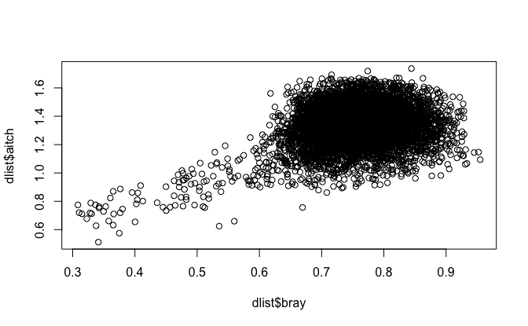


```r
cor.test(dlist$bray, dlist$aitch)
```

```
## 
## 	Pearson's product-moment correlation
## 
## data:  dlist$bray and dlist$aitch
## t = 25.317, df = 7019, p-value < 2.2e-16
## alternative hypothesis: true correlation is not equal to 0
## 95 percent confidence interval:
##  0.2676850 0.3105558
## sample estimates:
##       cor 
## 0.2892655
```
## Ordination:


```r
physeq_rare %>% 
  phyloseq_plot_bdiv(dlist = dlist, # list of distance computed from a phyloseq object
                     ps_rare = ., # phyloseq object
                     m = "PCoA", # PCoA or NMDS
                     seed = 123, # for reproducibility
                     axis1 = 1, # axis to plot
                     axis2 = 2) -> plot_list
```

```
## [1] "bray"
## [1] "sorensen"
## [1] "bjaccard"
## [1] "wjaccard"
## [1] "aitch"
```

```r
plot_list %>%
  phyloseq_plot_ordinations_facet(color_group = "Group",
                                  shape_group = "time",
                                  alpha = NULL)  + scale_color_manual(name = "", values = treat_pal,
                                                                      na.value = "black") +
  scale_fill_manual(name = "", values = treat_pal,
                    na.value = "black") -> pcoas
```

```
## Warning: `aes_string()` was deprecated in ggplot2 3.0.0.
## ℹ Please use tidy evaluation idioms with `aes()`.
## ℹ See also `vignette("ggplot2-in-packages")` for more information.
## This warning is displayed once every 8 hours.
## Call `lifecycle::last_lifecycle_warnings()` to see where this warning was
## generated.
```

```r
pcoas
```

```
## Warning: No shared levels found between `names(values)` of the manual scale and the
## data's fill values.
```

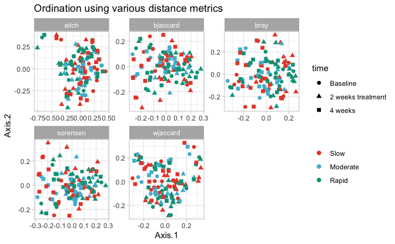

```r
plot_list %>%
  phyloseq_ordinations_expl_var() -> exp
```

```
## New names:
## • `.id` -> `.id...1`
## • `V1` -> `V1...2`
## • `.id` -> `.id...3`
## • `V1` -> `V1...4`
```

```r
exp %>% 
  DT::datatable()
```

```{=html}
<div class="datatables html-widget html-fill-item" id="htmlwidget-9eceb20dc2a931752ae4" style="width:100%;height:auto;"></div>
<script type="application/json" data-for="htmlwidget-9eceb20dc2a931752ae4">{"x":{"filter":"none","vertical":false,"data":[["1","2","3","4","5"],["bray","sorensen","bjaccard","wjaccard","aitch"],["Axis.1   [8.1%]","Axis.1   [8.8%]","Axis.1   [5.7%]","Axis.1   [5.6%]","Axis.1   [5.8%]"],["bray","sorensen","bjaccard","wjaccard","aitch"],["Axis.2   [7.1%]","Axis.2   [6%]","Axis.2   [4%]","Axis.2   [4.6%]","Axis.2   [4.3%]"]],"container":"<table class=\"display\">\n  <thead>\n    <tr>\n      <th> <\/th>\n      <th>.id...1<\/th>\n      <th>V1...2<\/th>\n      <th>.id...3<\/th>\n      <th>V1...4<\/th>\n    <\/tr>\n  <\/thead>\n<\/table>","options":{"columnDefs":[{"orderable":false,"targets":0},{"name":" ","targets":0},{"name":".id...1","targets":1},{"name":"V1...2","targets":2},{"name":".id...3","targets":3},{"name":"V1...4","targets":4}],"order":[],"autoWidth":false,"orderClasses":false}},"evals":[],"jsHooks":[]}</script>
```

### Selected ordination with trqjectories and envfit taxa:


```r
plot_list$wjaccard$layers[[1]] = NULL; plot_list$wjaccard$layers[[1]] = NULL
plot_list$wjaccard$layers[[2]] = NULL; plot_list$wjaccard$layers[[1]] = NULL

# plots_hall_humans$aichinson$layers[[1]] = NULL;plots_hall_humans$aichinson$layers[[1]] = NULL
# plots_hall_humans$aichinson$layers[[2]] = NULL;plots_hall_humans$aichinson$layers[[2]] = NULL

plot_list$wjaccard + geom_point(size = 3,
                                aes(colour = Group ,
                                    shape = time,
                                    alpha = NULL)) +
  geom_path(data = plot_list$wjaccard$data %>%
              arrange(Group) ,
            # aes(colour = Treatment, group = interaction(Model, Model2, Antibiotic, Treatment, Fermentation, Reactor,Antibiotic_mg.L)),
            aes(colour = Group, group = id),
            
            arrow = arrow(
              angle = 30, length = unit(0.15, "inches"),
              ends = "last", type = "open"
            ), linetype = "longdash", size = 0.1) +
  theme_light() +
  scale_color_manual(name = "", values = treat_pal,
                     na.value = "black") +
  scale_fill_manual(name = "", values = treat_pal,
                    na.value = "black") +
  # scale_shape_manual(name = "" ,values = c(15,16,18,19), na.value =  17) +
  theme(legend.position = "right")  -> PCOA
```

```
## Warning: Using `size` aesthetic for lines was deprecated in ggplot2 3.4.0.
## ℹ Please use `linewidth` instead.
## This warning is displayed once every 8 hours.
## Call `lifecycle::last_lifecycle_warnings()` to see where this warning was
## generated.
```

```r
PCOA
```

```
## Warning: No shared levels found between `names(values)` of the manual scale and the
## data's fill values.
```

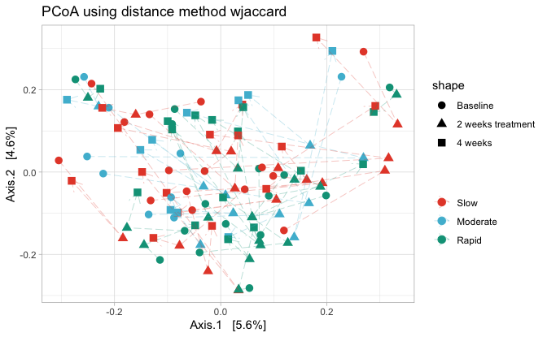


```r
PCOA + 
  scale_fill_manual(values = c("transparent")) + 
  scale_color_manual(values = c(rep("transparent", 3))) + 
  theme(panel.border = element_blank(), panel.grid.major = element_blank(),
        panel.grid.minor = element_blank(), axis.line = element_line(colour = "black")) -> empty_plot_tmp
```

```
## Scale for fill is already present.
## Adding another scale for fill, which will replace the existing scale.
## Scale for colour is already present.
## Adding another scale for colour, which will replace the existing scale.
```

```r
physeq_rare %>%
  phyloseq_add_taxa_vector_fix(phyloseq = .,
                               dist = dlist$wjaccard,
                               taxrank_glom = "Family",
                               figure_ord = empty_plot_tmp, 
                               fact = 0.2, pval_cutoff = 0.05,
                               top_r = 8) -> out #top 10 correlated genera
```

```
## Loading required package: vegan
## Loading required package: permute
## Loading required package: lattice
## This is vegan 2.6-4
```

```r
out$signenvfit %>% 
  DT::datatable()
```

```{=html}
<div class="datatables html-widget html-fill-item" id="htmlwidget-f30d7598595affc4f25a" style="width:100%;height:auto;"></div>
<script type="application/json" data-for="htmlwidget-f30d7598595affc4f25a">{"x":{"filter":"none","vertical":false,"data":[["ASV1","ASV2","ASV17","ASV12","ASV23","ASV33","ASV105","ASV107"],[0.6294127707889609,-0.655927671684904,0.2289043090812304,-0.2509090740817476,-0.3384992679956873,-0.3406537728917727,0.0003512844593163373,0.02605989603175538],[0.4847813461772582,0.3894620590529647,-0.3646760855408516,-0.380923769263725,-0.4132031018117213,0.2711911999997207,-0.4414779792328487,-0.4888089542256975],[0.001,0.001,0.001,0.001,0.001,0.001,0.001,0.001],[0.6311733896336715,0.5819218059237541,0.1853858300813539,0.2080582814466434,0.285318557780444,0.1895896599426879,0.194902929548291,0.239613311912406],["Bacteria","Bacteria","Bacteria","Bacteria","Bacteria","Bacteria","Bacteria","Bacteria"],["Proteobacteria","Firmicutes","Firmicutes","Bacteroidetes","Bacteroidetes","Firmicutes","Firmicutes","Firmicutes"],["Betaproteobacteria","Negativicutes","Bacilli","Bacteroidia","Flavobacteriia","Bacilli","Negativicutes","Clostridia"],["Burkholderiales","Veillonellales","Lactobacillales","Bacteroidales","Flavobacteriales","Bacillales","Selenomonadales","Clostridiales"],["Burkholderiaceae","Veillonellaceae","Streptococcaceae","Prevotellaceae","Flavobacteriaceae","Gemellaceae","Selenomonadaceae","Ruminococcaceae"],[null,null,null,null,null,null,null,null],[null,null,null,null,null,null,null,null],[null,null,null,null,null,null,null,null],[0.0048,0.0048,0.0048,0.0048,0.0048,0.0048,0.0048,0.0048]],"container":"<table class=\"display\">\n  <thead>\n    <tr>\n      <th> <\/th>\n      <th>Axis.1<\/th>\n      <th>Axis.2<\/th>\n      <th>pval<\/th>\n      <th>r<\/th>\n      <th>Kingdom<\/th>\n      <th>Phylum<\/th>\n      <th>Class<\/th>\n      <th>Order<\/th>\n      <th>tax_rank_plot<\/th>\n      <th>Genus<\/th>\n      <th>Species<\/th>\n      <th>Strain<\/th>\n      <th>pval.adj<\/th>\n    <\/tr>\n  <\/thead>\n<\/table>","options":{"columnDefs":[{"className":"dt-right","targets":[1,2,3,4,13]},{"orderable":false,"targets":0},{"name":" ","targets":0},{"name":"Axis.1","targets":1},{"name":"Axis.2","targets":2},{"name":"pval","targets":3},{"name":"r","targets":4},{"name":"Kingdom","targets":5},{"name":"Phylum","targets":6},{"name":"Class","targets":7},{"name":"Order","targets":8},{"name":"tax_rank_plot","targets":9},{"name":"Genus","targets":10},{"name":"Species","targets":11},{"name":"Strain","targets":12},{"name":"pval.adj","targets":13}],"order":[],"autoWidth":false,"orderClasses":false}},"evals":[],"jsHooks":[]}</script>
```


```r
out$vectors
```


## Statistical evalutaion:

### Overall:


```r
form = paste0(c("Group", "time"), collapse=" * ")

lapply(
  dlist,
  FUN = phyloseq_adonis2,
  physeq = physeq_rare,
  formula = form,
  nrep = 999,
  # strata = "id"
)  %>%
  bind_rows(.id = "Distance") %>% 
  mutate("Group" = (as.vector(form))) -> perm1

perm1 %>% 
  mutate_if(is.numeric, round, 3) %>%
  filter(! terms %in% (c("Residual", "Total"))) %>%
  DT::datatable()
```

```{=html}
<div class="datatables html-widget html-fill-item" id="htmlwidget-b85bf888dc62471906a9" style="width:100%;height:auto;"></div>
<script type="application/json" data-for="htmlwidget-b85bf888dc62471906a9">{"x":{"filter":"none","vertical":false,"data":[["1","2","3","4","5","6","7","8","9","10","11","12","13","14","15"],["bray","bray","bray","sorensen","sorensen","sorensen","bjaccard","bjaccard","bjaccard","wjaccard","wjaccard","wjaccard","aitch","aitch","aitch"],["Group","time","Group:time","Group","time","Group:time","Group","time","Group:time","Group","time","Group:time","Group","time","Group:time"],[2,2,4,2,2,4,2,2,4,2,2,4,2,2,4],[1.124,1.24,0.544,0.89,0.865,0.327,1.154,0.944,0.661,1.273,1.29,1.178,3.585,2.979,1.667],[0.033,0.037,0.016,0.035,0.034,0.013,0.031,0.026,0.018,0.026,0.026,0.024,0.034,0.028,0.016],[2.009,2.217,0.486,2.082,2.024,0.383,1.855,1.517,0.531,1.538,1.559,0.712,2.026,1.684,0.471],[0.001,0.001,1,0.001,0.001,1,0.001,0.001,1,0.001,0.001,1,0.001,0.001,1],["Group * time","Group * time","Group * time","Group * time","Group * time","Group * time","Group * time","Group * time","Group * time","Group * time","Group * time","Group * time","Group * time","Group * time","Group * time"]],"container":"<table class=\"display\">\n  <thead>\n    <tr>\n      <th> <\/th>\n      <th>Distance<\/th>\n      <th>terms<\/th>\n      <th>Df<\/th>\n      <th>SumOfSqs<\/th>\n      <th>R2<\/th>\n      <th>F<\/th>\n      <th>Pr(&gt;F)<\/th>\n      <th>Group<\/th>\n    <\/tr>\n  <\/thead>\n<\/table>","options":{"columnDefs":[{"className":"dt-right","targets":[3,4,5,6,7]},{"orderable":false,"targets":0},{"name":" ","targets":0},{"name":"Distance","targets":1},{"name":"terms","targets":2},{"name":"Df","targets":3},{"name":"SumOfSqs","targets":4},{"name":"R2","targets":5},{"name":"F","targets":6},{"name":"Pr(>F)","targets":7},{"name":"Group","targets":8}],"order":[],"autoWidth":false,"orderClasses":false}},"evals":[],"jsHooks":[]}</script>
```


```r
form = paste0(c("Group"), collapse=" * ")


lapply(
  dlist,
  FUN = phyloseq_adonis2,
  physeq = physeq_rare,
  formula = form,
  nrep = 999,
  # strata = "id"
) %>%
  bind_rows(.id = "Distance") %>% 
  mutate("Group" = (as.vector(form))) -> perm2

perm2 %>% 
  mutate_if(is.numeric, round, 3) %>%
  filter(! terms %in% (c("Residual", "Total"))) %>%
  DT::datatable()
```

```{=html}
<div class="datatables html-widget html-fill-item" id="htmlwidget-88fdd2a34d502a66744b" style="width:100%;height:auto;"></div>
<script type="application/json" data-for="htmlwidget-88fdd2a34d502a66744b">{"x":{"filter":"none","vertical":false,"data":[["1","2","3","4","5"],["bray","sorensen","bjaccard","wjaccard","aitch"],["Group","Group","Group","Group","Group"],[2,2,2,2,2],[1.124,0.89,1.154,1.273,3.585],[0.033,0.035,0.031,0.026,0.034],[2.003,2.09,1.869,1.539,2.039],[0.001,0.001,0.001,0.001,0.001],["Group","Group","Group","Group","Group"]],"container":"<table class=\"display\">\n  <thead>\n    <tr>\n      <th> <\/th>\n      <th>Distance<\/th>\n      <th>terms<\/th>\n      <th>Df<\/th>\n      <th>SumOfSqs<\/th>\n      <th>R2<\/th>\n      <th>F<\/th>\n      <th>Pr(&gt;F)<\/th>\n      <th>Group<\/th>\n    <\/tr>\n  <\/thead>\n<\/table>","options":{"columnDefs":[{"className":"dt-right","targets":[3,4,5,6,7]},{"orderable":false,"targets":0},{"name":" ","targets":0},{"name":"Distance","targets":1},{"name":"terms","targets":2},{"name":"Df","targets":3},{"name":"SumOfSqs","targets":4},{"name":"R2","targets":5},{"name":"F","targets":6},{"name":"Pr(>F)","targets":7},{"name":"Group","targets":8}],"order":[],"autoWidth":false,"orderClasses":false}},"evals":[],"jsHooks":[]}</script>
```


```r
form = paste0(c("time"), collapse=" * ")

lapply(
  dlist,
  FUN = phyloseq_adonis2,
  physeq = physeq_rare,
  formula = form,
  nrep = 999,
  # strata = "id"
)  %>%
  bind_rows(.id = "Distance") %>% 
  mutate("Group" = (as.vector(form))) -> perm3

perm3 %>% 
  mutate_if(is.numeric, round, 3) %>%
  filter(! terms %in% (c("Residual", "Total"))) %>%
  DT::datatable()
```

```{=html}
<div class="datatables html-widget html-fill-item" id="htmlwidget-8e1fe96c0688a849169a" style="width:100%;height:auto;"></div>
<script type="application/json" data-for="htmlwidget-8e1fe96c0688a849169a">{"x":{"filter":"none","vertical":false,"data":[["1","2","3","4","5"],["bray","sorensen","bjaccard","wjaccard","aitch"],["time","time","time","time","time"],[2,2,2,2,2],[1.238,0.864,0.9429999999999999,1.287,2.976],[0.037,0.034,0.026,0.026,0.028],[2.213,2.027,1.518,1.556,1.683],[0.001,0.001,0.001,0.001,0.001],["time","time","time","time","time"]],"container":"<table class=\"display\">\n  <thead>\n    <tr>\n      <th> <\/th>\n      <th>Distance<\/th>\n      <th>terms<\/th>\n      <th>Df<\/th>\n      <th>SumOfSqs<\/th>\n      <th>R2<\/th>\n      <th>F<\/th>\n      <th>Pr(&gt;F)<\/th>\n      <th>Group<\/th>\n    <\/tr>\n  <\/thead>\n<\/table>","options":{"columnDefs":[{"className":"dt-right","targets":[3,4,5,6,7]},{"orderable":false,"targets":0},{"name":" ","targets":0},{"name":"Distance","targets":1},{"name":"terms","targets":2},{"name":"Df","targets":3},{"name":"SumOfSqs","targets":4},{"name":"R2","targets":5},{"name":"F","targets":6},{"name":"Pr(>F)","targets":7},{"name":"Group","targets":8}],"order":[],"autoWidth":false,"orderClasses":false}},"evals":[],"jsHooks":[]}</script>
```


```r
form = paste0(c("Group", "time"), collapse=" + ")

lapply(
  dlist,
  FUN = phyloseq_adonis2,
  physeq = physeq_rare,
  formula = form,
  nrep = 999,
  # strata = "id"
)    %>%
  bind_rows(.id = "Distance") %>% 
  mutate("Group" = (as.vector(form))) -> perm4

perm4 %>% 
  mutate_if(is.numeric, round, 3) %>%
  filter(! terms %in% (c("Residual", "Total"))) %>%
  DT::datatable()
```

```{=html}
<div class="datatables html-widget html-fill-item" id="htmlwidget-bb3486349adfa5d821dc" style="width:100%;height:auto;"></div>
<script type="application/json" data-for="htmlwidget-bb3486349adfa5d821dc">{"x":{"filter":"none","vertical":false,"data":[["1","2","3","4","5","6","7","8","9","10"],["bray","bray","sorensen","sorensen","bjaccard","bjaccard","wjaccard","wjaccard","aitch","aitch"],["Group","time","Group","time","Group","time","Group","time","Group","time"],[2,2,2,2,2,2,2,2,2,2],[1.124,1.24,0.89,0.865,1.154,0.944,1.273,1.29,3.585,2.979],[0.033,0.037,0.035,0.034,0.031,0.026,0.026,0.026,0.034,0.028],[2.046,2.258,2.128,2.068,1.886,1.542,1.554,1.575,2.064,1.715],[0.001,0.001,0.001,0.001,0.001,0.001,0.001,0.001,0.001,0.001],["Group + time","Group + time","Group + time","Group + time","Group + time","Group + time","Group + time","Group + time","Group + time","Group + time"]],"container":"<table class=\"display\">\n  <thead>\n    <tr>\n      <th> <\/th>\n      <th>Distance<\/th>\n      <th>terms<\/th>\n      <th>Df<\/th>\n      <th>SumOfSqs<\/th>\n      <th>R2<\/th>\n      <th>F<\/th>\n      <th>Pr(&gt;F)<\/th>\n      <th>Group<\/th>\n    <\/tr>\n  <\/thead>\n<\/table>","options":{"columnDefs":[{"className":"dt-right","targets":[3,4,5,6,7]},{"orderable":false,"targets":0},{"name":" ","targets":0},{"name":"Distance","targets":1},{"name":"terms","targets":2},{"name":"Df","targets":3},{"name":"SumOfSqs","targets":4},{"name":"R2","targets":5},{"name":"F","targets":6},{"name":"Pr(>F)","targets":7},{"name":"Group","targets":8}],"order":[],"autoWidth":false,"orderClasses":false}},"evals":[],"jsHooks":[]}</script>
```


```r
bind_rows(perm1, perm2,perm3, perm4) -> combined_perm

combined_perm %>% 
  DT::datatable()
```

```{=html}
<div class="datatables html-widget html-fill-item" id="htmlwidget-44474b3e8cd160f85a98" style="width:100%;height:auto;"></div>
<script type="application/json" data-for="htmlwidget-44474b3e8cd160f85a98">{"x":{"filter":"none","vertical":false,"data":[["1","2","3","4","5","6","7","8","9","10","11","12","13","14","15","16","17","18","19","20","21","22","23","24","25","26","27","28","29","30","31","32","33","34","35","36","37","38","39","40","41","42","43","44","45","46","47","48","49","50","51","52","53","54","55","56","57","58","59","60","61","62","63","64","65","66","67","68","69","70","71","72","73","74","75"],["bray","bray","bray","bray","bray","sorensen","sorensen","sorensen","sorensen","sorensen","bjaccard","bjaccard","bjaccard","bjaccard","bjaccard","wjaccard","wjaccard","wjaccard","wjaccard","wjaccard","aitch","aitch","aitch","aitch","aitch","bray","bray","bray","sorensen","sorensen","sorensen","bjaccard","bjaccard","bjaccard","wjaccard","wjaccard","wjaccard","aitch","aitch","aitch","bray","bray","bray","sorensen","sorensen","sorensen","bjaccard","bjaccard","bjaccard","wjaccard","wjaccard","wjaccard","aitch","aitch","aitch","bray","bray","bray","bray","sorensen","sorensen","sorensen","sorensen","bjaccard","bjaccard","bjaccard","bjaccard","wjaccard","wjaccard","wjaccard","wjaccard","aitch","aitch","aitch","aitch"],["Group","time","Group:time","Residual","Total","Group","time","Group:time","Residual","Total","Group","time","Group:time","Residual","Total","Group","time","Group:time","Residual","Total","Group","time","Group:time","Residual","Total","Group","Residual","Total","Group","Residual","Total","Group","Residual","Total","Group","Residual","Total","Group","Residual","Total","time","Residual","Total","time","Residual","Total","time","Residual","Total","time","Residual","Total","time","Residual","Total","Group","time","Residual","Total","Group","time","Residual","Total","Group","time","Residual","Total","Group","time","Residual","Total","Group","time","Residual","Total"],[2,2,4,110,118,2,2,4,110,118,2,2,4,110,118,2,2,4,110,118,2,2,4,110,118,2,116,118,2,116,118,2,116,118,2,116,118,2,116,118,2,116,118,2,116,118,2,116,118,2,116,118,2,116,118,2,2,114,118,2,2,114,118,2,2,114,118,2,2,114,118,2,2,114,118],[1.124103919760164,1.240236553651002,0.543603670340441,30.76807655272728,33.67602069647889,0.8896835896008177,0.8646559926178123,0.3271756424410643,23.50100268794233,25.58251791260202,1.154263502415593,0.9438205415111458,0.6608378774526367,34.21873481874569,36.97765674012506,1.272820876835924,1.289544442765656,1.177629040515391,45.50400226020817,49.24399662032513,3.585073741631212,2.979002668497657,1.666642609646074,97.32158449766087,105.5523035174358,1.124103919760164,32.55191677671872,33.67602069647889,0.8896835896008177,24.6928343230012,25.58251791260202,1.154263502415593,35.82339323770947,36.97765674012506,1.272820876835924,47.97117574348921,49.24399662032513,3.585073741631212,101.9672297758046,105.5523035174358,1.237716089504107,32.43830460697478,33.67602069647889,0.8638211836932366,24.71869672890879,25.58251791260202,0.9431674773387608,36.03448926278631,36.97765674012506,1.286782094870104,47.95721452545504,49.24399662032513,2.975823994659805,102.576479522776,105.5523035174358,1.124103919760164,1.240236553651002,31.31168022306772,33.67602069647889,0.8896835896008177,0.8646559926178123,23.82817833038339,25.58251791260202,1.154263502415593,0.9438205415111458,34.87957269619833,36.97765674012506,1.272820876835924,1.289544442765656,46.68163130072355,49.24399662032513,3.585073741631212,2.979002668497657,98.98822710730694,105.5523035174358],[0.03337995097139545,0.03682847699938252,0.01614215869624048,0.9136494133329816,1,0.03477701423449633,0.03379870564624448,0.01278903208663041,0.918635248032629,1,0.03121516083422028,0.02552407655639765,0.01787127513506151,0.9253894874743208,1,0.02584722939223369,0.02618683557933242,0.02391416459543278,0.9240517704330012,1,0.0339649029169601,0.02822300005992353,0.01578973223801569,0.9220223647851007,1,0.03337995097139545,0.9666200490286044,1,0.03477701423449633,0.9652229857655037,1,0.03121516083422028,0.9687848391657798,1,0.02584722939223369,0.9741527706077664,1,0.0339649029169601,0.9660350970830399,1,0.03675363252266682,0.9632463674773333,1,0.03376607363842462,0.9662339263615756,1,0.02550641550834978,0.9744935844916504,1,0.02613074045941659,0.9738692595405836,1,0.02819288537997884,0.9718071146200213,1,0.03337995097139545,0.03682847699938252,0.929791572029222,1,0.03477701423449633,0.03379870564624448,0.9314242801192593,1,0.03121516083422028,0.02552407655639765,0.9432607626093823,1,0.02584722939223369,0.02618683557933242,0.9479659350284338,1,0.0339649029169601,0.02822300005992353,0.9378120970231164,1],[2.009411133674808,2.217006004061009,0.4858640061150342,null,null,2.082149348170188,2.02357662034477,0.3828487782670454,null,null,1.855255402314862,1.517009031984305,0.5310845572230789,null,null,1.538439362446876,1.558652883905395,0.7116912140823436,null,null,2.02605677669023,1.683543764860396,0.4709404599384489,null,null,2.002893648115966,null,null,2.089741806139316,null,null,1.868814679164239,null,null,1.538916020137429,null,null,2.039226499256629,null,null,2.213048248390968,null,null,2.026871772556412,null,null,1.518093215827593,null,null,1.556248882279258,null,null,1.682625417573872,null,null,2.046326577489931,2.257735230255269,null,null,2.128235062878626,2.068365902582294,null,null,1.886290873192374,1.542386179289374,null,null,1.554161411204222,1.574581504320803,null,null,2.064378858421789,1.715387345207158,null,null],[0.001,0.001,1,null,null,0.001,0.001,1,null,null,0.001,0.001,1,null,null,0.001,0.001,1,null,null,0.001,0.001,1,null,null,0.001,null,null,0.001,null,null,0.001,null,null,0.001,null,null,0.001,null,null,0.001,null,null,0.001,null,null,0.001,null,null,0.001,null,null,0.001,null,null,0.001,0.001,null,null,0.001,0.001,null,null,0.001,0.001,null,null,0.001,0.001,null,null,0.001,0.001,null,null],["Group * time","Group * time","Group * time","Group * time","Group * time","Group * time","Group * time","Group * time","Group * time","Group * time","Group * time","Group * time","Group * time","Group * time","Group * time","Group * time","Group * time","Group * time","Group * time","Group * time","Group * time","Group * time","Group * time","Group * time","Group * time","Group","Group","Group","Group","Group","Group","Group","Group","Group","Group","Group","Group","Group","Group","Group","time","time","time","time","time","time","time","time","time","time","time","time","time","time","time","Group + time","Group + time","Group + time","Group + time","Group + time","Group + time","Group + time","Group + time","Group + time","Group + time","Group + time","Group + time","Group + time","Group + time","Group + time","Group + time","Group + time","Group + time","Group + time","Group + time"]],"container":"<table class=\"display\">\n  <thead>\n    <tr>\n      <th> <\/th>\n      <th>Distance<\/th>\n      <th>terms<\/th>\n      <th>Df<\/th>\n      <th>SumOfSqs<\/th>\n      <th>R2<\/th>\n      <th>F<\/th>\n      <th>Pr(&gt;F)<\/th>\n      <th>Group<\/th>\n    <\/tr>\n  <\/thead>\n<\/table>","options":{"columnDefs":[{"className":"dt-right","targets":[3,4,5,6,7]},{"orderable":false,"targets":0},{"name":" ","targets":0},{"name":"Distance","targets":1},{"name":"terms","targets":2},{"name":"Df","targets":3},{"name":"SumOfSqs","targets":4},{"name":"R2","targets":5},{"name":"F","targets":6},{"name":"Pr(>F)","targets":7},{"name":"Group","targets":8}],"order":[],"autoWidth":false,"orderClasses":false}},"evals":[],"jsHooks":[]}</script>
```


```r
bdiv = NULL

bdiv$overall <- list("pcoas" = pcoas,
                     "pcoas_exp_var" = exp,
                     "pcoa" = PCOA,
                     "envfit" = out$signenvfit,
                     "penvfit" = out$vectors,
                     "permanovas "= combined_perm )
```

### Plot Distqnce to bqseline from qll the responders


```r
physeq_rare %>% 
  microViz::ps_mutate(tmp2 = paste0(id,"_", time,"_", Group, "_", "wjaccard")) %>% sample_data() %>% 
  phyloseq_distance_boxplot(p = ., # phyloseq object
                            dist = dlist$wjaccard, # distance matrix
                            d = "tmp2") -> outwjaccard # column in metadata for comparaisons

physeq_rare %>% 
  microViz::ps_mutate(tmp2 = paste0(id,"_", time,"_", Group, "_", "aitch")) %>% sample_data() %>% 
  phyloseq_distance_boxplot(p = ., # phyloseq object
                            dist = dlist$aitch, # distance matrix
                            d = "tmp2") -> outaitch # column in metadata for comparaisons


outwjaccard$matrix %>% 
  mutate(distance = "wjaccard") %>% 
  rbind(., 
        outaitch$matrix %>% 
          mutate(distance = "aitch")) %>% 
  separate(Type1, into = c("id_1", "time_1", "group_1", "dist_1") , sep = "_") %>% 
  separate(Type2, into = c("id_2", "time_2", "group_2", "dist_2") , sep = "_") -> combined


combined %>% 
  filter(id_1 == id_2,
         time_1 == "Baseline",
         time_2 != "Baseline",
         dist_1 == dist_2) %>% 
  mutate(group_2 = factor(group_2, levels = c("Slow", "Moderate", "Rapid"))) -> topplot


topplot %>% 
  filter(dist_1 == "wjaccard") %>%
  ggplot(data = ., aes(x=group_2, y=value)) +
  geom_boxplot(outlier.colour = NA, alpha=0.7, aes(fill = group_2, color = group_2)) +
  # ggbeeswarm::geom_beeswarm(size=1, alpha=0.2,
  #                           position=position_jitterdodge(dodge.width=0.9)) +
  geom_jitter(size=1, position = position_jitterdodge(dodge.width=1),
              aes_string(color = "group_2")) + 
  facet_grid(as.formula(paste0("dist_1 ~ ",paste("time_2"))), scales = "free_y", space = "fixed", switch = "y") +
  scale_color_manual(name = "", values = treat_pal,
                     na.value = "black") +
  scale_fill_manual(name = "", values = treat_pal,
                    na.value = "black") +
  theme_light() + ylab("Distance to Baseline") + xlab(NULL) + theme(
    axis.text.x = element_blank()) -> dist_box
# scale_shape_manual(name = "" ,values = c(15,16,18,19), na.value =  17) +

dist_box
```

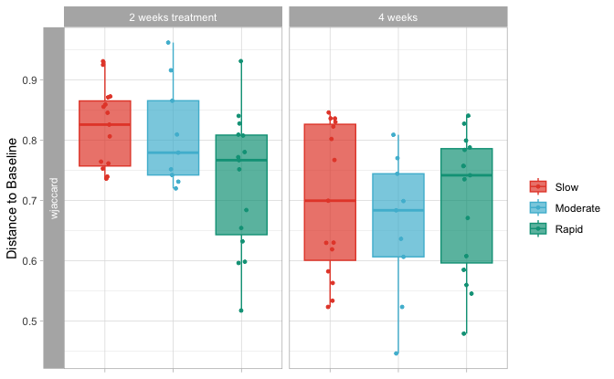


```r
ggpubr::compare_means(formula = as.formula(paste0("value ~ ", paste0("group_2"))),
                      group.by = c("dist_1", "time_2"),
                      data = topplot,
                      method = "wilcox.test",
                      # paired = TRUE,
                      p.adjust.method = "fdr") %>%
  select(-.y., -p.format, -p.signif) %>%
  arrange(p) %>%
  mutate(signif = ifelse(p.adj <= 0.05, 'SIGN', 'NS')) -> dist_box_stats

dist_box_stats %>% 
  DT::datatable()
```

```{=html}
<div class="datatables html-widget html-fill-item" id="htmlwidget-2514ce28ae593bde0f73" style="width:100%;height:auto;"></div>
<script type="application/json" data-for="htmlwidget-2514ce28ae593bde0f73">{"x":{"filter":"none","vertical":false,"data":[["1","2","3","4","5","6","7","8","9","10","11","12"],["wjaccard","aitch","wjaccard","wjaccard","wjaccard","aitch","wjaccard","wjaccard","aitch","aitch","aitch","aitch"],["2 weeks treatment","2 weeks treatment","2 weeks treatment","4 weeks","4 weeks","2 weeks treatment","2 weeks treatment","4 weeks","2 weeks treatment","4 weeks","4 weeks","4 weeks"],["Slow","Moderate","Moderate","Slow","Moderate","Slow","Slow","Slow","Slow","Slow","Slow","Moderate"],["Rapid","Rapid","Rapid","Moderate","Rapid","Moderate","Moderate","Rapid","Rapid","Moderate","Rapid","Rapid"],[0.05552963972090322,0.1936927152804121,0.2152284046549762,0.3871480376021395,0.4114832535885167,0.5194829231879978,0.5985220695309535,0.712965124764759,0.7437020653759808,0.9534364713224586,1,1],[0.67,0.86,0.86,0.99,0.99,0.99,0.99,0.99,0.99,1,1,1],["Wilcoxon","Wilcoxon","Wilcoxon","Wilcoxon","Wilcoxon","Wilcoxon","Wilcoxon","Wilcoxon","Wilcoxon","Wilcoxon","Wilcoxon","Wilcoxon"],["NS","NS","NS","NS","NS","NS","NS","NS","NS","NS","NS","NS"]],"container":"<table class=\"display\">\n  <thead>\n    <tr>\n      <th> <\/th>\n      <th>dist_1<\/th>\n      <th>time_2<\/th>\n      <th>group1<\/th>\n      <th>group2<\/th>\n      <th>p<\/th>\n      <th>p.adj<\/th>\n      <th>method<\/th>\n      <th>signif<\/th>\n    <\/tr>\n  <\/thead>\n<\/table>","options":{"columnDefs":[{"className":"dt-right","targets":[5,6]},{"orderable":false,"targets":0},{"name":" ","targets":0},{"name":"dist_1","targets":1},{"name":"time_2","targets":2},{"name":"group1","targets":3},{"name":"group2","targets":4},{"name":"p","targets":5},{"name":"p.adj","targets":6},{"name":"method","targets":7},{"name":"signif","targets":8}],"order":[],"autoWidth":false,"orderClasses":false}},"evals":[],"jsHooks":[]}</script>
```


```r
topplot %>% 
  filter(dist_1 == "wjaccard") %>%
  mutate(group_2 = factor(group_2, levels = c("Slow", "Moderate", "Rapid"))) %>% 
  ggplot(data = ., aes(x=time_2, y=value)) +
  geom_boxplot(outlier.colour = NA, alpha=0.7, aes(fill = time_2, color = time_2)) +
  # ggbeeswarm::geom_beeswarm(size=1, alpha=0.2,
  #                           position=position_jitterdodge(dodge.width=0.9)) +
  geom_jitter(size=1, position = position_jitterdodge(dodge.width=1),
              aes_string(color = "time_2")) + 
  facet_grid(as.formula(paste0("dist_1 ~ ",paste("group_2"))), scales = "free_y", space = "fixed", switch = "y") +
  scale_color_manual(name = "", values = time_pal,
                     na.value = "black") +
  scale_fill_manual(name = "", values = time_pal,
                    na.value = "black") +
  theme_light() + ylab("Distance to Baseline") + xlab(NULL) + theme(
    axis.text.x = element_blank()) -> dist_box2
# scale_shape_manual(name = "" ,values = c(15,16,18,19), na.value =  17) +

dist_box2
```

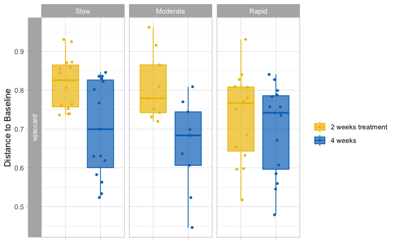


```r
ggpubr::compare_means(formula = as.formula(paste0("value ~ ", paste0("time_2"))),
                      group.by = c("dist_1", "group_1"),
                      data = topplot,
                      method = "wilcox.test",
                      # paired = TRUE,
                      p.adjust.method = "fdr") %>%
  select(-.y., -p.format, -p.signif) %>%
  arrange(p) %>%
  mutate(signif = ifelse(p.adj <= 0.05, 'SIGN', 'NS')) -> dist_box_stats2

dist_box_stats2 %>% 
  DT::datatable()
```

```{=html}
<div class="datatables html-widget html-fill-item" id="htmlwidget-5d05eac75555269eefd0" style="width:100%;height:auto;"></div>
<script type="application/json" data-for="htmlwidget-5d05eac75555269eefd0">{"x":{"filter":"none","vertical":false,"data":[["1","2","3","4","5","6"],["wjaccard","wjaccard","aitch","aitch","aitch","wjaccard"],["Moderate","Slow","Rapid","Moderate","Slow","Rapid"],["2 weeks treatment","2 weeks treatment","2 weeks treatment","2 weeks treatment","2 weeks treatment","2 weeks treatment"],["4 weeks","4 weeks","4 weeks","4 weeks","4 weeks","4 weeks"],[0.01061291649526944,0.01125600770306281,0.040839912860907,0.06252570958453312,0.08142934466719169,0.4362894275256592],[0.034,0.034,0.082,0.094,0.098,0.44],["Wilcoxon","Wilcoxon","Wilcoxon","Wilcoxon","Wilcoxon","Wilcoxon"],["SIGN","SIGN","NS","NS","NS","NS"]],"container":"<table class=\"display\">\n  <thead>\n    <tr>\n      <th> <\/th>\n      <th>dist_1<\/th>\n      <th>group_1<\/th>\n      <th>group1<\/th>\n      <th>group2<\/th>\n      <th>p<\/th>\n      <th>p.adj<\/th>\n      <th>method<\/th>\n      <th>signif<\/th>\n    <\/tr>\n  <\/thead>\n<\/table>","options":{"columnDefs":[{"className":"dt-right","targets":[5,6]},{"orderable":false,"targets":0},{"name":" ","targets":0},{"name":"dist_1","targets":1},{"name":"group_1","targets":2},{"name":"group1","targets":3},{"name":"group2","targets":4},{"name":"p","targets":5},{"name":"p.adj","targets":6},{"name":"method","targets":7},{"name":"signif","targets":8}],"order":[],"autoWidth":false,"orderClasses":false}},"evals":[],"jsHooks":[]}</script>
```


```r
bdiv$distbaseline <- list("dist_box" = dist_box,
                          "dist_box_stats" = dist_box_stats,
                          "dist_box2" = dist_box2,
                          "dist_box_stats2" = dist_box_stats2)
```


### Pairwise:

#### Within time points:

##### T1:


```r
physeq_rare %>% 
  subset_samples(time == "Baseline") -> physeq_tmp
```


```r
form = paste0(c("Group"), collapse=" * ")

lapply(
  dlist,
  FUN = phyloseq_adonis2,
  physeq = physeq_tmp,
  formula = form,
  nrep = 999,
  # strata = "id"
)  %>%
  bind_rows(.id = "Distance") %>% 
  mutate(time = "T1") %>% 
  mutate(comp = (as.vector(form))) -> perm_t1

perm_t1 %>% 
  mutate_if(is.numeric, round, 3) %>%
  filter(! terms %in% (c("Residual", "Total"))) %>%
  DT::datatable()
```

```{=html}
<div class="datatables html-widget html-fill-item" id="htmlwidget-7531f021030c44f57ef2" style="width:100%;height:auto;"></div>
<script type="application/json" data-for="htmlwidget-7531f021030c44f57ef2">{"x":{"filter":"none","vertical":false,"data":[["1","2","3","4","5"],["bray","sorensen","bjaccard","wjaccard","aitch"],["Group","Group","Group","Group","Group"],[2,2,2,2,2],[0.63,0.439,0.634,0.897,1.81],[0.061,0.056,0.055,0.058,0.055],[1.168,1.064,1.041,1.103,1.045],[0.079,0.254,0.235,0.109,0.213],["T1","T1","T1","T1","T1"],["Group","Group","Group","Group","Group"]],"container":"<table class=\"display\">\n  <thead>\n    <tr>\n      <th> <\/th>\n      <th>Distance<\/th>\n      <th>terms<\/th>\n      <th>Df<\/th>\n      <th>SumOfSqs<\/th>\n      <th>R2<\/th>\n      <th>F<\/th>\n      <th>Pr(&gt;F)<\/th>\n      <th>time<\/th>\n      <th>comp<\/th>\n    <\/tr>\n  <\/thead>\n<\/table>","options":{"columnDefs":[{"className":"dt-right","targets":[3,4,5,6,7]},{"orderable":false,"targets":0},{"name":" ","targets":0},{"name":"Distance","targets":1},{"name":"terms","targets":2},{"name":"Df","targets":3},{"name":"SumOfSqs","targets":4},{"name":"R2","targets":5},{"name":"F","targets":6},{"name":"Pr(>F)","targets":7},{"name":"time","targets":8},{"name":"comp","targets":9}],"order":[],"autoWidth":false,"orderClasses":false}},"evals":[],"jsHooks":[]}</script>
```


```r
lapply(
  dlist,
  FUN = physeq_pairwise_permanovas_adonis2,
  physeq = physeq_tmp,
  compare_header = "Group",
  n_perm = 999,
  strat = FALSE
) %>%
  bind_rows(.id = "Distance") %>% 
  mutate(group = "Baseline") -> pwperm_t1

pwperm_t1 %>% 
  mutate_if(is.numeric, round, 3) %>%
  # filter(! terms %in% (c("Residuals", "Total"))) %>%
  DT::datatable()
```

```{=html}
<div class="datatables html-widget html-fill-item" id="htmlwidget-983315589fed18d622a7" style="width:100%;height:auto;"></div>
<script type="application/json" data-for="htmlwidget-983315589fed18d622a7">{"x":{"filter":"none","vertical":false,"data":[["1","2","3","4","5","6","7","8","9","10","11","12","13","14","15"],["bray","bray","bray","sorensen","sorensen","sorensen","bjaccard","bjaccard","bjaccard","wjaccard","wjaccard","wjaccard","aitch","aitch","aitch"],["Slow","Slow","Moderate","Slow","Slow","Moderate","Slow","Slow","Moderate","Slow","Slow","Moderate","Slow","Slow","Moderate"],["Moderate","Rapid","Rapid","Moderate","Rapid","Rapid","Moderate","Rapid","Rapid","Moderate","Rapid","Rapid","Moderate","Rapid","Rapid"],[0.04,0.041,0.059,0.037,0.04,0.05,0.04,0.038,0.048,0.042,0.036,0.056,0.04,0.036,0.049],[0.714,0.098,0.022,0.877,0.128,0.109,0.895,0.135,0.132,0.586,0.255,0.014,0.802,0.201,0.06900000000000001],[2.142,0.294,0.066,2.631,0.384,0.327,2.685,0.405,0.396,1.758,0.765,0.042,2.406,0.603,0.207],[0.714,0.147,0.066,0.877,0.192,0.327,0.895,0.202,0.396,0.586,0.382,0.042,0.802,0.302,0.207],["Baseline","Baseline","Baseline","Baseline","Baseline","Baseline","Baseline","Baseline","Baseline","Baseline","Baseline","Baseline","Baseline","Baseline","Baseline"]],"container":"<table class=\"display\">\n  <thead>\n    <tr>\n      <th> <\/th>\n      <th>Distance<\/th>\n      <th>X1<\/th>\n      <th>X2<\/th>\n      <th>R2<\/th>\n      <th>pval<\/th>\n      <th>pvalBon<\/th>\n      <th>pvalFDR<\/th>\n      <th>group<\/th>\n    <\/tr>\n  <\/thead>\n<\/table>","options":{"columnDefs":[{"className":"dt-right","targets":[4,5,6,7]},{"orderable":false,"targets":0},{"name":" ","targets":0},{"name":"Distance","targets":1},{"name":"X1","targets":2},{"name":"X2","targets":3},{"name":"R2","targets":4},{"name":"pval","targets":5},{"name":"pvalBon","targets":6},{"name":"pvalFDR","targets":7},{"name":"group","targets":8}],"order":[],"autoWidth":false,"orderClasses":false}},"evals":[],"jsHooks":[]}</script>
```


```r
physeq_tmp %>% 
  phyloseq_plot_bdiv(dlist = dlist, # list of distance computed from a phyloseq object
                     ps_rare = ., # phyloseq object
                     m = "PCoA", # PCoA or NMDS
                     seed = 123, # for reproducibility
                     axis1 = 1, # axis to plot
                     axis2 = 2) -> plot_list
```

```
## [1] "bray"
## [1] "sorensen"
## [1] "bjaccard"
## [1] "wjaccard"
## [1] "aitch"
```


```r
plot_list %>%
  phyloseq_plot_ordinations_facet(color_group = "Group",
                                  shape_group = "time",
                                  alpha = NULL) + scale_color_manual(name = "", values = treat_pal,
                                                                     na.value = "black") +
  scale_fill_manual(name = "", values = treat_pal,
                    na.value = "black")  -> pcoas

pcoas
```

```
## Warning: No shared levels found between `names(values)` of the manual scale and the
## data's fill values.
```

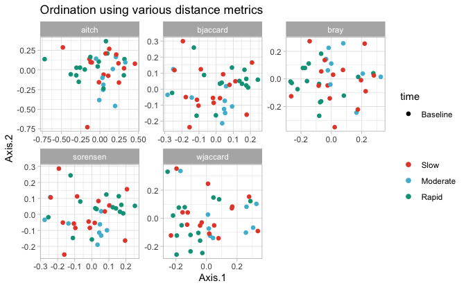


```r
plot_list %>%
  phyloseq_ordinations_expl_var() ->exp 
```

```
## New names:
## • `.id` -> `.id...1`
## • `V1` -> `V1...2`
## • `.id` -> `.id...3`
## • `V1` -> `V1...4`
```

```r
exp %>%
  DT::datatable()
```

```{=html}
<div class="datatables html-widget html-fill-item" id="htmlwidget-6f1d8b9e786d9d3fe28d" style="width:100%;height:auto;"></div>
<script type="application/json" data-for="htmlwidget-6f1d8b9e786d9d3fe28d">{"x":{"filter":"none","vertical":false,"data":[["1","2","3","4","5"],["bray","sorensen","bjaccard","wjaccard","aitch"],["Axis.1   [9.5%]","Axis.1   [9.8%]","Axis.1   [6.9%]","Axis.1   [7.5%]","Axis.1   [7%]"],["bray","sorensen","bjaccard","wjaccard","aitch"],["Axis.2   [7.9%]","Axis.2   [6.4%]","Axis.2   [4.9%]","Axis.2   [5.8%]","Axis.2   [5.3%]"]],"container":"<table class=\"display\">\n  <thead>\n    <tr>\n      <th> <\/th>\n      <th>.id...1<\/th>\n      <th>V1...2<\/th>\n      <th>.id...3<\/th>\n      <th>V1...4<\/th>\n    <\/tr>\n  <\/thead>\n<\/table>","options":{"columnDefs":[{"orderable":false,"targets":0},{"name":" ","targets":0},{"name":".id...1","targets":1},{"name":"V1...2","targets":2},{"name":".id...3","targets":3},{"name":"V1...4","targets":4}],"order":[],"autoWidth":false,"orderClasses":false}},"evals":[],"jsHooks":[]}</script>
```


```r
plot_list$wjaccard$layers[[1]] = NULL; plot_list$wjaccard$layers[[1]] = NULL
plot_list$wjaccard$layers[[2]] = NULL; plot_list$wjaccard$layers[[1]] = NULL

# plots_hall_humans$aichinson$layers[[1]] = NULL;plots_hall_humans$aichinson$layers[[1]] = NULL
# plots_hall_humans$aichinson$layers[[2]] = NULL;plots_hall_humans$aichinson$layers[[2]] = NULL

plot_list$wjaccard + geom_point(size = 3,
                                aes(colour = Group ,
                                    shape = time,
                                    alpha = NULL)) +
  geom_path(data = plot_list$wjaccard$data %>%
              arrange(Group) ,
            # aes(colour = Treatment, group = interaction(Model, Model2, Antibiotic, Treatment, Fermentation, Reactor,Antibiotic_mg.L)),
            aes(colour = Group, group = id),
            
            arrow = arrow(
              angle = 30, length = unit(0.15, "inches"),
              ends = "last", type = "open"
            ), linetype = "longdash", size = 0.1) +
  theme_light() +
  scale_color_manual(name = "", values = treat_pal,
                     na.value = "black") +
  scale_fill_manual(name = "", values = treat_pal,
                    na.value = "black") +
  # scale_shape_manual(name = "" ,values = c(15,16,18,19), na.value =  17) +
  theme(legend.position = "right")  -> PCOA

PCOA
```

```
## Warning: No shared levels found between `names(values)` of the manual scale and the
## data's fill values.
```

```
## `geom_path()`: Each group consists of only one observation.
## ℹ Do you need to adjust the group aesthetic?
```

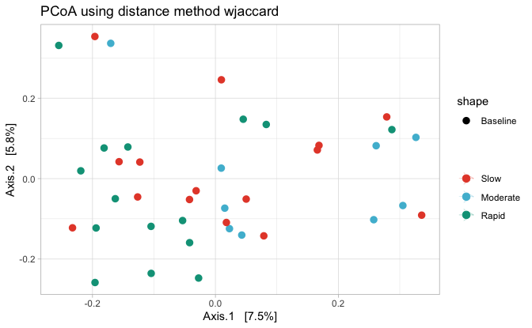


```r
PCOA + 
  scale_fill_manual(values = c("transparent")) + 
  scale_color_manual(values = c(rep("transparent", 3))) + 
  theme(panel.border = element_blank(), panel.grid.major = element_blank(),
        panel.grid.minor = element_blank(), axis.line = element_line(colour = "black")) -> empty_plot_tmp
```

```
## Scale for fill is already present.
## Adding another scale for fill, which will replace the existing scale.
## Scale for colour is already present.
## Adding another scale for colour, which will replace the existing scale.
```

```r
physeq_rare %>%
  phyloseq_add_taxa_vector_fix(phyloseq = .,
                               dist = dlist$wjaccard,
                               taxrank_glom = "Family",
                               figure_ord = empty_plot_tmp, 
                               fact = 0.2, pval_cutoff = 0.05,
                               top_r = 8) -> out #top 10 correlated genera

out$signenvfit %>% 
  DT::datatable()
```

```{=html}
<div class="datatables html-widget html-fill-item" id="htmlwidget-dcdfc64296f5794e54a4" style="width:100%;height:auto;"></div>
<script type="application/json" data-for="htmlwidget-dcdfc64296f5794e54a4">{"x":{"filter":"none","vertical":false,"data":[["ASV1","ASV2","ASV17","ASV12","ASV23","ASV33","ASV105","ASV107"],[0.6294127707889609,-0.655927671684904,0.2289043090812304,-0.2509090740817476,-0.3384992679956873,-0.3406537728917727,0.0003512844593163373,0.02605989603175538],[0.4847813461772582,0.3894620590529647,-0.3646760855408516,-0.380923769263725,-0.4132031018117213,0.2711911999997207,-0.4414779792328487,-0.4888089542256975],[0.001,0.001,0.001,0.001,0.001,0.001,0.001,0.001],[0.6311733896336715,0.5819218059237541,0.1853858300813539,0.2080582814466434,0.285318557780444,0.1895896599426879,0.194902929548291,0.239613311912406],["Bacteria","Bacteria","Bacteria","Bacteria","Bacteria","Bacteria","Bacteria","Bacteria"],["Proteobacteria","Firmicutes","Firmicutes","Bacteroidetes","Bacteroidetes","Firmicutes","Firmicutes","Firmicutes"],["Betaproteobacteria","Negativicutes","Bacilli","Bacteroidia","Flavobacteriia","Bacilli","Negativicutes","Clostridia"],["Burkholderiales","Veillonellales","Lactobacillales","Bacteroidales","Flavobacteriales","Bacillales","Selenomonadales","Clostridiales"],["Burkholderiaceae","Veillonellaceae","Streptococcaceae","Prevotellaceae","Flavobacteriaceae","Gemellaceae","Selenomonadaceae","Ruminococcaceae"],[null,null,null,null,null,null,null,null],[null,null,null,null,null,null,null,null],[null,null,null,null,null,null,null,null],[0.0048,0.0048,0.0048,0.0048,0.0048,0.0048,0.0048,0.0048]],"container":"<table class=\"display\">\n  <thead>\n    <tr>\n      <th> <\/th>\n      <th>Axis.1<\/th>\n      <th>Axis.2<\/th>\n      <th>pval<\/th>\n      <th>r<\/th>\n      <th>Kingdom<\/th>\n      <th>Phylum<\/th>\n      <th>Class<\/th>\n      <th>Order<\/th>\n      <th>tax_rank_plot<\/th>\n      <th>Genus<\/th>\n      <th>Species<\/th>\n      <th>Strain<\/th>\n      <th>pval.adj<\/th>\n    <\/tr>\n  <\/thead>\n<\/table>","options":{"columnDefs":[{"className":"dt-right","targets":[1,2,3,4,13]},{"orderable":false,"targets":0},{"name":" ","targets":0},{"name":"Axis.1","targets":1},{"name":"Axis.2","targets":2},{"name":"pval","targets":3},{"name":"r","targets":4},{"name":"Kingdom","targets":5},{"name":"Phylum","targets":6},{"name":"Class","targets":7},{"name":"Order","targets":8},{"name":"tax_rank_plot","targets":9},{"name":"Genus","targets":10},{"name":"Species","targets":11},{"name":"Strain","targets":12},{"name":"pval.adj","targets":13}],"order":[],"autoWidth":false,"orderClasses":false}},"evals":[],"jsHooks":[]}</script>
```


```r
out$vectors
```


```r
bdiv$T1 <-  list("pcoas" = pcoas,
                 "pcoas_exp_var" = exp,
                 "pcoa" = PCOA,
                 "envfit" = out$signenvfit,
                 "penvfit" = out$vectors,
                 "PW_permanovas"= pwperm_t1,
                 "Permanova" = perm_t1)
```

##### T2:


```r
physeq_rare %>% 
  subset_samples(time == "2 weeks treatment") -> physeq_tmp
```


```r
form = paste0(c("Group"), collapse=" * ")

lapply(
  dlist,
  FUN = phyloseq_adonis2,
  physeq = physeq_tmp,
  formula = form,
  nrep = 999,
  # strata = "id"
)  %>%
  bind_rows(.id = "Distance") %>% 
  mutate(time = "T2") %>% 
  mutate(comp = (as.vector(form))) -> perm_t2

perm_t2 %>% 
  mutate_if(is.numeric, round, 3) %>%
  filter(! terms %in% (c("Residual", "Total"))) %>%
  DT::datatable()
```

```{=html}
<div class="datatables html-widget html-fill-item" id="htmlwidget-873249b169eb6149d57e" style="width:100%;height:auto;"></div>
<script type="application/json" data-for="htmlwidget-873249b169eb6149d57e">{"x":{"filter":"none","vertical":false,"data":[["1","2","3","4","5"],["bray","sorensen","bjaccard","wjaccard","aitch"],["Group","Group","Group","Group","Group"],[2,2,2,2,2],[0.535,0.387,0.589,0.795,1.816],[0.047,0.044,0.047,0.048,0.048],[0.908,0.86,0.917,0.9419999999999999,0.9429999999999999],[0.801,0.925,0.926,0.778,0.828],["T2","T2","T2","T2","T2"],["Group","Group","Group","Group","Group"]],"container":"<table class=\"display\">\n  <thead>\n    <tr>\n      <th> <\/th>\n      <th>Distance<\/th>\n      <th>terms<\/th>\n      <th>Df<\/th>\n      <th>SumOfSqs<\/th>\n      <th>R2<\/th>\n      <th>F<\/th>\n      <th>Pr(&gt;F)<\/th>\n      <th>time<\/th>\n      <th>comp<\/th>\n    <\/tr>\n  <\/thead>\n<\/table>","options":{"columnDefs":[{"className":"dt-right","targets":[3,4,5,6,7]},{"orderable":false,"targets":0},{"name":" ","targets":0},{"name":"Distance","targets":1},{"name":"terms","targets":2},{"name":"Df","targets":3},{"name":"SumOfSqs","targets":4},{"name":"R2","targets":5},{"name":"F","targets":6},{"name":"Pr(>F)","targets":7},{"name":"time","targets":8},{"name":"comp","targets":9}],"order":[],"autoWidth":false,"orderClasses":false}},"evals":[],"jsHooks":[]}</script>
```


```r
lapply(
  dlist,
  FUN = physeq_pairwise_permanovas_adonis2,
  physeq = physeq_tmp,
  compare_header = "Group",
  n_perm = 999,
  strat = FALSE
) %>%
  bind_rows(.id = "Distance") %>%
  mutate(group = "T2") -> pwperm_t2

pwperm_t2 %>% 
  mutate_if(is.numeric, round, 3) %>%
  # filter(! terms %in% (c("Residuals", "Total"))) %>%
  DT::datatable()
```

```{=html}
<div class="datatables html-widget html-fill-item" id="htmlwidget-cbd3ad10bd2d35a2e76d" style="width:100%;height:auto;"></div>
<script type="application/json" data-for="htmlwidget-cbd3ad10bd2d35a2e76d">{"x":{"filter":"none","vertical":false,"data":[["1","2","3","4","5","6","7","8","9","10","11","12","13","14","15"],["bray","bray","bray","sorensen","sorensen","sorensen","bjaccard","bjaccard","bjaccard","wjaccard","wjaccard","wjaccard","aitch","aitch","aitch"],["Slow","Slow","Moderate","Slow","Slow","Moderate","Slow","Slow","Moderate","Slow","Slow","Moderate","Slow","Slow","Moderate"],["Moderate","Rapid","Rapid","Moderate","Rapid","Rapid","Moderate","Rapid","Rapid","Moderate","Rapid","Rapid","Moderate","Rapid","Rapid"],[0.036,0.034,0.036,0.033,0.032,0.036,0.036,0.033,0.039,0.038,0.033,0.039,0.038,0.034,0.039],[0.86,0.47,0.858,0.95,0.672,0.872,0.96,0.667,0.836,0.829,0.545,0.739,0.93,0.477,0.829],[2.58,1.41,2.574,2.85,2.016,2.616,2.88,2.001,2.508,2.487,1.635,2.217,2.79,1.431,2.487],[0.86,1.41,1.287,0.95,2.016,1.308,0.96,2.001,1.254,0.829,1.635,1.108,0.93,1.431,1.244],["T2","T2","T2","T2","T2","T2","T2","T2","T2","T2","T2","T2","T2","T2","T2"]],"container":"<table class=\"display\">\n  <thead>\n    <tr>\n      <th> <\/th>\n      <th>Distance<\/th>\n      <th>X1<\/th>\n      <th>X2<\/th>\n      <th>R2<\/th>\n      <th>pval<\/th>\n      <th>pvalBon<\/th>\n      <th>pvalFDR<\/th>\n      <th>group<\/th>\n    <\/tr>\n  <\/thead>\n<\/table>","options":{"columnDefs":[{"className":"dt-right","targets":[4,5,6,7]},{"orderable":false,"targets":0},{"name":" ","targets":0},{"name":"Distance","targets":1},{"name":"X1","targets":2},{"name":"X2","targets":3},{"name":"R2","targets":4},{"name":"pval","targets":5},{"name":"pvalBon","targets":6},{"name":"pvalFDR","targets":7},{"name":"group","targets":8}],"order":[],"autoWidth":false,"orderClasses":false}},"evals":[],"jsHooks":[]}</script>
```


```r
physeq_tmp %>% 
  phyloseq_plot_bdiv(dlist = dlist, # list of distance computed from a phyloseq object
                     ps_rare = ., # phyloseq object
                     m = "PCoA", # PCoA or NMDS
                     seed = 123, # for reproducibility
                     axis1 = 1, # axis to plot
                     axis2 = 2) -> plot_list
```

```
## [1] "bray"
## [1] "sorensen"
## [1] "bjaccard"
## [1] "wjaccard"
## [1] "aitch"
```


```r
plot_list %>%
  phyloseq_plot_ordinations_facet(color_group = "Group",
                                  shape_group = "time",
                                  alpha = NULL) + scale_color_manual(name = "", values = treat_pal,
                                                                     na.value = "black") +
  scale_fill_manual(name = "", values = treat_pal,
                    na.value = "black")  -> pcoas

pcoas
```

```
## Warning: No shared levels found between `names(values)` of the manual scale and the
## data's fill values.
```

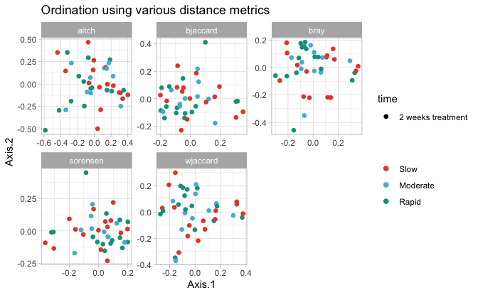


```r
plot_list %>%
  phyloseq_ordinations_expl_var() -> exp
```

```
## New names:
## • `.id` -> `.id...1`
## • `V1` -> `V1...2`
## • `.id` -> `.id...3`
## • `V1` -> `V1...4`
```

```r
exp %>%
  DT::datatable()
```

```{=html}
<div class="datatables html-widget html-fill-item" id="htmlwidget-f25d4e1770d66a86dcce" style="width:100%;height:auto;"></div>
<script type="application/json" data-for="htmlwidget-f25d4e1770d66a86dcce">{"x":{"filter":"none","vertical":false,"data":[["1","2","3","4","5"],["bray","sorensen","bjaccard","wjaccard","aitch"],["Axis.1   [9.8%]","Axis.1   [10%]","Axis.1   [6.9%]","Axis.1   [7.4%]","Axis.1   [6.2%]"],["bray","sorensen","bjaccard","wjaccard","aitch"],["Axis.2   [7.3%]","Axis.2   [7%]","Axis.2   [5.1%]","Axis.2   [5.5%]","Axis.2   [5.3%]"]],"container":"<table class=\"display\">\n  <thead>\n    <tr>\n      <th> <\/th>\n      <th>.id...1<\/th>\n      <th>V1...2<\/th>\n      <th>.id...3<\/th>\n      <th>V1...4<\/th>\n    <\/tr>\n  <\/thead>\n<\/table>","options":{"columnDefs":[{"orderable":false,"targets":0},{"name":" ","targets":0},{"name":".id...1","targets":1},{"name":"V1...2","targets":2},{"name":".id...3","targets":3},{"name":"V1...4","targets":4}],"order":[],"autoWidth":false,"orderClasses":false}},"evals":[],"jsHooks":[]}</script>
```


```r
plot_list$wjaccard$layers[[1]] = NULL; plot_list$wjaccard$layers[[1]] = NULL
plot_list$wjaccard$layers[[2]] = NULL; plot_list$wjaccard$layers[[1]] = NULL

# plots_hall_humans$aichinson$layers[[1]] = NULL;plots_hall_humans$aichinson$layers[[1]] = NULL
# plots_hall_humans$aichinson$layers[[2]] = NULL;plots_hall_humans$aichinson$layers[[2]] = NULL

plot_list$wjaccard + geom_point(size = 3,
                                aes(colour = Group ,
                                    shape = time,
                                    alpha = NULL)) +
  geom_path(data = plot_list$wjaccard$data %>%
              arrange(Group) ,
            # aes(colour = Treatment, group = interaction(Model, Model2, Antibiotic, Treatment, Fermentation, Reactor,Antibiotic_mg.L)),
            aes(colour = Group, group = id),
            
            arrow = arrow(
              angle = 30, length = unit(0.15, "inches"),
              ends = "last", type = "open"
            ), linetype = "longdash", size = 0.1) +
  theme_light() +
  scale_color_manual(name = "", values = treat_pal,
                     na.value = "black") +
  scale_fill_manual(name = "", values = treat_pal,
                    na.value = "black") +
  # scale_shape_manual(name = "" ,values = c(15,16,18,19), na.value =  17) +
  theme(legend.position = "right")  -> PCOA

PCOA
```

```
## Warning: No shared levels found between `names(values)` of the manual scale and the
## data's fill values.
```

```
## `geom_path()`: Each group consists of only one observation.
## ℹ Do you need to adjust the group aesthetic?
```

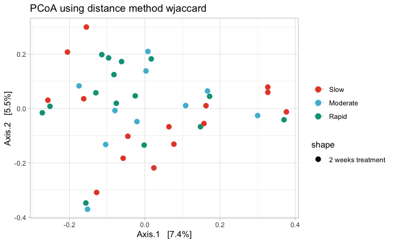


```r
PCOA + 
  scale_fill_manual(values = c("transparent")) + 
  scale_color_manual(values = c(rep("transparent", 3))) + 
  theme(panel.border = element_blank(), panel.grid.major = element_blank(),
        panel.grid.minor = element_blank(), axis.line = element_line(colour = "black")) -> empty_plot_tmp
```

```
## Scale for fill is already present.
## Adding another scale for fill, which will replace the existing scale.
## Scale for colour is already present.
## Adding another scale for colour, which will replace the existing scale.
```

```r
physeq_rare %>%
  phyloseq_add_taxa_vector_fix(phyloseq = .,
                               dist = dlist$wjaccard,
                               taxrank_glom = "Family",
                               figure_ord = empty_plot_tmp, 
                               fact = 0.2, pval_cutoff = 0.05,
                               top_r = 8) -> out #top 10 correlated genera

out$signenvfit %>% 
  DT::datatable()
```

```{=html}
<div class="datatables html-widget html-fill-item" id="htmlwidget-969965edfe9f869aa904" style="width:100%;height:auto;"></div>
<script type="application/json" data-for="htmlwidget-969965edfe9f869aa904">{"x":{"filter":"none","vertical":false,"data":[["ASV1","ASV2","ASV17","ASV12","ASV23","ASV33","ASV105","ASV107"],[0.6294127707889609,-0.655927671684904,0.2289043090812304,-0.2509090740817476,-0.3384992679956873,-0.3406537728917727,0.0003512844593163373,0.02605989603175538],[0.4847813461772582,0.3894620590529647,-0.3646760855408516,-0.380923769263725,-0.4132031018117213,0.2711911999997207,-0.4414779792328487,-0.4888089542256975],[0.001,0.001,0.001,0.001,0.001,0.001,0.001,0.001],[0.6311733896336715,0.5819218059237541,0.1853858300813539,0.2080582814466434,0.285318557780444,0.1895896599426879,0.194902929548291,0.239613311912406],["Bacteria","Bacteria","Bacteria","Bacteria","Bacteria","Bacteria","Bacteria","Bacteria"],["Proteobacteria","Firmicutes","Firmicutes","Bacteroidetes","Bacteroidetes","Firmicutes","Firmicutes","Firmicutes"],["Betaproteobacteria","Negativicutes","Bacilli","Bacteroidia","Flavobacteriia","Bacilli","Negativicutes","Clostridia"],["Burkholderiales","Veillonellales","Lactobacillales","Bacteroidales","Flavobacteriales","Bacillales","Selenomonadales","Clostridiales"],["Burkholderiaceae","Veillonellaceae","Streptococcaceae","Prevotellaceae","Flavobacteriaceae","Gemellaceae","Selenomonadaceae","Ruminococcaceae"],[null,null,null,null,null,null,null,null],[null,null,null,null,null,null,null,null],[null,null,null,null,null,null,null,null],[0.0048,0.0048,0.0048,0.0048,0.0048,0.0048,0.0048,0.0048]],"container":"<table class=\"display\">\n  <thead>\n    <tr>\n      <th> <\/th>\n      <th>Axis.1<\/th>\n      <th>Axis.2<\/th>\n      <th>pval<\/th>\n      <th>r<\/th>\n      <th>Kingdom<\/th>\n      <th>Phylum<\/th>\n      <th>Class<\/th>\n      <th>Order<\/th>\n      <th>tax_rank_plot<\/th>\n      <th>Genus<\/th>\n      <th>Species<\/th>\n      <th>Strain<\/th>\n      <th>pval.adj<\/th>\n    <\/tr>\n  <\/thead>\n<\/table>","options":{"columnDefs":[{"className":"dt-right","targets":[1,2,3,4,13]},{"orderable":false,"targets":0},{"name":" ","targets":0},{"name":"Axis.1","targets":1},{"name":"Axis.2","targets":2},{"name":"pval","targets":3},{"name":"r","targets":4},{"name":"Kingdom","targets":5},{"name":"Phylum","targets":6},{"name":"Class","targets":7},{"name":"Order","targets":8},{"name":"tax_rank_plot","targets":9},{"name":"Genus","targets":10},{"name":"Species","targets":11},{"name":"Strain","targets":12},{"name":"pval.adj","targets":13}],"order":[],"autoWidth":false,"orderClasses":false}},"evals":[],"jsHooks":[]}</script>
```


```r
out$vectors
```


```r
bdiv$T2 <-  list("pcoas" = pcoas,
                 "pcoas_exp_var" = exp,
                 "pcoa" = PCOA,
                 "envfit" = out$signenvfit,
                 "penvfit" = out$vectors,
                 "PW_permanovas"= pwperm_t2,
                 "Permanova" = perm_t2)
```

##### T3:


```r
physeq_rare %>% 
  subset_samples(time == "4 weeks") -> physeq_tmp
```


```r
form = paste0(c("Group"), collapse=" * ")

lapply(
  dlist,
  FUN = phyloseq_adonis2,
  physeq = physeq_tmp,
  formula = form,
  nrep = 999,
  # strata = "id"
)  %>%
  bind_rows(.id = "Distance") %>% 
  mutate(time = "T3") %>% 
  mutate(comp = (as.vector(form))) -> perm_t3

perm_t3 %>% 
  mutate_if(is.numeric, round, 3) %>%
  filter(! terms %in% (c("Residual", "Total"))) %>%
  DT::datatable()
```

```{=html}
<div class="datatables html-widget html-fill-item" id="htmlwidget-450f171f14364aa3ebed" style="width:100%;height:auto;"></div>
<script type="application/json" data-for="htmlwidget-450f171f14364aa3ebed">{"x":{"filter":"none","vertical":false,"data":[["1","2","3","4","5"],["bray","sorensen","bjaccard","wjaccard","aitch"],["Group","Group","Group","Group","Group"],[2,2,2,2,2],[0.506,0.392,0.593,0.762,1.629],[0.047,0.048,0.05,0.048,0.051],[0.92,0.9350000000000001,0.964,0.924,0.987],[0.774,0.708,0.718,0.87,0.53],["T3","T3","T3","T3","T3"],["Group","Group","Group","Group","Group"]],"container":"<table class=\"display\">\n  <thead>\n    <tr>\n      <th> <\/th>\n      <th>Distance<\/th>\n      <th>terms<\/th>\n      <th>Df<\/th>\n      <th>SumOfSqs<\/th>\n      <th>R2<\/th>\n      <th>F<\/th>\n      <th>Pr(&gt;F)<\/th>\n      <th>time<\/th>\n      <th>comp<\/th>\n    <\/tr>\n  <\/thead>\n<\/table>","options":{"columnDefs":[{"className":"dt-right","targets":[3,4,5,6,7]},{"orderable":false,"targets":0},{"name":" ","targets":0},{"name":"Distance","targets":1},{"name":"terms","targets":2},{"name":"Df","targets":3},{"name":"SumOfSqs","targets":4},{"name":"R2","targets":5},{"name":"F","targets":6},{"name":"Pr(>F)","targets":7},{"name":"time","targets":8},{"name":"comp","targets":9}],"order":[],"autoWidth":false,"orderClasses":false}},"evals":[],"jsHooks":[]}</script>
```


```r
lapply(
  dlist,
  FUN = physeq_pairwise_permanovas_adonis2,
  physeq = physeq_tmp,
  compare_header = "Group",
  n_perm = 999,
  strat = FALSE
) %>%
  bind_rows(.id = "Distance") %>% 
  mutate(group = "T3") -> pwperm_t3

pwperm_t3 %>% 
  mutate_if(is.numeric, round, 3) %>%
  # filter(! terms %in% (c("Residuals", "Total"))) %>%
  DT::datatable()
```

```{=html}
<div class="datatables html-widget html-fill-item" id="htmlwidget-fbfc52d82635d988c6e1" style="width:100%;height:auto;"></div>
<script type="application/json" data-for="htmlwidget-fbfc52d82635d988c6e1">{"x":{"filter":"none","vertical":false,"data":[["1","2","3","4","5","6","7","8","9","10","11","12","13","14","15"],["bray","bray","bray","sorensen","sorensen","sorensen","bjaccard","bjaccard","bjaccard","wjaccard","wjaccard","wjaccard","aitch","aitch","aitch"],["Slow","Slow","Moderate","Slow","Slow","Moderate","Slow","Slow","Moderate","Slow","Slow","Moderate","Slow","Slow","Moderate"],["Moderate","Rapid","Rapid","Moderate","Rapid","Rapid","Moderate","Rapid","Rapid","Moderate","Rapid","Rapid","Moderate","Rapid","Rapid"],[0.034,0.035,0.039,0.034,0.036,0.038,0.037,0.036,0.039,0.037,0.031,0.041,0.037,0.038,0.04],[0.9360000000000001,0.399,0.679,0.9350000000000001,0.289,0.748,0.922,0.281,0.782,0.868,0.819,0.55,0.926,0.155,0.6929999999999999],[2.808,1.197,2.037,2.805,0.867,2.244,2.766,0.843,2.346,2.604,2.457,1.65,2.778,0.465,2.079],[0.9360000000000001,1.197,1.018,0.9350000000000001,0.867,1.122,0.922,0.843,1.173,0.868,1.228,1.65,0.926,0.465,1.039],["T3","T3","T3","T3","T3","T3","T3","T3","T3","T3","T3","T3","T3","T3","T3"]],"container":"<table class=\"display\">\n  <thead>\n    <tr>\n      <th> <\/th>\n      <th>Distance<\/th>\n      <th>X1<\/th>\n      <th>X2<\/th>\n      <th>R2<\/th>\n      <th>pval<\/th>\n      <th>pvalBon<\/th>\n      <th>pvalFDR<\/th>\n      <th>group<\/th>\n    <\/tr>\n  <\/thead>\n<\/table>","options":{"columnDefs":[{"className":"dt-right","targets":[4,5,6,7]},{"orderable":false,"targets":0},{"name":" ","targets":0},{"name":"Distance","targets":1},{"name":"X1","targets":2},{"name":"X2","targets":3},{"name":"R2","targets":4},{"name":"pval","targets":5},{"name":"pvalBon","targets":6},{"name":"pvalFDR","targets":7},{"name":"group","targets":8}],"order":[],"autoWidth":false,"orderClasses":false}},"evals":[],"jsHooks":[]}</script>
```


```r
physeq_tmp %>% 
  phyloseq_plot_bdiv(dlist = dlist, # list of distance computed from a phyloseq object
                     ps_rare = ., # phyloseq object
                     m = "PCoA", # PCoA or NMDS
                     seed = 123, # for reproducibility
                     axis1 = 1, # axis to plot
                     axis2 = 2) -> plot_list
```

```
## [1] "bray"
## [1] "sorensen"
## [1] "bjaccard"
## [1] "wjaccard"
## [1] "aitch"
```


```r
plot_list %>%
  phyloseq_plot_ordinations_facet(color_group = "Group",
                                  shape_group = "time",
                                  alpha = NULL) + scale_color_manual(name = "", values = treat_pal,
                                                                     na.value = "black") +
  scale_fill_manual(name = "", values = treat_pal,
                    na.value = "black")  -> pcoas

pcoas
```

```
## Warning: No shared levels found between `names(values)` of the manual scale and the
## data's fill values.
```

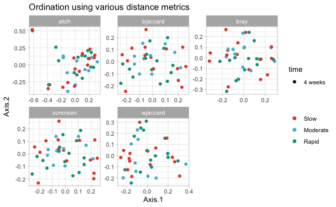


```r
plot_list %>%
  phyloseq_ordinations_expl_var() -> exp
```

```
## New names:
## • `.id` -> `.id...1`
## • `V1` -> `V1...2`
## • `.id` -> `.id...3`
## • `V1` -> `V1...4`
```

```r
exp %>%
  DT::datatable()
```

```{=html}
<div class="datatables html-widget html-fill-item" id="htmlwidget-2f4c52b7f36e26c300a7" style="width:100%;height:auto;"></div>
<script type="application/json" data-for="htmlwidget-2f4c52b7f36e26c300a7">{"x":{"filter":"none","vertical":false,"data":[["1","2","3","4","5"],["bray","sorensen","bjaccard","wjaccard","aitch"],["Axis.1   [9.4%]","Axis.1   [10.1%]","Axis.1   [7%]","Axis.1   [6.9%]","Axis.1   [7%]"],["bray","sorensen","bjaccard","wjaccard","aitch"],["Axis.2   [7%]","Axis.2   [6%]","Axis.2   [4.6%]","Axis.2   [5.1%]","Axis.2   [5.7%]"]],"container":"<table class=\"display\">\n  <thead>\n    <tr>\n      <th> <\/th>\n      <th>.id...1<\/th>\n      <th>V1...2<\/th>\n      <th>.id...3<\/th>\n      <th>V1...4<\/th>\n    <\/tr>\n  <\/thead>\n<\/table>","options":{"columnDefs":[{"orderable":false,"targets":0},{"name":" ","targets":0},{"name":".id...1","targets":1},{"name":"V1...2","targets":2},{"name":".id...3","targets":3},{"name":"V1...4","targets":4}],"order":[],"autoWidth":false,"orderClasses":false}},"evals":[],"jsHooks":[]}</script>
```


```r
plot_list$wjaccard$layers[[1]] = NULL; plot_list$wjaccard$layers[[1]] = NULL
plot_list$wjaccard$layers[[2]] = NULL; plot_list$wjaccard$layers[[1]] = NULL

# plots_hall_humans$aichinson$layers[[1]] = NULL;plots_hall_humans$aichinson$layers[[1]] = NULL
# plots_hall_humans$aichinson$layers[[2]] = NULL;plots_hall_humans$aichinson$layers[[2]] = NULL

plot_list$wjaccard + geom_point(size = 3,
                                aes(colour = Group ,
                                    shape = time,
                                    alpha = NULL)) +
  geom_path(data = plot_list$wjaccard$data %>%
              arrange(Group) ,
            # aes(colour = Treatment, group = interaction(Model, Model2, Antibiotic, Treatment, Fermentation, Reactor,Antibiotic_mg.L)),
            aes(colour = Group, group = id),
            
            arrow = arrow(
              angle = 30, length = unit(0.15, "inches"),
              ends = "last", type = "open"
            ), linetype = "longdash", size = 0.1) +
  theme_light() +
  scale_color_manual(name = "", values = treat_pal,
                     na.value = "black") +
  scale_fill_manual(name = "", values = treat_pal,
                    na.value = "black") +
  # scale_shape_manual(name = "" ,values = c(15,16,18,19), na.value =  17) +
  theme(legend.position = "right")  -> PCOA

PCOA
```

```
## Warning: No shared levels found between `names(values)` of the manual scale and the
## data's fill values.
```

```
## `geom_path()`: Each group consists of only one observation.
## ℹ Do you need to adjust the group aesthetic?
```

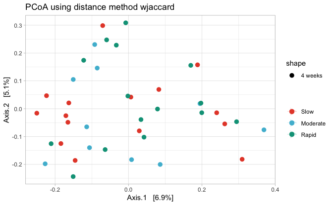


```r
PCOA + 
  scale_fill_manual(values = c("transparent")) + 
  scale_color_manual(values = c(rep("transparent", 3))) + 
  theme(panel.border = element_blank(), panel.grid.major = element_blank(),
        panel.grid.minor = element_blank(), axis.line = element_line(colour = "black")) -> empty_plot_tmp
```

```
## Scale for fill is already present.
## Adding another scale for fill, which will replace the existing scale.
## Scale for colour is already present.
## Adding another scale for colour, which will replace the existing scale.
```

```r
physeq_rare %>%
  phyloseq_add_taxa_vector_fix(phyloseq = .,
                               dist = dlist$wjaccard,
                               taxrank_glom = "Family",
                               figure_ord = empty_plot_tmp, 
                               fact = 0.2, pval_cutoff = 0.05,
                               top_r = 8) -> out #top 10 correlated genera

out$signenvfit %>% 
  DT::datatable()
```

```{=html}
<div class="datatables html-widget html-fill-item" id="htmlwidget-1d5df3d80f5735caaf13" style="width:100%;height:auto;"></div>
<script type="application/json" data-for="htmlwidget-1d5df3d80f5735caaf13">{"x":{"filter":"none","vertical":false,"data":[["ASV1","ASV2","ASV17","ASV12","ASV23","ASV33","ASV105","ASV107"],[0.6294127707889609,-0.655927671684904,0.2289043090812304,-0.2509090740817476,-0.3384992679956873,-0.3406537728917727,0.0003512844593163373,0.02605989603175538],[0.4847813461772582,0.3894620590529647,-0.3646760855408516,-0.380923769263725,-0.4132031018117213,0.2711911999997207,-0.4414779792328487,-0.4888089542256975],[0.001,0.001,0.001,0.001,0.001,0.001,0.001,0.001],[0.6311733896336715,0.5819218059237541,0.1853858300813539,0.2080582814466434,0.285318557780444,0.1895896599426879,0.194902929548291,0.239613311912406],["Bacteria","Bacteria","Bacteria","Bacteria","Bacteria","Bacteria","Bacteria","Bacteria"],["Proteobacteria","Firmicutes","Firmicutes","Bacteroidetes","Bacteroidetes","Firmicutes","Firmicutes","Firmicutes"],["Betaproteobacteria","Negativicutes","Bacilli","Bacteroidia","Flavobacteriia","Bacilli","Negativicutes","Clostridia"],["Burkholderiales","Veillonellales","Lactobacillales","Bacteroidales","Flavobacteriales","Bacillales","Selenomonadales","Clostridiales"],["Burkholderiaceae","Veillonellaceae","Streptococcaceae","Prevotellaceae","Flavobacteriaceae","Gemellaceae","Selenomonadaceae","Ruminococcaceae"],[null,null,null,null,null,null,null,null],[null,null,null,null,null,null,null,null],[null,null,null,null,null,null,null,null],[0.0048,0.0048,0.0048,0.0048,0.0048,0.0048,0.0048,0.0048]],"container":"<table class=\"display\">\n  <thead>\n    <tr>\n      <th> <\/th>\n      <th>Axis.1<\/th>\n      <th>Axis.2<\/th>\n      <th>pval<\/th>\n      <th>r<\/th>\n      <th>Kingdom<\/th>\n      <th>Phylum<\/th>\n      <th>Class<\/th>\n      <th>Order<\/th>\n      <th>tax_rank_plot<\/th>\n      <th>Genus<\/th>\n      <th>Species<\/th>\n      <th>Strain<\/th>\n      <th>pval.adj<\/th>\n    <\/tr>\n  <\/thead>\n<\/table>","options":{"columnDefs":[{"className":"dt-right","targets":[1,2,3,4,13]},{"orderable":false,"targets":0},{"name":" ","targets":0},{"name":"Axis.1","targets":1},{"name":"Axis.2","targets":2},{"name":"pval","targets":3},{"name":"r","targets":4},{"name":"Kingdom","targets":5},{"name":"Phylum","targets":6},{"name":"Class","targets":7},{"name":"Order","targets":8},{"name":"tax_rank_plot","targets":9},{"name":"Genus","targets":10},{"name":"Species","targets":11},{"name":"Strain","targets":12},{"name":"pval.adj","targets":13}],"order":[],"autoWidth":false,"orderClasses":false}},"evals":[],"jsHooks":[]}</script>
```


```r
out$vectors
```


```r
bdiv$T3 <-  list("pcoas" = pcoas,
                 "pcoas_exp_var" = exp,
                 "pcoa" = PCOA,
                 "envfit" = out$signenvfit,
                 "penvfit" = out$vectors,
                 "PW_permanovas" = pwperm_t3,
                 "Permanova" = perm_t3)
```


#### Within groups:

##### Slow:


```r
physeq_rare %>% 
  subset_samples(Group  == "Slow") -> physeq_tmp

lapply(
  dlist,
  FUN = physeq_pairwise_permanovas_adonis2,
  physeq = physeq_tmp,
  compare_header = "time",
  n_perm = 999,
  strat = FALSE
) %>%
  bind_rows(.id = "Distance") %>% 
  mutate(group = "Slow") -> pwperm_slow

pwperm_slow %>% 
  mutate_if(is.numeric, round, 3) %>%
  # filter(! terms %in% (c("Residuals", "Total"))) %>%
  DT::datatable()
```

```{=html}
<div class="datatables html-widget html-fill-item" id="htmlwidget-67c25ca3336b15b0293a" style="width:100%;height:auto;"></div>
<script type="application/json" data-for="htmlwidget-67c25ca3336b15b0293a">{"x":{"filter":"none","vertical":false,"data":[["1","2","3","4","5","6","7","8","9","10","11","12","13","14","15"],["bray","bray","bray","sorensen","sorensen","sorensen","bjaccard","bjaccard","bjaccard","wjaccard","wjaccard","wjaccard","aitch","aitch","aitch"],["Baseline","Baseline","2 weeks treatment","Baseline","Baseline","2 weeks treatment","Baseline","Baseline","2 weeks treatment","Baseline","Baseline","2 weeks treatment","Baseline","Baseline","2 weeks treatment"],["2 weeks treatment","4 weeks","4 weeks","2 weeks treatment","4 weeks","4 weeks","2 weeks treatment","4 weeks","4 weeks","2 weeks treatment","4 weeks","4 weeks","2 weeks treatment","4 weeks","4 weeks"],[0.057,0.016,0.045,0.052,0.018,0.042,0.042,0.021,0.036,0.044,0.021,0.037,0.044,0.02,0.037],[0.006,0.997,0.08699999999999999,0.018,0.991,0.157,0.082,0.999,0.365,0.029,0.999,0.24,0.064,0.998,0.316],[0.018,2.991,0.261,0.054,2.973,0.471,0.246,2.997,1.095,0.08699999999999999,2.997,0.72,0.192,2.994,0.948],[0.018,0.997,0.13,0.054,0.991,0.236,0.246,0.999,0.547,0.08699999999999999,0.999,0.36,0.192,0.998,0.474],["Slow","Slow","Slow","Slow","Slow","Slow","Slow","Slow","Slow","Slow","Slow","Slow","Slow","Slow","Slow"]],"container":"<table class=\"display\">\n  <thead>\n    <tr>\n      <th> <\/th>\n      <th>Distance<\/th>\n      <th>X1<\/th>\n      <th>X2<\/th>\n      <th>R2<\/th>\n      <th>pval<\/th>\n      <th>pvalBon<\/th>\n      <th>pvalFDR<\/th>\n      <th>group<\/th>\n    <\/tr>\n  <\/thead>\n<\/table>","options":{"columnDefs":[{"className":"dt-right","targets":[4,5,6,7]},{"orderable":false,"targets":0},{"name":" ","targets":0},{"name":"Distance","targets":1},{"name":"X1","targets":2},{"name":"X2","targets":3},{"name":"R2","targets":4},{"name":"pval","targets":5},{"name":"pvalBon","targets":6},{"name":"pvalFDR","targets":7},{"name":"group","targets":8}],"order":[],"autoWidth":false,"orderClasses":false}},"evals":[],"jsHooks":[]}</script>
```


```r
form = paste0(c("time"), collapse=" * ")

lapply(
  dlist,
  FUN = phyloseq_adonis2,
  physeq = physeq_tmp,
  formula = form,
  nrep = 999,
  # strata = "id"
)  %>%
  bind_rows(.id = "Distance") %>% 
  mutate(group = "Slow") %>% 
  mutate(comp = (as.vector(form))) -> perm_slow

perm_slow %>% 
  mutate_if(is.numeric, round, 3) %>%
  filter(! terms %in% (c("Residual", "Total"))) %>%
  DT::datatable()
```

```{=html}
<div class="datatables html-widget html-fill-item" id="htmlwidget-530a78b6872d546cc16a" style="width:100%;height:auto;"></div>
<script type="application/json" data-for="htmlwidget-530a78b6872d546cc16a">{"x":{"filter":"none","vertical":false,"data":[["1","2","3","4","5"],["bray","sorensen","bjaccard","wjaccard","aitch"],["time","time","time","time","time"],[2,2,2,2,2],[0.6820000000000001,0.49,0.61,0.839,1.667],[0.053,0.05,0.043,0.045,0.045],[1.165,1.098,0.955,0.995,0.986],[0.157,0.277,0.603,0.489,0.518],["Slow","Slow","Slow","Slow","Slow"],["time","time","time","time","time"]],"container":"<table class=\"display\">\n  <thead>\n    <tr>\n      <th> <\/th>\n      <th>Distance<\/th>\n      <th>terms<\/th>\n      <th>Df<\/th>\n      <th>SumOfSqs<\/th>\n      <th>R2<\/th>\n      <th>F<\/th>\n      <th>Pr(&gt;F)<\/th>\n      <th>group<\/th>\n      <th>comp<\/th>\n    <\/tr>\n  <\/thead>\n<\/table>","options":{"columnDefs":[{"className":"dt-right","targets":[3,4,5,6,7]},{"orderable":false,"targets":0},{"name":" ","targets":0},{"name":"Distance","targets":1},{"name":"terms","targets":2},{"name":"Df","targets":3},{"name":"SumOfSqs","targets":4},{"name":"R2","targets":5},{"name":"F","targets":6},{"name":"Pr(>F)","targets":7},{"name":"group","targets":8},{"name":"comp","targets":9}],"order":[],"autoWidth":false,"orderClasses":false}},"evals":[],"jsHooks":[]}</script>
```


```r
physeq_tmp %>% 
  phyloseq_plot_bdiv(dlist = dlist, # list of distance computed from a phyloseq object
                     ps_rare = ., # phyloseq object
                     m = "PCoA", # PCoA or NMDS
                     seed = 123, # for reproducibility
                     axis1 = 1, # axis to plot
                     axis2 = 2) -> plot_list
```

```
## [1] "bray"
## [1] "sorensen"
## [1] "bjaccard"
## [1] "wjaccard"
## [1] "aitch"
```


```r
plot_list %>%
  phyloseq_plot_ordinations_facet(color_group = "time",
                                  shape_group = NULL,
                                  alpha = NULL) +
  scale_color_manual(name = "", values = time_pal,
                     na.value = "black") +
  scale_fill_manual(name = "", values = time_pal,
                    na.value = "black") -> pcoas

pcoas
```

```
## Warning: No shared levels found between `names(values)` of the manual scale and the
## data's fill values.
```

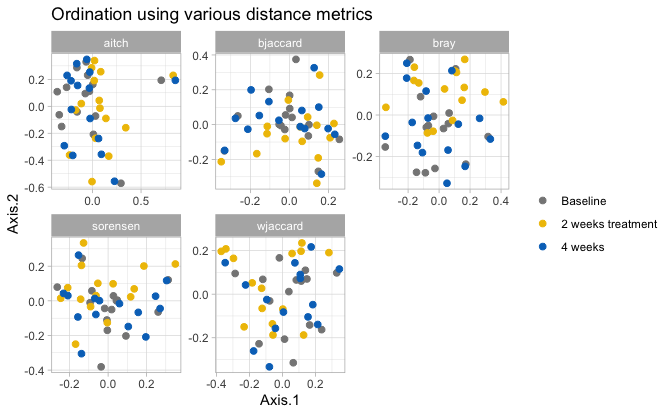


```r
plot_list %>%
  phyloseq_ordinations_expl_var() -> exp
```

```
## New names:
## • `.id` -> `.id...1`
## • `V1` -> `V1...2`
## • `.id` -> `.id...3`
## • `V1` -> `V1...4`
```

```r
exp %>%
  DT::datatable()
```

```{=html}
<div class="datatables html-widget html-fill-item" id="htmlwidget-4cadc5f8c7ab9ff923ac" style="width:100%;height:auto;"></div>
<script type="application/json" data-for="htmlwidget-4cadc5f8c7ab9ff923ac">{"x":{"filter":"none","vertical":false,"data":[["1","2","3","4","5"],["bray","sorensen","bjaccard","wjaccard","aitch"],["Axis.1   [11.1%]","Axis.1   [11.7%]","Axis.1   [8.3%]","Axis.1   [8%]","Axis.1   [8.6%]"],["bray","sorensen","bjaccard","wjaccard","aitch"],["Axis.2   [9.4%]","Axis.2   [9.5%]","Axis.2   [7%]","Axis.2   [5.8%]","Axis.2   [8%]"]],"container":"<table class=\"display\">\n  <thead>\n    <tr>\n      <th> <\/th>\n      <th>.id...1<\/th>\n      <th>V1...2<\/th>\n      <th>.id...3<\/th>\n      <th>V1...4<\/th>\n    <\/tr>\n  <\/thead>\n<\/table>","options":{"columnDefs":[{"orderable":false,"targets":0},{"name":" ","targets":0},{"name":".id...1","targets":1},{"name":"V1...2","targets":2},{"name":".id...3","targets":3},{"name":"V1...4","targets":4}],"order":[],"autoWidth":false,"orderClasses":false}},"evals":[],"jsHooks":[]}</script>
```


```r
plot_list$wjaccard$layers[[1]] = NULL; plot_list$wjaccard$layers[[1]] = NULL
plot_list$wjaccard$layers[[2]] = NULL; plot_list$wjaccard$layers[[1]] = NULL

# plots_hall_humans$aichinson$layers[[1]] = NULL;plots_hall_humans$aichinson$layers[[1]] = NULL
# plots_hall_humans$aichinson$layers[[2]] = NULL;plots_hall_humans$aichinson$layers[[2]] = NULL

plot_list$wjaccard + geom_point(size = 3,
                                aes(colour = time ,
                                    shape = NULL,
                                    alpha = NULL)) +
  geom_path(data = plot_list$wjaccard$data %>%
              arrange(Group) ,
            # aes(colour = Treatment, group = interaction(Model, Model2, Antibiotic, Treatment, Fermentation, Reactor,Antibiotic_mg.L)),
            aes(colour = Group, group = id),
            
            arrow = arrow(
              angle = 30, length = unit(0.15, "inches"),
              ends = "last", type = "open"
            ), linetype = "longdash", size = 0.1) +
  theme_light() +
  scale_color_manual(name = "", values = time_pal,
                     na.value = "black") +
  scale_fill_manual(name = "", values = time_pal,
                    na.value = "black") +
  # scale_shape_manual(name = "" ,values = c(15,16,18,19), na.value =  17) +
  theme(legend.position = "right")  -> PCOA

PCOA
```

```
## Warning: No shared levels found between `names(values)` of the manual scale and the
## data's fill values.
```

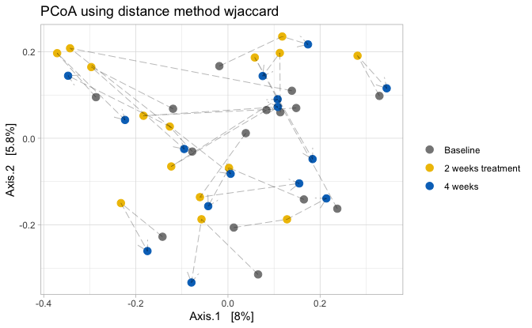


```r
PCOA + 
  scale_fill_manual(values = c("transparent")) + 
  scale_color_manual(values = c(rep("transparent", 3))) + 
  theme(panel.border = element_blank(), panel.grid.major = element_blank(),
        panel.grid.minor = element_blank(), axis.line = element_line(colour = "black")) -> empty_plot_tmp
```

```
## Scale for fill is already present.
## Adding another scale for fill, which will replace the existing scale.
## Scale for colour is already present.
## Adding another scale for colour, which will replace the existing scale.
```

```r
physeq_rare %>%
  phyloseq_add_taxa_vector_fix(phyloseq = .,
                               dist = dlist$wjaccard,
                               taxrank_glom = "Family",
                               figure_ord = empty_plot_tmp, 
                               fact = 0.2, pval_cutoff = 0.05,
                               top_r = 8) -> out #top 10 correlated genera

out$signenvfit %>% 
  DT::datatable()
```

```{=html}
<div class="datatables html-widget html-fill-item" id="htmlwidget-fc8df40fd67c2027a709" style="width:100%;height:auto;"></div>
<script type="application/json" data-for="htmlwidget-fc8df40fd67c2027a709">{"x":{"filter":"none","vertical":false,"data":[["ASV1","ASV2","ASV17","ASV12","ASV23","ASV33","ASV105","ASV107"],[0.6294127707889609,-0.655927671684904,0.2289043090812304,-0.2509090740817476,-0.3384992679956873,-0.3406537728917727,0.0003512844593163373,0.02605989603175538],[0.4847813461772582,0.3894620590529647,-0.3646760855408516,-0.380923769263725,-0.4132031018117213,0.2711911999997207,-0.4414779792328487,-0.4888089542256975],[0.001,0.001,0.001,0.001,0.001,0.001,0.001,0.001],[0.6311733896336715,0.5819218059237541,0.1853858300813539,0.2080582814466434,0.285318557780444,0.1895896599426879,0.194902929548291,0.239613311912406],["Bacteria","Bacteria","Bacteria","Bacteria","Bacteria","Bacteria","Bacteria","Bacteria"],["Proteobacteria","Firmicutes","Firmicutes","Bacteroidetes","Bacteroidetes","Firmicutes","Firmicutes","Firmicutes"],["Betaproteobacteria","Negativicutes","Bacilli","Bacteroidia","Flavobacteriia","Bacilli","Negativicutes","Clostridia"],["Burkholderiales","Veillonellales","Lactobacillales","Bacteroidales","Flavobacteriales","Bacillales","Selenomonadales","Clostridiales"],["Burkholderiaceae","Veillonellaceae","Streptococcaceae","Prevotellaceae","Flavobacteriaceae","Gemellaceae","Selenomonadaceae","Ruminococcaceae"],[null,null,null,null,null,null,null,null],[null,null,null,null,null,null,null,null],[null,null,null,null,null,null,null,null],[0.0048,0.0048,0.0048,0.0048,0.0048,0.0048,0.0048,0.0048]],"container":"<table class=\"display\">\n  <thead>\n    <tr>\n      <th> <\/th>\n      <th>Axis.1<\/th>\n      <th>Axis.2<\/th>\n      <th>pval<\/th>\n      <th>r<\/th>\n      <th>Kingdom<\/th>\n      <th>Phylum<\/th>\n      <th>Class<\/th>\n      <th>Order<\/th>\n      <th>tax_rank_plot<\/th>\n      <th>Genus<\/th>\n      <th>Species<\/th>\n      <th>Strain<\/th>\n      <th>pval.adj<\/th>\n    <\/tr>\n  <\/thead>\n<\/table>","options":{"columnDefs":[{"className":"dt-right","targets":[1,2,3,4,13]},{"orderable":false,"targets":0},{"name":" ","targets":0},{"name":"Axis.1","targets":1},{"name":"Axis.2","targets":2},{"name":"pval","targets":3},{"name":"r","targets":4},{"name":"Kingdom","targets":5},{"name":"Phylum","targets":6},{"name":"Class","targets":7},{"name":"Order","targets":8},{"name":"tax_rank_plot","targets":9},{"name":"Genus","targets":10},{"name":"Species","targets":11},{"name":"Strain","targets":12},{"name":"pval.adj","targets":13}],"order":[],"autoWidth":false,"orderClasses":false}},"evals":[],"jsHooks":[]}</script>
```


```r
out$vectors
```

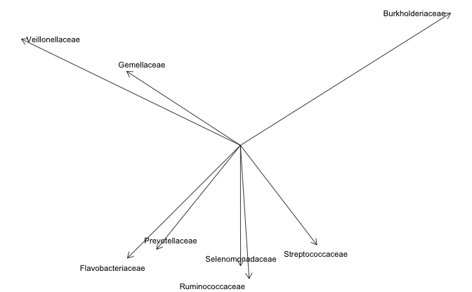


```r
bdiv$slow <-  list("pcoas" = pcoas,
                   "pcoas_exp_var" = exp,
                   "pcoa" = PCOA,
                   "envfit" = out$signenvfit,
                   "penvfit" = out$vectors,
                   "PWpermanovas"= pwperm_slow,
                   "PERMANOVA" = perm_slow)
```


##### Intermediate:


```r
physeq_rare %>% 
  subset_samples(Group == "Moderate") -> physeq_tmp

lapply(
  dlist,
  FUN = physeq_pairwise_permanovas_adonis2,
  physeq = physeq_tmp,
  compare_header = "time",
  n_perm = 999,
  strat = FALSE
) %>%
  bind_rows(.id = "Distance") %>% 
  mutate(group = "Intermediate") -> pwperm_int

pwperm_int %>% 
  mutate_if(is.numeric, round, 3) %>%
  # filter(! terms %in% (c("Residuals", "Total"))) %>%
  DT::datatable()
```

```{=html}
<div class="datatables html-widget html-fill-item" id="htmlwidget-d8c7d17cf4080686b93c" style="width:100%;height:auto;"></div>
<script type="application/json" data-for="htmlwidget-d8c7d17cf4080686b93c">{"x":{"filter":"none","vertical":false,"data":[["1","2","3","4","5","6","7","8","9","10","11","12","13","14","15"],["bray","bray","bray","sorensen","sorensen","sorensen","bjaccard","bjaccard","bjaccard","wjaccard","wjaccard","wjaccard","aitch","aitch","aitch"],["Baseline","Baseline","2 weeks treatment","Baseline","Baseline","2 weeks treatment","Baseline","Baseline","2 weeks treatment","Baseline","Baseline","2 weeks treatment","Baseline","Baseline","2 weeks treatment"],["2 weeks treatment","4 weeks","4 weeks","2 weeks treatment","4 weeks","4 weeks","2 weeks treatment","4 weeks","4 weeks","2 weeks treatment","4 weeks","4 weeks","2 weeks treatment","4 weeks","4 weeks"],[0.076,0.028,0.064,0.068,0.023,0.051,0.059,0.031,0.047,0.06900000000000001,0.04,0.058,0.058,0.029,0.05],[0.047,0.984,0.162,0.179,0.996,0.549,0.33,0.998,0.751,0.059,0.9409999999999999,0.208,0.399,0.998,0.592],[0.141,2.952,0.486,0.537,2.988,1.647,0.99,2.994,2.253,0.177,2.823,0.624,1.197,2.994,1.776],[0.141,0.984,0.243,0.537,0.996,0.824,0.99,0.998,1.127,0.177,0.9409999999999999,0.312,1.197,0.998,0.888],["Intermediate","Intermediate","Intermediate","Intermediate","Intermediate","Intermediate","Intermediate","Intermediate","Intermediate","Intermediate","Intermediate","Intermediate","Intermediate","Intermediate","Intermediate"]],"container":"<table class=\"display\">\n  <thead>\n    <tr>\n      <th> <\/th>\n      <th>Distance<\/th>\n      <th>X1<\/th>\n      <th>X2<\/th>\n      <th>R2<\/th>\n      <th>pval<\/th>\n      <th>pvalBon<\/th>\n      <th>pvalFDR<\/th>\n      <th>group<\/th>\n    <\/tr>\n  <\/thead>\n<\/table>","options":{"columnDefs":[{"className":"dt-right","targets":[4,5,6,7]},{"orderable":false,"targets":0},{"name":" ","targets":0},{"name":"Distance","targets":1},{"name":"X1","targets":2},{"name":"X2","targets":3},{"name":"R2","targets":4},{"name":"pval","targets":5},{"name":"pvalBon","targets":6},{"name":"pvalFDR","targets":7},{"name":"group","targets":8}],"order":[],"autoWidth":false,"orderClasses":false}},"evals":[],"jsHooks":[]}</script>
```


```r
form = paste0(c("time"), collapse=" * ")

lapply(
  dlist,
  FUN = phyloseq_adonis2,
  physeq = physeq_tmp,
  formula = form,
  nrep = 999,
  # strata = "id"
)  %>%
  bind_rows(.id = "Distance") %>% 
  mutate(group = "Intermediate") %>% 
  mutate(comp = (as.vector(form))) -> perm_int

perm_int %>% 
  mutate_if(is.numeric, round, 3) %>%
  filter(! terms %in% (c("Residual", "Total"))) %>%
  DT::datatable()
```

```{=html}
<div class="datatables html-widget html-fill-item" id="htmlwidget-fbc9973e359619ea20b8" style="width:100%;height:auto;"></div>
<script type="application/json" data-for="htmlwidget-fbc9973e359619ea20b8">{"x":{"filter":"none","vertical":false,"data":[["1","2","3","4","5"],["bray","sorensen","bjaccard","wjaccard","aitch"],["time","time","time","time","time"],[2,2,2,2,2],[0.552,0.358,0.507,0.827,1.452],[0.075,0.063,0.06,0.074,0.061],[1.052,0.874,0.833,1.033,0.839],[0.368,0.743,0.902,0.354,0.844],["Intermediate","Intermediate","Intermediate","Intermediate","Intermediate"],["time","time","time","time","time"]],"container":"<table class=\"display\">\n  <thead>\n    <tr>\n      <th> <\/th>\n      <th>Distance<\/th>\n      <th>terms<\/th>\n      <th>Df<\/th>\n      <th>SumOfSqs<\/th>\n      <th>R2<\/th>\n      <th>F<\/th>\n      <th>Pr(&gt;F)<\/th>\n      <th>group<\/th>\n      <th>comp<\/th>\n    <\/tr>\n  <\/thead>\n<\/table>","options":{"columnDefs":[{"className":"dt-right","targets":[3,4,5,6,7]},{"orderable":false,"targets":0},{"name":" ","targets":0},{"name":"Distance","targets":1},{"name":"terms","targets":2},{"name":"Df","targets":3},{"name":"SumOfSqs","targets":4},{"name":"R2","targets":5},{"name":"F","targets":6},{"name":"Pr(>F)","targets":7},{"name":"group","targets":8},{"name":"comp","targets":9}],"order":[],"autoWidth":false,"orderClasses":false}},"evals":[],"jsHooks":[]}</script>
```


```r
physeq_tmp %>% 
  phyloseq_plot_bdiv(dlist = dlist, # list of distance computed from a phyloseq object
                     ps_rare = ., # phyloseq object
                     m = "PCoA", # PCoA or NMDS
                     seed = 123, # for reproducibility
                     axis1 = 1, # axis to plot
                     axis2 = 2) -> plot_list
```

```
## [1] "bray"
## [1] "sorensen"
## [1] "bjaccard"
## [1] "wjaccard"
## [1] "aitch"
```


```r
plot_list %>%
  phyloseq_plot_ordinations_facet(color_group = "time",
                                  shape_group = NULL,
                                  alpha = NULL) +
  scale_color_manual(name = "", values = time_pal,
                     na.value = "black") +
  scale_fill_manual(name = "", values = time_pal,
                    na.value = "black") -> pcoas

pcoas
```

```
## Warning: No shared levels found between `names(values)` of the manual scale and the
## data's fill values.
```

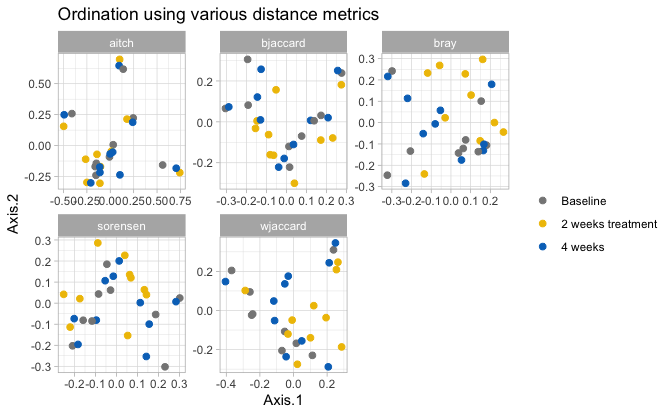


```r
plot_list %>%
  phyloseq_ordinations_expl_var() -> exp
```

```
## New names:
## • `.id` -> `.id...1`
## • `V1` -> `V1...2`
## • `.id` -> `.id...3`
## • `V1` -> `V1...4`
```

```r
exp %>%
  DT::datatable()
```

```{=html}
<div class="datatables html-widget html-fill-item" id="htmlwidget-fc9c72093435cc6a0a18" style="width:100%;height:auto;"></div>
<script type="application/json" data-for="htmlwidget-fc9c72093435cc6a0a18">{"x":{"filter":"none","vertical":false,"data":[["1","2","3","4","5"],["bray","sorensen","bjaccard","wjaccard","aitch"],["Axis.1   [11.9%]","Axis.1   [12.3%]","Axis.1   [9.4%]","Axis.1   [9.9%]","Axis.1   [10.6%]"],["bray","sorensen","bjaccard","wjaccard","aitch"],["Axis.2   [10.9%]","Axis.2   [10.4%]","Axis.2   [8.2%]","Axis.2   [8.6%]","Axis.2   [9.4%]"]],"container":"<table class=\"display\">\n  <thead>\n    <tr>\n      <th> <\/th>\n      <th>.id...1<\/th>\n      <th>V1...2<\/th>\n      <th>.id...3<\/th>\n      <th>V1...4<\/th>\n    <\/tr>\n  <\/thead>\n<\/table>","options":{"columnDefs":[{"orderable":false,"targets":0},{"name":" ","targets":0},{"name":".id...1","targets":1},{"name":"V1...2","targets":2},{"name":".id...3","targets":3},{"name":"V1...4","targets":4}],"order":[],"autoWidth":false,"orderClasses":false}},"evals":[],"jsHooks":[]}</script>
```


```r
plot_list$wjaccard$layers[[1]] = NULL; plot_list$wjaccard$layers[[1]] = NULL
plot_list$wjaccard$layers[[2]] = NULL; plot_list$wjaccard$layers[[1]] = NULL

# plots_hall_humans$aichinson$layers[[1]] = NULL;plots_hall_humans$aichinson$layers[[1]] = NULL
# plots_hall_humans$aichinson$layers[[2]] = NULL;plots_hall_humans$aichinson$layers[[2]] = NULL

plot_list$wjaccard + geom_point(size = 3,
                                aes(colour = time ,
                                    shape = NULL,
                                    alpha = NULL)) +
  geom_path(data = plot_list$wjaccard$data %>%
              arrange(Group) ,
            # aes(colour = Treatment, group = interaction(Model, Model2, Antibiotic, Treatment, Fermentation, Reactor,Antibiotic_mg.L)),
            aes(colour = Group, group = id),
            
            arrow = arrow(
              angle = 30, length = unit(0.15, "inches"),
              ends = "last", type = "open"
            ), linetype = "longdash", size = 0.1) +
  theme_light() +
  scale_color_manual(name = "", values = time_pal,
                     na.value = "black") +
  scale_fill_manual(name = "", values = time_pal,
                    na.value = "black") +
  # scale_shape_manual(name = "" ,values = c(15,16,18,19), na.value =  17) +
  theme(legend.position = "right")  -> PCOA

PCOA
```

```
## Warning: No shared levels found between `names(values)` of the manual scale and the
## data's fill values.
```

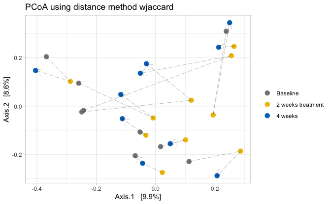


```r
PCOA + 
  scale_fill_manual(values = c("transparent")) + 
  scale_color_manual(values = c(rep("transparent", 3))) + 
  theme(panel.border = element_blank(), panel.grid.major = element_blank(),
        panel.grid.minor = element_blank(), axis.line = element_line(colour = "black")) -> empty_plot_tmp
```

```
## Scale for fill is already present.
## Adding another scale for fill, which will replace the existing scale.
## Scale for colour is already present.
## Adding another scale for colour, which will replace the existing scale.
```

```r
physeq_rare %>%
  phyloseq_add_taxa_vector_fix(phyloseq = .,
                               dist = dlist$wjaccard,
                               taxrank_glom = "Family",
                               figure_ord = empty_plot_tmp, 
                               fact = 0.2, pval_cutoff = 0.05,
                               top_r = 8) -> out #top 10 correlated genera

out$signenvfit %>% 
  DT::datatable()
```

```{=html}
<div class="datatables html-widget html-fill-item" id="htmlwidget-33198698d6599fd3fc97" style="width:100%;height:auto;"></div>
<script type="application/json" data-for="htmlwidget-33198698d6599fd3fc97">{"x":{"filter":"none","vertical":false,"data":[["ASV1","ASV2","ASV17","ASV12","ASV23","ASV33","ASV105","ASV107"],[0.6294127707889609,-0.655927671684904,0.2289043090812304,-0.2509090740817476,-0.3384992679956873,-0.3406537728917727,0.0003512844593163373,0.02605989603175538],[0.4847813461772582,0.3894620590529647,-0.3646760855408516,-0.380923769263725,-0.4132031018117213,0.2711911999997207,-0.4414779792328487,-0.4888089542256975],[0.001,0.001,0.001,0.001,0.001,0.001,0.001,0.001],[0.6311733896336715,0.5819218059237541,0.1853858300813539,0.2080582814466434,0.285318557780444,0.1895896599426879,0.194902929548291,0.239613311912406],["Bacteria","Bacteria","Bacteria","Bacteria","Bacteria","Bacteria","Bacteria","Bacteria"],["Proteobacteria","Firmicutes","Firmicutes","Bacteroidetes","Bacteroidetes","Firmicutes","Firmicutes","Firmicutes"],["Betaproteobacteria","Negativicutes","Bacilli","Bacteroidia","Flavobacteriia","Bacilli","Negativicutes","Clostridia"],["Burkholderiales","Veillonellales","Lactobacillales","Bacteroidales","Flavobacteriales","Bacillales","Selenomonadales","Clostridiales"],["Burkholderiaceae","Veillonellaceae","Streptococcaceae","Prevotellaceae","Flavobacteriaceae","Gemellaceae","Selenomonadaceae","Ruminococcaceae"],[null,null,null,null,null,null,null,null],[null,null,null,null,null,null,null,null],[null,null,null,null,null,null,null,null],[0.0048,0.0048,0.0048,0.0048,0.0048,0.0048,0.0048,0.0048]],"container":"<table class=\"display\">\n  <thead>\n    <tr>\n      <th> <\/th>\n      <th>Axis.1<\/th>\n      <th>Axis.2<\/th>\n      <th>pval<\/th>\n      <th>r<\/th>\n      <th>Kingdom<\/th>\n      <th>Phylum<\/th>\n      <th>Class<\/th>\n      <th>Order<\/th>\n      <th>tax_rank_plot<\/th>\n      <th>Genus<\/th>\n      <th>Species<\/th>\n      <th>Strain<\/th>\n      <th>pval.adj<\/th>\n    <\/tr>\n  <\/thead>\n<\/table>","options":{"columnDefs":[{"className":"dt-right","targets":[1,2,3,4,13]},{"orderable":false,"targets":0},{"name":" ","targets":0},{"name":"Axis.1","targets":1},{"name":"Axis.2","targets":2},{"name":"pval","targets":3},{"name":"r","targets":4},{"name":"Kingdom","targets":5},{"name":"Phylum","targets":6},{"name":"Class","targets":7},{"name":"Order","targets":8},{"name":"tax_rank_plot","targets":9},{"name":"Genus","targets":10},{"name":"Species","targets":11},{"name":"Strain","targets":12},{"name":"pval.adj","targets":13}],"order":[],"autoWidth":false,"orderClasses":false}},"evals":[],"jsHooks":[]}</script>
```


```r
out$vectors
```


```r
bdiv$int <-  list("pcoas" = pcoas,
                  "pcoas_exp_var" = exp,
                  "pcoa" = PCOA,
                  "envfit" = out$signenvfit,
                  "penvfit" = out$vectors,
                  "PWpermanovas"= pwperm_int,
                  "PERMANOVA" = perm_int)
```


##### Fast:


```r
physeq_rare %>% 
  subset_samples(Group == "Rapid") -> physeq_tmp


lapply(
  dlist,
  FUN = physeq_pairwise_permanovas_adonis2,
  physeq = physeq_tmp,
  compare_header = "time",
  n_perm = 999,
  strat = FALSE
) %>%
  bind_rows(.id = "Distance") %>% 
  mutate(group = "Fast") -> pwperm_fst

pwperm_fst %>% 
  mutate_if(is.numeric, round, 3) %>%
  # filter(! terms %in% (c("Residuals", "Total"))) %>%
  DT::datatable()
```

```{=html}
<div class="datatables html-widget html-fill-item" id="htmlwidget-38c86864160d6d855a80" style="width:100%;height:auto;"></div>
<script type="application/json" data-for="htmlwidget-38c86864160d6d855a80">{"x":{"filter":"none","vertical":false,"data":[["1","2","3","4","5","6","7","8","9","10","11","12","13","14","15"],["bray","bray","bray","sorensen","sorensen","sorensen","bjaccard","bjaccard","bjaccard","wjaccard","wjaccard","wjaccard","aitch","aitch","aitch"],["Baseline","Baseline","2 weeks treatment","Baseline","Baseline","2 weeks treatment","Baseline","Baseline","2 weeks treatment","Baseline","Baseline","2 weeks treatment","Baseline","Baseline","2 weeks treatment"],["2 weeks treatment","4 weeks","4 weeks","2 weeks treatment","4 weeks","4 weeks","2 weeks treatment","4 weeks","4 weeks","2 weeks treatment","4 weeks","4 weeks","2 weeks treatment","4 weeks","4 weeks"],[0.033,0.021,0.047,0.03,0.017,0.038,0.029,0.019,0.035,0.032,0.027,0.042,0.028,0.019,0.038],[0.573,0.981,0.049,0.6879999999999999,0.996,0.306,0.863,0.998,0.44,0.725,0.955,0.043,0.874,0.995,0.252],[1.719,2.943,0.147,2.064,2.988,0.918,2.589,2.994,1.32,2.175,2.865,0.129,2.622,2.985,0.756],[0.859,0.981,0.147,1.032,0.996,0.918,1.294,0.998,1.32,1.087,0.955,0.129,1.311,0.995,0.756],["Fast","Fast","Fast","Fast","Fast","Fast","Fast","Fast","Fast","Fast","Fast","Fast","Fast","Fast","Fast"]],"container":"<table class=\"display\">\n  <thead>\n    <tr>\n      <th> <\/th>\n      <th>Distance<\/th>\n      <th>X1<\/th>\n      <th>X2<\/th>\n      <th>R2<\/th>\n      <th>pval<\/th>\n      <th>pvalBon<\/th>\n      <th>pvalFDR<\/th>\n      <th>group<\/th>\n    <\/tr>\n  <\/thead>\n<\/table>","options":{"columnDefs":[{"className":"dt-right","targets":[4,5,6,7]},{"orderable":false,"targets":0},{"name":" ","targets":0},{"name":"Distance","targets":1},{"name":"X1","targets":2},{"name":"X2","targets":3},{"name":"R2","targets":4},{"name":"pval","targets":5},{"name":"pvalBon","targets":6},{"name":"pvalFDR","targets":7},{"name":"group","targets":8}],"order":[],"autoWidth":false,"orderClasses":false}},"evals":[],"jsHooks":[]}</script>
```


```r
form = paste0(c("time"), collapse=" * ")

lapply(
  dlist,
  FUN = phyloseq_adonis2,
  physeq = physeq_tmp,
  formula = form,
  nrep = 999,
  # strata = "id"
)  %>%
  bind_rows(.id = "Distance") %>% 
  mutate(group = "Fast") %>% 
  mutate(comp = (as.vector(form))) -> perm_fst

perm_fst %>% 
  mutate_if(is.numeric, round, 3) %>%
  filter(! terms %in% (c("Residual", "Total"))) %>%
  DT::datatable()
```

```{=html}
<div class="datatables html-widget html-fill-item" id="htmlwidget-d96970b9501c191ad406" style="width:100%;height:auto;"></div>
<script type="application/json" data-for="htmlwidget-d96970b9501c191ad406">{"x":{"filter":"none","vertical":false,"data":[["1","2","3","4","5"],["bray","sorensen","bjaccard","wjaccard","aitch"],["time","time","time","time","time"],[2,2,2,2,2],[0.55,0.344,0.488,0.801,1.527],[0.045,0.038,0.036,0.044,0.037],[0.99,0.82,0.794,0.967,0.8149999999999999],[0.505,0.866,0.958,0.577,0.905],["Fast","Fast","Fast","Fast","Fast"],["time","time","time","time","time"]],"container":"<table class=\"display\">\n  <thead>\n    <tr>\n      <th> <\/th>\n      <th>Distance<\/th>\n      <th>terms<\/th>\n      <th>Df<\/th>\n      <th>SumOfSqs<\/th>\n      <th>R2<\/th>\n      <th>F<\/th>\n      <th>Pr(&gt;F)<\/th>\n      <th>group<\/th>\n      <th>comp<\/th>\n    <\/tr>\n  <\/thead>\n<\/table>","options":{"columnDefs":[{"className":"dt-right","targets":[3,4,5,6,7]},{"orderable":false,"targets":0},{"name":" ","targets":0},{"name":"Distance","targets":1},{"name":"terms","targets":2},{"name":"Df","targets":3},{"name":"SumOfSqs","targets":4},{"name":"R2","targets":5},{"name":"F","targets":6},{"name":"Pr(>F)","targets":7},{"name":"group","targets":8},{"name":"comp","targets":9}],"order":[],"autoWidth":false,"orderClasses":false}},"evals":[],"jsHooks":[]}</script>
```


```r
physeq_tmp %>% 
  phyloseq_plot_bdiv(dlist = dlist, # list of distance computed from a phyloseq object
                     ps_rare = ., # phyloseq object
                     m = "PCoA", # PCoA or NMDS
                     seed = 123, # for reproducibility
                     axis1 = 1, # axis to plot
                     axis2 = 2) -> plot_list
```

```
## [1] "bray"
## [1] "sorensen"
## [1] "bjaccard"
## [1] "wjaccard"
## [1] "aitch"
```


```r
plot_list %>%
  phyloseq_plot_ordinations_facet(color_group = "time",
                                  shape_group = NULL,
                                  alpha = NULL) +
  scale_color_manual(name = "", values = time_pal,
                     na.value = "black") +
  scale_fill_manual(name = "", values = time_pal,
                    na.value = "black") -> pcoas

pcoas
```

```
## Warning: No shared levels found between `names(values)` of the manual scale and the
## data's fill values.
```

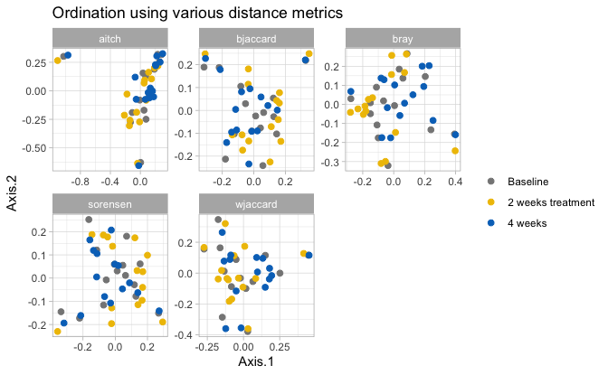


```r
plot_list %>%
  phyloseq_ordinations_expl_var() -> exp
```

```
## New names:
## • `.id` -> `.id...1`
## • `V1` -> `V1...2`
## • `.id` -> `.id...3`
## • `V1` -> `V1...4`
```

```r
exp %>%
  DT::datatable()
```

```{=html}
<div class="datatables html-widget html-fill-item" id="htmlwidget-bbf49928d385f1dd9e5c" style="width:100%;height:auto;"></div>
<script type="application/json" data-for="htmlwidget-bbf49928d385f1dd9e5c">{"x":{"filter":"none","vertical":false,"data":[["1","2","3","4","5"],["bray","sorensen","bjaccard","wjaccard","aitch"],["Axis.1   [11.1%]","Axis.1   [12%]","Axis.1   [8.5%]","Axis.1   [7.1%]","Axis.1   [10.2%]"],["bray","sorensen","bjaccard","wjaccard","aitch"],["Axis.2   [8.6%]","Axis.2   [8.3%]","Axis.2   [6.4%]","Axis.2   [7%]","Axis.2   [7.1%]"]],"container":"<table class=\"display\">\n  <thead>\n    <tr>\n      <th> <\/th>\n      <th>.id...1<\/th>\n      <th>V1...2<\/th>\n      <th>.id...3<\/th>\n      <th>V1...4<\/th>\n    <\/tr>\n  <\/thead>\n<\/table>","options":{"columnDefs":[{"orderable":false,"targets":0},{"name":" ","targets":0},{"name":".id...1","targets":1},{"name":"V1...2","targets":2},{"name":".id...3","targets":3},{"name":"V1...4","targets":4}],"order":[],"autoWidth":false,"orderClasses":false}},"evals":[],"jsHooks":[]}</script>
```


```r
plot_list$wjaccard$layers[[1]] = NULL; plot_list$wjaccard$layers[[1]] = NULL
plot_list$wjaccard$layers[[2]] = NULL; plot_list$wjaccard$layers[[1]] = NULL

# plots_hall_humans$aichinson$layers[[1]] = NULL;plots_hall_humans$aichinson$layers[[1]] = NULL
# plots_hall_humans$aichinson$layers[[2]] = NULL;plots_hall_humans$aichinson$layers[[2]] = NULL

plot_list$wjaccard + geom_point(size = 3,
                                aes(colour = time ,
                                    shape = NULL,
                                    alpha = NULL)) +
  geom_path(data = plot_list$wjaccard$data %>%
              arrange(Group) ,
            # aes(colour = Treatment, group = interaction(Model, Model2, Antibiotic, Treatment, Fermentation, Reactor,Antibiotic_mg.L)),
            aes(colour = Group, group = id),
            
            arrow = arrow(
              angle = 30, length = unit(0.15, "inches"),
              ends = "last", type = "open"
            ), linetype = "longdash", size = 0.1) +
  theme_light() +
  scale_color_manual(name = "", values = time_pal,
                     na.value = "black") +
  scale_fill_manual(name = "", values = time_pal,
                    na.value = "black") +
  # scale_shape_manual(name = "" ,values = c(15,16,18,19), na.value =  17) +
  theme(legend.position = "right")  -> PCOA

PCOA
```

```
## Warning: No shared levels found between `names(values)` of the manual scale and the
## data's fill values.
```

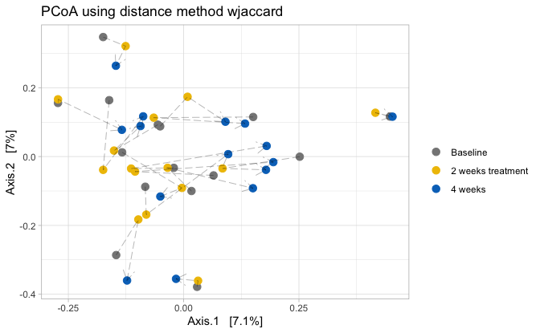


```r
PCOA + 
  scale_fill_manual(values = c("transparent")) + 
  scale_color_manual(values = c(rep("transparent", 3))) + 
  theme(panel.border = element_blank(), panel.grid.major = element_blank(),
        panel.grid.minor = element_blank(), axis.line = element_line(colour = "black")) -> empty_plot_tmp
```

```
## Scale for fill is already present.
## Adding another scale for fill, which will replace the existing scale.
## Scale for colour is already present.
## Adding another scale for colour, which will replace the existing scale.
```

```r
physeq_rare %>%
  phyloseq_add_taxa_vector_fix(phyloseq = .,
                               dist = dlist$wjaccard,
                               taxrank_glom = "Family",
                               figure_ord = empty_plot_tmp, 
                               fact = 0.2, pval_cutoff = 0.05,
                               top_r = 8) -> out #top 10 correlated genera

out$signenvfit %>% 
  DT::datatable()
```

```{=html}
<div class="datatables html-widget html-fill-item" id="htmlwidget-90bfa43893a2d8eda041" style="width:100%;height:auto;"></div>
<script type="application/json" data-for="htmlwidget-90bfa43893a2d8eda041">{"x":{"filter":"none","vertical":false,"data":[["ASV1","ASV2","ASV17","ASV12","ASV23","ASV33","ASV105","ASV107"],[0.6294127707889609,-0.655927671684904,0.2289043090812304,-0.2509090740817476,-0.3384992679956873,-0.3406537728917727,0.0003512844593163373,0.02605989603175538],[0.4847813461772582,0.3894620590529647,-0.3646760855408516,-0.380923769263725,-0.4132031018117213,0.2711911999997207,-0.4414779792328487,-0.4888089542256975],[0.001,0.001,0.001,0.001,0.001,0.001,0.001,0.001],[0.6311733896336715,0.5819218059237541,0.1853858300813539,0.2080582814466434,0.285318557780444,0.1895896599426879,0.194902929548291,0.239613311912406],["Bacteria","Bacteria","Bacteria","Bacteria","Bacteria","Bacteria","Bacteria","Bacteria"],["Proteobacteria","Firmicutes","Firmicutes","Bacteroidetes","Bacteroidetes","Firmicutes","Firmicutes","Firmicutes"],["Betaproteobacteria","Negativicutes","Bacilli","Bacteroidia","Flavobacteriia","Bacilli","Negativicutes","Clostridia"],["Burkholderiales","Veillonellales","Lactobacillales","Bacteroidales","Flavobacteriales","Bacillales","Selenomonadales","Clostridiales"],["Burkholderiaceae","Veillonellaceae","Streptococcaceae","Prevotellaceae","Flavobacteriaceae","Gemellaceae","Selenomonadaceae","Ruminococcaceae"],[null,null,null,null,null,null,null,null],[null,null,null,null,null,null,null,null],[null,null,null,null,null,null,null,null],[0.0048,0.0048,0.0048,0.0048,0.0048,0.0048,0.0048,0.0048]],"container":"<table class=\"display\">\n  <thead>\n    <tr>\n      <th> <\/th>\n      <th>Axis.1<\/th>\n      <th>Axis.2<\/th>\n      <th>pval<\/th>\n      <th>r<\/th>\n      <th>Kingdom<\/th>\n      <th>Phylum<\/th>\n      <th>Class<\/th>\n      <th>Order<\/th>\n      <th>tax_rank_plot<\/th>\n      <th>Genus<\/th>\n      <th>Species<\/th>\n      <th>Strain<\/th>\n      <th>pval.adj<\/th>\n    <\/tr>\n  <\/thead>\n<\/table>","options":{"columnDefs":[{"className":"dt-right","targets":[1,2,3,4,13]},{"orderable":false,"targets":0},{"name":" ","targets":0},{"name":"Axis.1","targets":1},{"name":"Axis.2","targets":2},{"name":"pval","targets":3},{"name":"r","targets":4},{"name":"Kingdom","targets":5},{"name":"Phylum","targets":6},{"name":"Class","targets":7},{"name":"Order","targets":8},{"name":"tax_rank_plot","targets":9},{"name":"Genus","targets":10},{"name":"Species","targets":11},{"name":"Strain","targets":12},{"name":"pval.adj","targets":13}],"order":[],"autoWidth":false,"orderClasses":false}},"evals":[],"jsHooks":[]}</script>
```


```r
out$vectors
```


```r
bdiv$rapid <-  list("pcoas" = pcoas,
                    "pcoas_exp_var" = exp,
                    "pcoa" = PCOA,
                    "envfit" = out$signenvfit,
                    "penvfit" = out$vectors,
                    "PWpermanovas"= pwperm_fst,
                    "PERMANOVA" = perm_fst)
```


```r
save(physeq, treat_pal, time_pal, physeq_rare ,alpha_save, plot_rare, heat_all, bdiv, file = here::here("save.RData"))
```


```r
sessionInfo()
```

```
## R version 4.3.3 (2024-02-29)
## Platform: x86_64-apple-darwin20 (64-bit)
## Running under: macOS Sonoma 14.4
## 
## Matrix products: default
## BLAS:   /Library/Frameworks/R.framework/Versions/4.3-x86_64/Resources/lib/libRblas.0.dylib 
## LAPACK: /Library/Frameworks/R.framework/Versions/4.3-x86_64/Resources/lib/libRlapack.dylib;  LAPACK version 3.11.0
## 
## locale:
## [1] en_US.UTF-8/en_US.UTF-8/en_US.UTF-8/C/en_US.UTF-8/en_US.UTF-8
## 
## time zone: Europe/Paris
## tzcode source: internal
## 
## attached base packages:
## [1] stats     graphics  grDevices utils     datasets  methods   base     
## 
## other attached packages:
##  [1] vegan_2.6-4            lattice_0.22-6         permute_0.9-7         
##  [4] GUniFrac_1.8           ape_5.8                microbiomeMarker_1.8.0
##  [7] readxl_1.4.3           phyloseq_1.46.0        lubridate_1.9.3       
## [10] forcats_1.0.0          stringr_1.5.1          dplyr_1.1.4           
## [13] purrr_1.0.2            readr_2.1.5            tidyr_1.3.1           
## [16] tibble_3.2.1           ggplot2_3.5.0          tidyverse_2.0.0       
## [19] rgl_1.3.1             
## 
## loaded via a namespace (and not attached):
##   [1] fs_1.6.3                        matrixStats_1.3.0              
##   [3] bitops_1.0-7                    DirichletMultinomial_1.44.0    
##   [5] httr_1.4.7                      RColorBrewer_1.1-3             
##   [7] doParallel_1.0.17               numDeriv_2016.8-1.1            
##   [9] tools_4.3.3                     doRNG_1.8.6                    
##  [11] backports_1.4.1                 DT_0.33                        
##  [13] utf8_1.2.4                      R6_2.5.1                       
##  [15] plotROC_2.3.1                   lazyeval_0.2.2                 
##  [17] mgcv_1.9-1                      rhdf5filters_1.14.1            
##  [19] GetoptLong_1.0.5                withr_3.0.0                    
##  [21] gridExtra_2.3                   cli_3.6.2                      
##  [23] Biobase_2.62.0                  sandwich_3.1-0                 
##  [25] labeling_0.4.3                  sass_0.4.9                     
##  [27] mvtnorm_1.2-4                   speedyseq_0.5.3.9021           
##  [29] proxy_0.4-27                    yulab.utils_0.1.4              
##  [31] foreign_0.8-86                  scater_1.30.1                  
##  [33] decontam_1.22.0                 limma_3.58.1                   
##  [35] rstudioapi_0.16.0               RSQLite_2.3.6                  
##  [37] gridGraphics_0.5-1              generics_0.1.3                 
##  [39] shape_1.4.6.1                   crosstalk_1.2.1                
##  [41] gtools_3.9.5                    car_3.1-2                      
##  [43] inline_0.3.19                   Matrix_1.6-5                   
##  [45] biomformat_1.30.0               ggbeeswarm_0.7.2               
##  [47] fansi_1.0.6                     DescTools_0.99.54              
##  [49] S4Vectors_0.40.2                DECIPHER_2.30.0                
##  [51] abind_1.4-5                     lifecycle_1.0.4                
##  [53] ampvis2_2.8.7                   multcomp_1.4-25                
##  [55] yaml_2.3.8                      carData_3.0-5                  
##  [57] SummarizedExperiment_1.32.0     Rtsne_0.17                     
##  [59] gplots_3.1.3.1                  rhdf5_2.46.1                   
##  [61] SparseArray_1.2.4               grid_4.3.3                     
##  [63] blob_1.2.4                      crayon_1.5.2                   
##  [65] beachmat_2.18.1                 pillar_1.9.0                   
##  [67] knitr_1.45                      ComplexHeatmap_2.18.0          
##  [69] GenomicRanges_1.54.1            statip_0.2.3                   
##  [71] rjson_0.2.21                    boot_1.3-30                    
##  [73] gld_2.6.6                       codetools_0.2-20               
##  [75] glue_1.7.0                      ggfun_0.1.4                    
##  [77] data.table_1.15.4               MultiAssayExperiment_1.28.0    
##  [79] vctrs_0.6.5                     png_0.1-8                      
##  [81] treeio_1.26.0                   Rdpack_2.6                     
##  [83] cellranger_1.1.0                gtable_0.3.5                   
##  [85] cachem_1.0.8                    xfun_0.43                      
##  [87] rbibutils_2.2.16                S4Arrays_1.2.1                 
##  [89] metagenomeSeq_1.43.0            modeest_2.4.0                  
##  [91] survival_3.5-8                  timeDate_4032.109              
##  [93] SingleCellExperiment_1.24.0     iterators_1.0.14               
##  [95] statmod_1.5.0                   bluster_1.12.0                 
##  [97] gmp_0.7-4                       TH.data_1.1-2                  
##  [99] nlme_3.1-164                    ANCOMBC_2.4.0                  
## [101] ggtree_3.10.1                   bit64_4.0.5                    
## [103] rprojroot_2.0.4                 GenomeInfoDb_1.38.8            
## [105] fBasics_4032.96                 bslib_0.7.0                    
## [107] irlba_2.3.5.1                   KernSmooth_2.23-22             
## [109] vipor_0.4.7                     rpart_4.1.23                   
## [111] colorspace_2.1-0                BiocGenerics_0.48.1            
## [113] DBI_1.2.2                       Hmisc_5.1-2                    
## [115] nnet_7.3-19                     ade4_1.7-22                    
## [117] Exact_3.2                       DESeq2_1.42.1                  
## [119] tidyselect_1.2.1                timeSeries_4032.109            
## [121] bit_4.0.5                       compiler_4.3.3                 
## [123] microbiome_1.24.0               glmnet_4.1-8                   
## [125] htmlTable_2.4.2                 BiocNeighbors_1.20.2           
## [127] expm_0.999-9                    plotly_4.10.4                  
## [129] DelayedArray_0.28.0             caTools_1.18.2                 
## [131] checkmate_2.3.1                 scales_1.3.0                   
## [133] spatial_7.3-17                  microViz_0.12.1                
## [135] digest_0.6.35                   minqa_1.2.6                    
## [137] rmarkdown_2.26                  XVector_0.42.0                 
## [139] htmltools_0.5.8.1               pkgconfig_2.0.3                
## [141] base64enc_0.1-3                 lme4_1.1-35.3                  
## [143] sparseMatrixStats_1.14.0        MatrixGenerics_1.14.0          
## [145] highr_0.10                      stabledist_0.7-1               
## [147] fastmap_1.1.1                   rlang_1.1.3                    
## [149] GlobalOptions_0.1.2             htmlwidgets_1.6.4              
## [151] DelayedMatrixStats_1.24.0       farver_2.1.1                   
## [153] jquerylib_0.1.4                 zoo_1.8-12                     
## [155] jsonlite_1.8.8                  energy_1.7-11                  
## [157] BiocParallel_1.36.0             BiocSingular_1.18.0            
## [159] RCurl_1.98-1.14                 magrittr_2.0.3                 
## [161] Formula_1.2-5                   scuttle_1.12.0                 
## [163] GenomeInfoDbData_1.2.11         ggplotify_0.1.2                
## [165] patchwork_1.2.0                 Rhdf5lib_1.24.2                
## [167] munsell_0.5.1                   Rcpp_1.0.12                    
## [169] viridis_0.6.5                   CVXR_1.0-12                    
## [171] stringi_1.8.3                   stable_1.1.6                   
## [173] rootSolve_1.8.2.4               zlibbioc_1.48.2                
## [175] MASS_7.3-60.0.1                 plyr_1.8.9                     
## [177] parallel_4.3.3                  ggrepel_0.9.5                  
## [179] lmom_3.0                        Biostrings_2.70.3              
## [181] splines_4.3.3                   multtest_2.58.0                
## [183] hms_1.1.3                       circlize_0.4.16                
## [185] locfit_1.5-9.9                  ggpubr_0.6.0                   
## [187] igraph_2.0.3                    ggsignif_0.6.4                 
## [189] Wrench_1.20.0                   rngtools_1.5.2                 
## [191] rmutil_1.1.10                   reshape2_1.4.4                 
## [193] stats4_4.3.3                    ScaledMatrix_1.10.0            
## [195] evaluate_0.23                   nloptr_2.0.3                   
## [197] tzdb_0.4.0                      foreach_1.5.2                  
## [199] clue_0.3-65                     rsvd_1.0.5                     
## [201] broom_1.0.5                     Rmpfr_0.9-5                    
## [203] e1071_1.7-14                    tidytree_0.4.6                 
## [205] rstatix_0.7.2                   viridisLite_0.4.2              
## [207] class_7.3-22                    gsl_2.1-8                      
## [209] lmerTest_3.1-3                  aplot_0.2.2                    
## [211] memoise_2.0.1                   beeswarm_0.4.0                 
## [213] IRanges_2.36.0                  cluster_2.1.6                  
## [215] TreeSummarizedExperiment_2.10.0 timechange_0.3.0               
## [217] here_1.0.1                      mia_1.10.0
```

