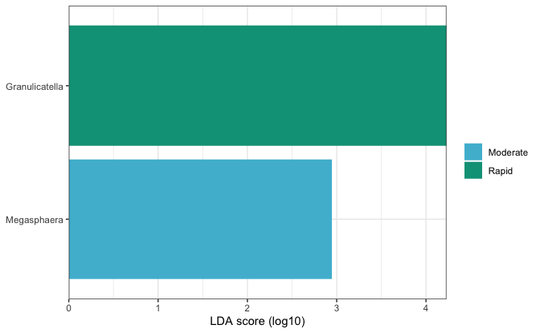
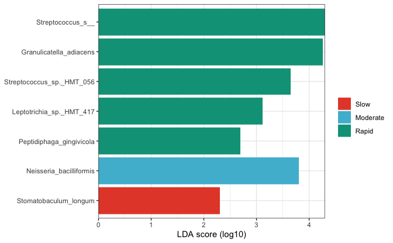
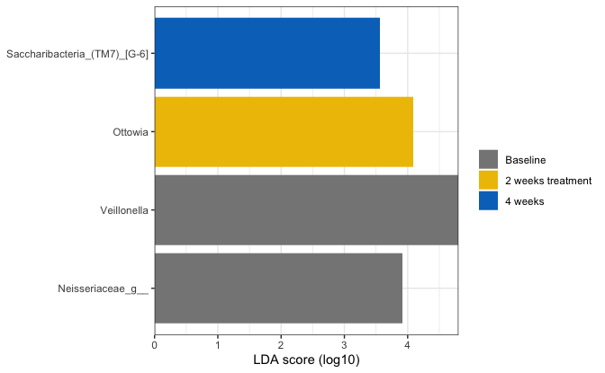
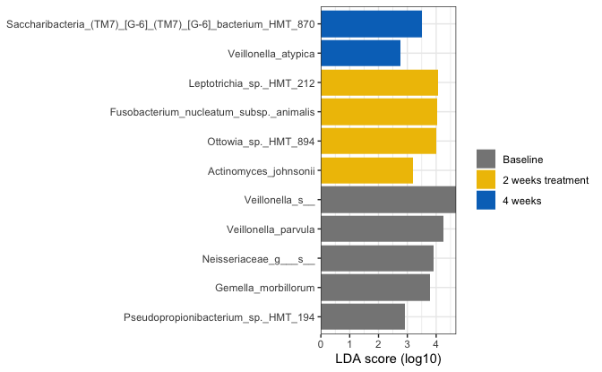
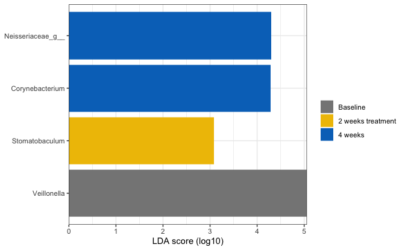
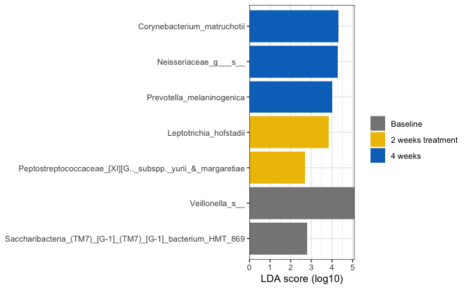
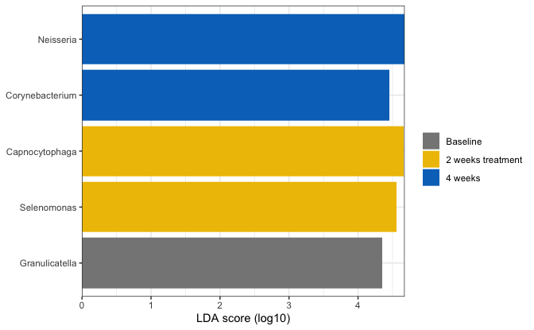
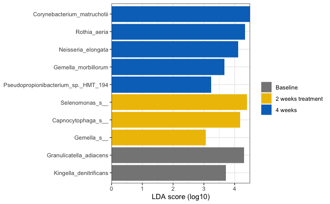

```r
load(here::here("save.RData"))
```


### Pairwise:

#### Within time points:

##### T1:


```r
physeq_rare %>% 
      physeq_sel_tax_table(c("Kingdom", "Phylum", "Class", "Order", "Family", "Genus", "Species")) %>% 
  subset_samples(time == "Baseline") -> physeq_tmp
```

```
## Warning: Using an external vector in selections was deprecated in tidyselect 1.1.0.
## ℹ Please use `all_of()` or `any_of()` instead.
##   # Was:
##   data %>% select(tax_sel)
## 
##   # Now:
##   data %>% select(all_of(tax_sel))
## 
## See <https://tidyselect.r-lib.org/reference/faq-external-vector.html>.
## This warning is displayed once every 8 hours.
## Call `lifecycle::last_lifecycle_warnings()` to see where this warning was
## generated.
```


```r
physeq_tmp %>% 
  run_lefse(.,taxa_rank = "Genus", group = "Group", norm = "CPM",
            kw_cutoff = 0.05, lda_cutoff = 2, multigrp_strat = TRUE, strict = "1") -> lef_out
```


```r
lef_out %>% 
  marker_table() %>%  data.frame() -> lefse_df
```


```r
plot_ef_bar(lef_out) +
  scale_color_manual(name = "", values = treat_pal,
                     na.value = "black") +
  scale_fill_manual(name = "", values = treat_pal,
                    na.value = "black")  -> lef_plot

lef_plot
```

```
## Warning: No shared levels found between `names(values)` of the manual scale and the
## data's colour values.
```



```r
lefse = NULL

lefse$T1$genus$plot <- lef_plot
lefse$T1$genus$table <- lefse_df
```


```r
physeq_tmp %>% 
  run_lefse(.,taxa_rank = "Species", group = "Group", norm = "CPM",
            kw_cutoff = 0.05, lda_cutoff = 2, multigrp_strat = TRUE, strict = "1") -> lef_out
```


```r
lef_out %>% 
  marker_table() %>%  data.frame() -> lefse_df
```


```r
plot_ef_bar(lef_out) +
  scale_color_manual(name = "", values = treat_pal,
                     na.value = "black") +
  scale_fill_manual(name = "", values = treat_pal,
                    na.value = "black")  -> lef_plot

lef_plot
```

```
## Warning: No shared levels found between `names(values)` of the manual scale and the
## data's colour values.
```




```r
lefse$T1$species$plot <- lef_plot
lefse$T1$species$table <- lefse_df
```

##### T2:


```r
physeq_rare %>% 
      physeq_sel_tax_table(c("Kingdom", "Phylum", "Class", "Order", "Family", "Genus", "Species")) %>% 
  subset_samples(time == "2 weeks treatment") -> physeq_tmp
```


```r
physeq_tmp %>% 
  run_lefse(.,taxa_rank = "Genus", group = "Group", norm = "CPM",
            kw_cutoff = 0.05, lda_cutoff = 2, multigrp_strat = TRUE, strict = "1") -> lef_out
```

```
## Warning: No marker was identified
```


```r
# lef_out %>% 
#   marker_table() %>%  data.frame() -> lefse_df
```


```r
# plot_ef_bar(lef_out) +
#   scale_color_manual(name = "", values = treat_pal,
#                      na.value = "black") +
#   scale_fill_manual(name = "", values = treat_pal,
#                     na.value = "black")  -> lef_plot
# 
# lef_plot
```


```r
lefse$T2$genus$plot <- NULL
lefse$T2$genus$table <- NULL
```


```r
physeq_tmp %>% 
  run_lefse(.,taxa_rank = "Species", group = "Group", norm = "CPM",
            kw_cutoff = 0.05, lda_cutoff = 2, multigrp_strat = TRUE, strict = "1") -> lef_out
```

```
## Warning: No marker was identified
```


```r
# lef_out %>% 
#   marker_table() %>%  data.frame() -> lefse_df
```


```r
# plot_ef_bar(lef_out) +
#   scale_color_manual(name = "", values = treat_pal,
#                      na.value = "black") +
#   scale_fill_manual(name = "", values = treat_pal,
#                     na.value = "black")  -> lef_plot
# 
# lef_plot
```


```r
lefse$T2$species$plot <- NULL
lefse$T2$species$table <- NULL
```

##### T3:


```r
physeq_rare %>% 
      physeq_sel_tax_table(c("Kingdom", "Phylum", "Class", "Order", "Family", "Genus", "Species")) %>% 
  subset_samples(time == "4 weeks") -> physeq_tmp
```


```r
physeq_tmp %>% 
  run_lefse(.,taxa_rank = "Genus", group = "Group", norm = "CPM",
            kw_cutoff = 0.05, lda_cutoff = 2, multigrp_strat = TRUE, strict = "1") -> lef_out
```

```
## Warning: No marker was identified
```


```r
# lef_out %>% 
#   marker_table() %>%  data.frame() -> lefse_df
```


```r
# plot_ef_bar(lef_out) +
#   scale_color_manual(name = "", values = treat_pal,
#                      na.value = "black") +
#   scale_fill_manual(name = "", values = treat_pal,
#                     na.value = "black")  -> lef_plot
# 
# lef_plot
```


```r
lefse$T3$genus$plot <- NULL
lefse$T3$genus$table <- NULL
```


```r
physeq_tmp %>% 
  run_lefse(.,taxa_rank = "Species", group = "Group", norm = "CPM",
            kw_cutoff = 0.05, lda_cutoff = 2, multigrp_strat = TRUE, strict = "1") -> lef_out
```

```
## Warning: No marker was identified
```


```r
# lef_out %>% 
#   marker_table() %>%  data.frame() -> lefse_df
```


```r
# plot_ef_bar(lef_out) +
#   scale_color_manual(name = "", values = treat_pal,
#                      na.value = "black") +
#   scale_fill_manual(name = "", values = treat_pal,
#                     na.value = "black")  -> lef_plot
# 
# lef_plot
```


```r
lefse$T3$species$plot <- NULL
lefse$T3$species$table <- NULL
```

#### Within groups:

##### Slow:


```r
physeq_rare %>% 
      physeq_sel_tax_table(c("Kingdom", "Phylum", "Class", "Order", "Family", "Genus", "Species")) %>% 
  subset_samples(Group == "Slow") -> physeq_tmp
```


```r
physeq_tmp %>% 
  run_lefse(.,taxa_rank = "Genus", group = "time", norm = "CPM",
            kw_cutoff = 0.05, lda_cutoff = 2, multigrp_strat = FALSE, strict = "2") -> lef_out
```


```r
lef_out %>% 
  marker_table() %>%  data.frame() -> lefse_df
```


```r
plot_ef_bar(lef_out) +
  scale_color_manual(name = "", values = time_pal,
                     na.value = "black") +
  scale_fill_manual(name = "", values = time_pal,
                    na.value = "black")  -> lef_plot

lef_plot
```

```
## Warning: No shared levels found between `names(values)` of the manual scale and the
## data's colour values.
```




```r
lefse$slow$genus$plot <- lef_plot
lefse$slow$genus$table <- lefse_df
```


```r
physeq_tmp %>% 
  run_lefse(.,taxa_rank = "Species", group = "time", norm = "CPM",
            kw_cutoff = 0.05, lda_cutoff = 2, multigrp_strat = FALSE, strict = "2") -> lef_out
```


```r
lef_out %>% 
  marker_table() %>%  data.frame() -> lefse_df
```


```r
plot_ef_bar(lef_out) +
  scale_color_manual(name = "", values = time_pal,
                     na.value = "black") +
  scale_fill_manual(name = "", values = time_pal,
                    na.value = "black")  -> lef_plot

lef_plot
```

```
## Warning: No shared levels found between `names(values)` of the manual scale and the
## data's colour values.
```




```r
lefse$slow$species$plot <- lef_plot
lefse$slow$species$table <- lefse_df
```

### Moderate:


```r
physeq_rare %>% 
      physeq_sel_tax_table(c("Kingdom", "Phylum", "Class", "Order", "Family", "Genus", "Species")) %>% 
  subset_samples(Group == "Moderate") -> physeq_tmp
```


```r
physeq_tmp %>% 
  run_lefse(.,taxa_rank = "Genus", group = "time", norm = "CPM",
            kw_cutoff = 0.05, lda_cutoff = 2, multigrp_strat = FALSE, strict = "2") -> lef_out
```


```r
lef_out %>% 
  marker_table() %>%  data.frame() -> lefse_df
```


```r
plot_ef_bar(lef_out) +
  scale_color_manual(name = "", values = time_pal,
                     na.value = "black") +
  scale_fill_manual(name = "", values = time_pal,
                    na.value = "black")  -> lef_plot

lef_plot
```

```
## Warning: No shared levels found between `names(values)` of the manual scale and the
## data's colour values.
```




```r
lefse$Moderate$genus$plot <- lef_plot
lefse$Moderate$genus$table <- lefse_df
```


```r
physeq_tmp %>% 
  run_lefse(.,taxa_rank = "Species", group = "time", norm = "CPM",
            kw_cutoff = 0.05, lda_cutoff = 2, multigrp_strat = FALSE, strict = "2") -> lef_out
```


```r
lef_out %>% 
  marker_table() %>%  data.frame() -> lefse_df
```


```r
plot_ef_bar(lef_out) +
  scale_color_manual(name = "", values = time_pal,
                     na.value = "black") +
  scale_fill_manual(name = "", values = time_pal,
                    na.value = "black")  -> lef_plot

lef_plot
```

```
## Warning: No shared levels found between `names(values)` of the manual scale and the
## data's colour values.
```




```r
lefse$Moderate$species$plot <- lef_plot
lefse$Moderate$species$table <- lefse_df
```


### Rapid:


```r
physeq_rare %>% 
      physeq_sel_tax_table(c("Kingdom", "Phylum", "Class", "Order", "Family", "Genus", "Species")) %>% 
  subset_samples(Group == "Rapid") -> physeq_tmp
```


```r
physeq_tmp %>% 
  run_lefse(.,taxa_rank = "Genus", group = "time", norm = "CPM",
            kw_cutoff = 0.05, lda_cutoff = 2, multigrp_strat = FALSE, strict = "2") -> lef_out
```


```r
lef_out %>% 
  marker_table() %>%  data.frame() -> lefse_df
```


```r
plot_ef_bar(lef_out) +
  scale_color_manual(name = "", values = time_pal,
                     na.value = "black") +
  scale_fill_manual(name = "", values = time_pal,
                    na.value = "black")  -> lef_plot

lef_plot
```

```
## Warning: No shared levels found between `names(values)` of the manual scale and the
## data's colour values.
```




```r
lefse$Rapid$genus$plot <- lef_plot
lefse$Rapid$genus$table <- lefse_df
```


```r
physeq_tmp %>% 
  run_lefse(.,taxa_rank = "Species", group = "time", norm = "CPM",
            kw_cutoff = 0.05, lda_cutoff = 2, multigrp_strat = FALSE, strict = "2") -> lef_out
```


```r
lef_out %>% 
  marker_table() %>%  data.frame() -> lefse_df
```


```r
plot_ef_bar(lef_out) +
  scale_color_manual(name = "", values = time_pal,
                     na.value = "black") +
  scale_fill_manual(name = "", values = time_pal,
                    na.value = "black")  -> lef_plot

lef_plot
```

```
## Warning: No shared levels found between `names(values)` of the manual scale and the
## data's colour values.
```




```r
lefse$Rapid$species$plot <- lef_plot
lefse$Rapid$species$table <- lefse_df
```


```r
lefse$T1$species$plot
```

```
## Warning: No shared levels found between `names(values)` of the manual scale and the
## data's colour values.
```


```r
save(physeq, treat_pal, time_pal, physeq_rare ,alpha_save, plot_rare, heat_all, bdiv, lefse, file = here::here("save.RData"))
```


```r
sessionInfo()
```

```
## R version 4.3.3 (2024-02-29)
## Platform: x86_64-apple-darwin20 (64-bit)
## Running under: macOS Sonoma 14.4
## 
## Matrix products: default
## BLAS:   /Library/Frameworks/R.framework/Versions/4.3-x86_64/Resources/lib/libRblas.0.dylib 
## LAPACK: /Library/Frameworks/R.framework/Versions/4.3-x86_64/Resources/lib/libRlapack.dylib;  LAPACK version 3.11.0
## 
## locale:
## [1] en_US.UTF-8/en_US.UTF-8/en_US.UTF-8/C/en_US.UTF-8/en_US.UTF-8
## 
## time zone: Europe/Paris
## tzcode source: internal
## 
## attached base packages:
## [1] stats     graphics  grDevices utils     datasets  methods   base     
## 
## other attached packages:
##  [1] microbiomeMarker_1.8.0 readxl_1.4.3           phyloseq_1.46.0       
##  [4] lubridate_1.9.3        forcats_1.0.0          stringr_1.5.1         
##  [7] dplyr_1.1.4            purrr_1.0.2            readr_2.1.5           
## [10] tidyr_1.3.1            tibble_3.2.1           ggplot2_3.5.0         
## [13] tidyverse_2.0.0       
## 
## loaded via a namespace (and not attached):
##   [1] fs_1.6.3                        matrixStats_1.3.0              
##   [3] bitops_1.0-7                    DirichletMultinomial_1.44.0    
##   [5] httr_1.4.7                      RColorBrewer_1.1-3             
##   [7] doParallel_1.0.17               numDeriv_2016.8-1.1            
##   [9] tools_4.3.3                     doRNG_1.8.6                    
##  [11] backports_1.4.1                 utf8_1.2.4                     
##  [13] R6_2.5.1                        vegan_2.6-4                    
##  [15] plotROC_2.3.1                   lazyeval_0.2.2                 
##  [17] mgcv_1.9-1                      rhdf5filters_1.14.1            
##  [19] GetoptLong_1.0.5                permute_0.9-7                  
##  [21] withr_3.0.0                     gridExtra_2.3                  
##  [23] cli_3.6.2                       Biobase_2.62.0                 
##  [25] sandwich_3.1-0                  labeling_0.4.3                 
##  [27] sass_0.4.9                      mvtnorm_1.2-4                  
##  [29] proxy_0.4-27                    yulab.utils_0.1.4              
##  [31] foreign_0.8-86                  scater_1.30.1                  
##  [33] decontam_1.22.0                 limma_3.58.1                   
##  [35] rstudioapi_0.16.0               RSQLite_2.3.6                  
##  [37] gridGraphics_0.5-1              generics_0.1.3                 
##  [39] shape_1.4.6.1                   gtools_3.9.5                   
##  [41] Matrix_1.6-5                    biomformat_1.30.0              
##  [43] ggbeeswarm_0.7.2                fansi_1.0.6                    
##  [45] DescTools_0.99.54               S4Vectors_0.40.2               
##  [47] DECIPHER_2.30.0                 abind_1.4-5                    
##  [49] lifecycle_1.0.4                 ampvis2_2.8.7                  
##  [51] multcomp_1.4-25                 yaml_2.3.8                     
##  [53] SummarizedExperiment_1.32.0     gplots_3.1.3.1                 
##  [55] rhdf5_2.46.1                    SparseArray_1.2.4              
##  [57] grid_4.3.3                      blob_1.2.4                     
##  [59] crayon_1.5.2                    lattice_0.22-6                 
##  [61] beachmat_2.18.1                 pillar_1.9.0                   
##  [63] knitr_1.45                      ComplexHeatmap_2.18.0          
##  [65] GenomicRanges_1.54.1            rjson_0.2.21                   
##  [67] boot_1.3-30                     gld_2.6.6                      
##  [69] codetools_0.2-20                glue_1.7.0                     
##  [71] ggfun_0.1.4                     data.table_1.15.4              
##  [73] MultiAssayExperiment_1.28.0     vctrs_0.6.5                    
##  [75] png_0.1-8                       treeio_1.26.0                  
##  [77] Rdpack_2.6                      cellranger_1.1.0               
##  [79] gtable_0.3.5                    cachem_1.0.8                   
##  [81] xfun_0.43                       rbibutils_2.2.16               
##  [83] S4Arrays_1.2.1                  libcoin_1.0-10                 
##  [85] metagenomeSeq_1.43.0            survival_3.5-8                 
##  [87] SingleCellExperiment_1.24.0     iterators_1.0.14               
##  [89] statmod_1.5.0                   bluster_1.12.0                 
##  [91] gmp_0.7-4                       TH.data_1.1-2                  
##  [93] nlme_3.1-164                    ANCOMBC_2.4.0                  
##  [95] ggtree_3.10.1                   bit64_4.0.5                    
##  [97] rprojroot_2.0.4                 GenomeInfoDb_1.38.8            
##  [99] bslib_0.7.0                     irlba_2.3.5.1                  
## [101] KernSmooth_2.23-22              vipor_0.4.7                    
## [103] rpart_4.1.23                    colorspace_2.1-0               
## [105] BiocGenerics_0.48.1             DBI_1.2.2                      
## [107] Hmisc_5.1-2                     nnet_7.3-19                    
## [109] ade4_1.7-22                     Exact_3.2                      
## [111] DESeq2_1.42.1                   tidyselect_1.2.1               
## [113] bit_4.0.5                       compiler_4.3.3                 
## [115] glmnet_4.1-8                    htmlTable_2.4.2                
## [117] BiocNeighbors_1.20.2            expm_0.999-9                   
## [119] plotly_4.10.4                   DelayedArray_0.28.0            
## [121] caTools_1.18.2                  checkmate_2.3.1                
## [123] scales_1.3.0                    digest_0.6.35                  
## [125] minqa_1.2.6                     rmarkdown_2.26                 
## [127] XVector_0.42.0                  htmltools_0.5.8.1              
## [129] pkgconfig_2.0.3                 base64enc_0.1-3                
## [131] lme4_1.1-35.3                   sparseMatrixStats_1.14.0       
## [133] MatrixGenerics_1.14.0           highr_0.10                     
## [135] fastmap_1.1.1                   rlang_1.1.3                    
## [137] GlobalOptions_0.1.2             htmlwidgets_1.6.4              
## [139] DelayedMatrixStats_1.24.0       farver_2.1.1                   
## [141] jquerylib_0.1.4                 zoo_1.8-12                     
## [143] jsonlite_1.8.8                  energy_1.7-11                  
## [145] BiocParallel_1.36.0             BiocSingular_1.18.0            
## [147] RCurl_1.98-1.14                 magrittr_2.0.3                 
## [149] modeltools_0.2-23               Formula_1.2-5                  
## [151] scuttle_1.12.0                  GenomeInfoDbData_1.2.11        
## [153] ggplotify_0.1.2                 patchwork_1.2.0                
## [155] Rhdf5lib_1.24.2                 munsell_0.5.1                  
## [157] Rcpp_1.0.12                     ape_5.8                        
## [159] viridis_0.6.5                   CVXR_1.0-12                    
## [161] stringi_1.8.3                   rootSolve_1.8.2.4              
## [163] zlibbioc_1.48.2                 MASS_7.3-60.0.1                
## [165] plyr_1.8.9                      parallel_4.3.3                 
## [167] ggrepel_0.9.5                   lmom_3.0                       
## [169] Biostrings_2.70.3               splines_4.3.3                  
## [171] multtest_2.58.0                 hms_1.1.3                      
## [173] circlize_0.4.16                 locfit_1.5-9.9                 
## [175] igraph_2.0.3                    Wrench_1.20.0                  
## [177] rngtools_1.5.2                  reshape2_1.4.4                 
## [179] stats4_4.3.3                    ScaledMatrix_1.10.0            
## [181] evaluate_0.23                   nloptr_2.0.3                   
## [183] tzdb_0.4.0                      foreach_1.5.2                  
## [185] clue_0.3-65                     coin_1.4-3                     
## [187] rsvd_1.0.5                      Rmpfr_0.9-5                    
## [189] e1071_1.7-14                    tidytree_0.4.6                 
## [191] viridisLite_0.4.2               class_7.3-22                   
## [193] gsl_2.1-8                       lmerTest_3.1-3                 
## [195] aplot_0.2.2                     memoise_2.0.1                  
## [197] beeswarm_0.4.0                  IRanges_2.36.0                 
## [199] cluster_2.1.6                   TreeSummarizedExperiment_2.10.0
## [201] timechange_0.3.0                here_1.0.1                     
## [203] mia_1.10.0
```

