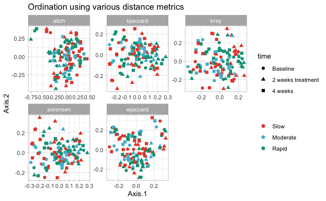
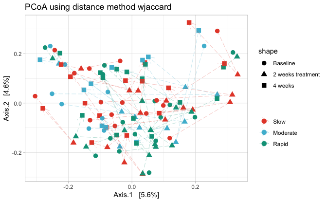
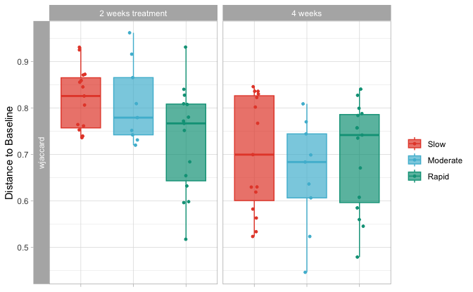
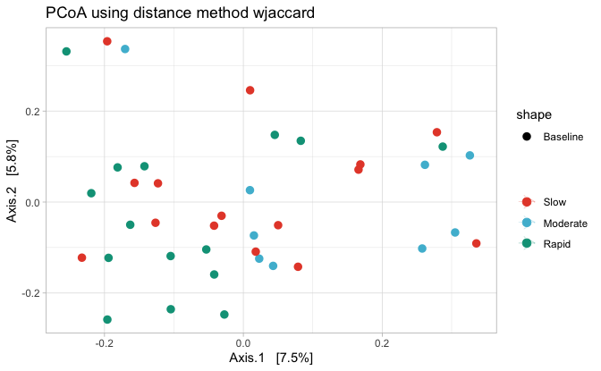
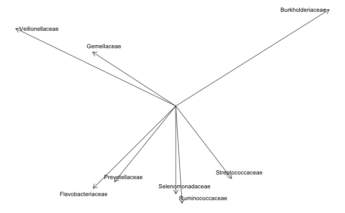
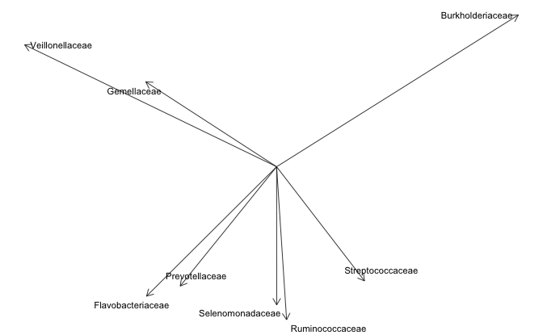

```r
load(here::here("save.RData"))
```

```
## Registered S3 method overwritten by 'gplots':
##   method         from     
##   reorder.factor DescTools
```


```r
bdiv$overall$pcoa
```

```
## Warning: No shared levels found between `names(values)` of the manual scale and the
## data's fill values.
```


```r
bdiv$overall$pcoas
```

```
## Warning: No shared levels found between `names(values)` of the manual scale and the
## data's fill values.
```




```r
bdiv$overall$pcoa
```

```
## Warning: No shared levels found between `names(values)` of the manual scale and the
## data's fill values.
```




```r
bdiv$distbaseline$dist_box
```




```r
bdiv$T1$pcoa
```

```
## Warning: No shared levels found between `names(values)` of the manual scale and the
## data's fill values.
```

```
## `geom_path()`: Each group consists of only one observation.
## ℹ Do you need to adjust the group aesthetic?
```


```r
bdiv$T1$Permanova %>% 
  DT::datatable()
```

```{=html}
<div class="datatables html-widget html-fill-item" id="htmlwidget-1451d484cee683596233" style="width:100%;height:auto;"></div>
<script type="application/json" data-for="htmlwidget-1451d484cee683596233">{"x":{"filter":"none","vertical":false,"data":[["1","2","3","4","5","6","7","8","9","10","11","12","13","14","15"],["bray","bray","bray","sorensen","sorensen","sorensen","bjaccard","bjaccard","bjaccard","wjaccard","wjaccard","wjaccard","aitch","aitch","aitch"],["Group","Residual","Total","Group","Residual","Total","Group","Residual","Total","Group","Residual","Total","Group","Residual","Total"],[2,36,38,2,36,38,2,36,38,2,36,38,2,36,38],[0.6299458681050825,9.706817681790284,10.33676354989537,0.4385322661611767,7.417319252717566,7.855851518878743,0.6343499733475645,10.96596881253272,11.60031878588029,0.896635918444919,14.63251614564355,15.52915206408847,1.809689721064941,31.16224172385667,32.97193144492161],[0.0609422731848654,0.9390577268151347,1,0.05582237203787781,0.9441776279621221,1,0.05468383973375667,0.9453161602662433,1,0.0577388845665573,0.9422611154334426,1,0.05488576621869908,0.9451142337813009,1],[1.168150674877017,null,null,1.064209389127901,null,null,1.041248586007876,null,null,1.10298504859765,null,null,1.04531680576212,null,null],[0.079,null,null,0.254,null,null,0.235,null,null,0.109,null,null,0.213,null,null],["T1","T1","T1","T1","T1","T1","T1","T1","T1","T1","T1","T1","T1","T1","T1"],["Group","Group","Group","Group","Group","Group","Group","Group","Group","Group","Group","Group","Group","Group","Group"]],"container":"<table class=\"display\">\n  <thead>\n    <tr>\n      <th> <\/th>\n      <th>Distance<\/th>\n      <th>terms<\/th>\n      <th>Df<\/th>\n      <th>SumOfSqs<\/th>\n      <th>R2<\/th>\n      <th>F<\/th>\n      <th>Pr(&gt;F)<\/th>\n      <th>time<\/th>\n      <th>comp<\/th>\n    <\/tr>\n  <\/thead>\n<\/table>","options":{"columnDefs":[{"className":"dt-right","targets":[3,4,5,6,7]},{"orderable":false,"targets":0},{"name":" ","targets":0},{"name":"Distance","targets":1},{"name":"terms","targets":2},{"name":"Df","targets":3},{"name":"SumOfSqs","targets":4},{"name":"R2","targets":5},{"name":"F","targets":6},{"name":"Pr(>F)","targets":7},{"name":"time","targets":8},{"name":"comp","targets":9}],"order":[],"autoWidth":false,"orderClasses":false}},"evals":[],"jsHooks":[]}</script>
```

Rely on the pvalFDR p values below:


```r
bdiv$T1$PW_permanovas %>% 
  DT::datatable()
```

```{=html}
<div class="datatables html-widget html-fill-item" id="htmlwidget-ab53a77ed3f2377f2959" style="width:100%;height:auto;"></div>
<script type="application/json" data-for="htmlwidget-ab53a77ed3f2377f2959">{"x":{"filter":"none","vertical":false,"data":[["1","2","3","4","5","6","7","8","9","10","11","12","13","14","15"],["bray","bray","bray","sorensen","sorensen","sorensen","bjaccard","bjaccard","bjaccard","wjaccard","wjaccard","wjaccard","aitch","aitch","aitch"],["Slow","Slow","Moderate","Slow","Slow","Moderate","Slow","Slow","Moderate","Slow","Slow","Moderate","Slow","Slow","Moderate"],["Moderate","Rapid","Rapid","Moderate","Rapid","Rapid","Moderate","Rapid","Rapid","Moderate","Rapid","Rapid","Moderate","Rapid","Rapid"],[0.03980422611389814,0.04107367504181007,0.05946061862451294,0.03726560606156501,0.03973645915482509,0.05019998505998642,0.03988260957312849,0.0376143167243836,0.0477731693268335,0.04198375912958779,0.03645542646543404,0.05570559293826034,0.04030395248103918,0.03645811754023368,0.04927894980076663],[0.714,0.098,0.022,0.877,0.128,0.109,0.895,0.135,0.132,0.586,0.255,0.014,0.802,0.201,0.06900000000000001],[2.142,0.294,0.066,2.631,0.384,0.327,2.685,0.405,0.396,1.758,0.765,0.042,2.406,0.603,0.207],[0.714,0.147,0.066,0.877,0.192,0.327,0.895,0.202,0.396,0.586,0.382,0.042,0.802,0.302,0.207],["Baseline","Baseline","Baseline","Baseline","Baseline","Baseline","Baseline","Baseline","Baseline","Baseline","Baseline","Baseline","Baseline","Baseline","Baseline"]],"container":"<table class=\"display\">\n  <thead>\n    <tr>\n      <th> <\/th>\n      <th>Distance<\/th>\n      <th>X1<\/th>\n      <th>X2<\/th>\n      <th>R2<\/th>\n      <th>pval<\/th>\n      <th>pvalBon<\/th>\n      <th>pvalFDR<\/th>\n      <th>group<\/th>\n    <\/tr>\n  <\/thead>\n<\/table>","options":{"columnDefs":[{"className":"dt-right","targets":[4,5,6,7]},{"orderable":false,"targets":0},{"name":" ","targets":0},{"name":"Distance","targets":1},{"name":"X1","targets":2},{"name":"X2","targets":3},{"name":"R2","targets":4},{"name":"pval","targets":5},{"name":"pvalBon","targets":6},{"name":"pvalFDR","targets":7},{"name":"group","targets":8}],"order":[],"autoWidth":false,"orderClasses":false}},"evals":[],"jsHooks":[]}</script>
```


```r
heat_all$p_heat_sp_t1 
```


```r
bdiv$T1$pcoa
```

```
## Warning: No shared levels found between `names(values)` of the manual scale and the
## data's fill values.
```

```
## `geom_path()`: Each group consists of only one observation.
## ℹ Do you need to adjust the group aesthetic?
```




```r
bdiv$T1$penvfit
```




```r
bdiv$slow$PERMANOVA %>% 
  DT::datatable()
```

```{=html}
<div class="datatables html-widget html-fill-item" id="htmlwidget-0a42f8bcde99572f1adb" style="width:100%;height:auto;"></div>
<script type="application/json" data-for="htmlwidget-0a42f8bcde99572f1adb">{"x":{"filter":"none","vertical":false,"data":[["1","2","3","4","5","6","7","8","9","10","11","12","13","14","15"],["bray","bray","bray","sorensen","sorensen","sorensen","bjaccard","bjaccard","bjaccard","wjaccard","wjaccard","wjaccard","aitch","aitch","aitch"],["time","Residual","Total","time","Residual","Total","time","Residual","Total","time","Residual","Total","time","Residual","Total"],[2,42,44,2,42,44,2,42,44,2,42,44,2,42,44],[0.682267797552561,12.29623163067194,12.9784994282245,0.4897536859673791,9.369406484197235,9.859160170164614,0.6097933068079623,13.40934535558054,14.0191386623885,0.8393458035196024,17.71328395123158,18.55262975475118,1.666616378772016,35.47933067470968,37.14594705348169],[0.05256908175908417,0.9474309182409157,1,0.0496749903150424,0.9503250096849576,1,0.04349720203880694,0.9565027979611931,1,0.04524133853879408,0.9547586614612059,1,0.04486670850988046,0.9551332914901196,1],[1.165204444658045,null,null,1.097703192049753,null,null,0.9549802099502124,null,null,0.9950871855518424,null,null,0.9864600963050363,null,null],[0.157,null,null,0.277,null,null,0.603,null,null,0.489,null,null,0.518,null,null],["Slow","Slow","Slow","Slow","Slow","Slow","Slow","Slow","Slow","Slow","Slow","Slow","Slow","Slow","Slow"],["time","time","time","time","time","time","time","time","time","time","time","time","time","time","time"]],"container":"<table class=\"display\">\n  <thead>\n    <tr>\n      <th> <\/th>\n      <th>Distance<\/th>\n      <th>terms<\/th>\n      <th>Df<\/th>\n      <th>SumOfSqs<\/th>\n      <th>R2<\/th>\n      <th>F<\/th>\n      <th>Pr(&gt;F)<\/th>\n      <th>group<\/th>\n      <th>comp<\/th>\n    <\/tr>\n  <\/thead>\n<\/table>","options":{"columnDefs":[{"className":"dt-right","targets":[3,4,5,6,7]},{"orderable":false,"targets":0},{"name":" ","targets":0},{"name":"Distance","targets":1},{"name":"terms","targets":2},{"name":"Df","targets":3},{"name":"SumOfSqs","targets":4},{"name":"R2","targets":5},{"name":"F","targets":6},{"name":"Pr(>F)","targets":7},{"name":"group","targets":8},{"name":"comp","targets":9}],"order":[],"autoWidth":false,"orderClasses":false}},"evals":[],"jsHooks":[]}</script>
```


```r
bdiv$int$PERMANOVA %>% 
  DT::datatable()
```

```{=html}
<div class="datatables html-widget html-fill-item" id="htmlwidget-85ba5c4ebc8d52169c0a" style="width:100%;height:auto;"></div>
<script type="application/json" data-for="htmlwidget-85ba5c4ebc8d52169c0a">{"x":{"filter":"none","vertical":false,"data":[["1","2","3","4","5","6","7","8","9","10","11","12","13","14","15"],["bray","bray","bray","sorensen","sorensen","sorensen","bjaccard","bjaccard","bjaccard","wjaccard","wjaccard","wjaccard","aitch","aitch","aitch"],["time","Residual","Total","time","Residual","Total","time","Residual","Total","time","Residual","Total","time","Residual","Total"],[2,26,28,2,26,28,2,26,28,2,26,28,2,26,28],[0.5520405992255111,6.818627169758154,7.370667768983664,0.3584432193063301,5.332139181048397,5.690582400354727,0.5068430525846216,7.908399109183497,8.415242161768118,0.8265712381275023,10.39775589698428,11.22432713511178,1.451895392105104,22.49126530415728,23.94316069626239],[0.07489695866479565,0.9251030413352044,1,0.06298884614762562,0.9370111538523744,1,0.06022917021773849,0.9397708297822616,1,0.07364105020975681,0.9263589497902432,1,0.06063925354398803,0.939360746456012,1],[1.052488662492187,null,null,0.8739010166021388,null,null,0.8331597321572657,null,null,1.033437041811502,null,null,0.839198677447354,null,null],[0.368,null,null,0.743,null,null,0.902,null,null,0.354,null,null,0.844,null,null],["Intermediate","Intermediate","Intermediate","Intermediate","Intermediate","Intermediate","Intermediate","Intermediate","Intermediate","Intermediate","Intermediate","Intermediate","Intermediate","Intermediate","Intermediate"],["time","time","time","time","time","time","time","time","time","time","time","time","time","time","time"]],"container":"<table class=\"display\">\n  <thead>\n    <tr>\n      <th> <\/th>\n      <th>Distance<\/th>\n      <th>terms<\/th>\n      <th>Df<\/th>\n      <th>SumOfSqs<\/th>\n      <th>R2<\/th>\n      <th>F<\/th>\n      <th>Pr(&gt;F)<\/th>\n      <th>group<\/th>\n      <th>comp<\/th>\n    <\/tr>\n  <\/thead>\n<\/table>","options":{"columnDefs":[{"className":"dt-right","targets":[3,4,5,6,7]},{"orderable":false,"targets":0},{"name":" ","targets":0},{"name":"Distance","targets":1},{"name":"terms","targets":2},{"name":"Df","targets":3},{"name":"SumOfSqs","targets":4},{"name":"R2","targets":5},{"name":"F","targets":6},{"name":"Pr(>F)","targets":7},{"name":"group","targets":8},{"name":"comp","targets":9}],"order":[],"autoWidth":false,"orderClasses":false}},"evals":[],"jsHooks":[]}</script>
```


```r
bdiv$rapid$PERMANOVA %>% 
  DT::datatable()
```

```{=html}
<div class="datatables html-widget html-fill-item" id="htmlwidget-2e23eaeab0c202f70c86" style="width:100%;height:auto;"></div>
<script type="application/json" data-for="htmlwidget-2e23eaeab0c202f70c86">{"x":{"filter":"none","vertical":false,"data":[["1","2","3","4","5","6","7","8","9","10","11","12","13","14","15"],["bray","bray","bray","sorensen","sorensen","sorensen","bjaccard","bjaccard","bjaccard","wjaccard","wjaccard","wjaccard","aitch","aitch","aitch"],["time","Residual","Total","time","Residual","Total","time","Residual","Total","time","Residual","Total","time","Residual","Total"],[2,42,44,2,42,44,2,42,44,2,42,44,2,42,44],[0.5495318272133707,11.65321775229719,12.20274957951056,0.3436347297851665,8.799457022696695,9.14309175248186,0.4880220595711977,12.90099035398165,13.38901241355285,0.8012564416339416,17.3929624119923,18.19421885362625,1.527133507266613,39.3509885187939,40.87812202606051],[0.04503344296568053,0.9549665570343195,1,0.03758408414657854,0.9624159158534216,1,0.03644944410367442,0.9635505558963255,1,0.04403906801825928,0.9559609319817407,1,0.03735821098369047,0.9626417890163096,1],[0.9902988699585472,null,null,0.8200880243945972,null,null,0.7943935286977523,null,null,0.9674249202488427,null,null,0.8149681840211572,null,null],[0.505,null,null,0.866,null,null,0.958,null,null,0.577,null,null,0.905,null,null],["Fast","Fast","Fast","Fast","Fast","Fast","Fast","Fast","Fast","Fast","Fast","Fast","Fast","Fast","Fast"],["time","time","time","time","time","time","time","time","time","time","time","time","time","time","time"]],"container":"<table class=\"display\">\n  <thead>\n    <tr>\n      <th> <\/th>\n      <th>Distance<\/th>\n      <th>terms<\/th>\n      <th>Df<\/th>\n      <th>SumOfSqs<\/th>\n      <th>R2<\/th>\n      <th>F<\/th>\n      <th>Pr(&gt;F)<\/th>\n      <th>group<\/th>\n      <th>comp<\/th>\n    <\/tr>\n  <\/thead>\n<\/table>","options":{"columnDefs":[{"className":"dt-right","targets":[3,4,5,6,7]},{"orderable":false,"targets":0},{"name":" ","targets":0},{"name":"Distance","targets":1},{"name":"terms","targets":2},{"name":"Df","targets":3},{"name":"SumOfSqs","targets":4},{"name":"R2","targets":5},{"name":"F","targets":6},{"name":"Pr(>F)","targets":7},{"name":"group","targets":8},{"name":"comp","targets":9}],"order":[],"autoWidth":false,"orderClasses":false}},"evals":[],"jsHooks":[]}</script>
```


```r
bdiv$T1$PW_permanovas %>% 
  DT::datatable()
```

```{=html}
<div class="datatables html-widget html-fill-item" id="htmlwidget-57bc48f46611673e90e9" style="width:100%;height:auto;"></div>
<script type="application/json" data-for="htmlwidget-57bc48f46611673e90e9">{"x":{"filter":"none","vertical":false,"data":[["1","2","3","4","5","6","7","8","9","10","11","12","13","14","15"],["bray","bray","bray","sorensen","sorensen","sorensen","bjaccard","bjaccard","bjaccard","wjaccard","wjaccard","wjaccard","aitch","aitch","aitch"],["Slow","Slow","Moderate","Slow","Slow","Moderate","Slow","Slow","Moderate","Slow","Slow","Moderate","Slow","Slow","Moderate"],["Moderate","Rapid","Rapid","Moderate","Rapid","Rapid","Moderate","Rapid","Rapid","Moderate","Rapid","Rapid","Moderate","Rapid","Rapid"],[0.03980422611389814,0.04107367504181007,0.05946061862451294,0.03726560606156501,0.03973645915482509,0.05019998505998642,0.03988260957312849,0.0376143167243836,0.0477731693268335,0.04198375912958779,0.03645542646543404,0.05570559293826034,0.04030395248103918,0.03645811754023368,0.04927894980076663],[0.714,0.098,0.022,0.877,0.128,0.109,0.895,0.135,0.132,0.586,0.255,0.014,0.802,0.201,0.06900000000000001],[2.142,0.294,0.066,2.631,0.384,0.327,2.685,0.405,0.396,1.758,0.765,0.042,2.406,0.603,0.207],[0.714,0.147,0.066,0.877,0.192,0.327,0.895,0.202,0.396,0.586,0.382,0.042,0.802,0.302,0.207],["Baseline","Baseline","Baseline","Baseline","Baseline","Baseline","Baseline","Baseline","Baseline","Baseline","Baseline","Baseline","Baseline","Baseline","Baseline"]],"container":"<table class=\"display\">\n  <thead>\n    <tr>\n      <th> <\/th>\n      <th>Distance<\/th>\n      <th>X1<\/th>\n      <th>X2<\/th>\n      <th>R2<\/th>\n      <th>pval<\/th>\n      <th>pvalBon<\/th>\n      <th>pvalFDR<\/th>\n      <th>group<\/th>\n    <\/tr>\n  <\/thead>\n<\/table>","options":{"columnDefs":[{"className":"dt-right","targets":[4,5,6,7]},{"orderable":false,"targets":0},{"name":" ","targets":0},{"name":"Distance","targets":1},{"name":"X1","targets":2},{"name":"X2","targets":3},{"name":"R2","targets":4},{"name":"pval","targets":5},{"name":"pvalBon","targets":6},{"name":"pvalFDR","targets":7},{"name":"group","targets":8}],"order":[],"autoWidth":false,"orderClasses":false}},"evals":[],"jsHooks":[]}</script>
```


```r
bdiv$T1$pcoa
```

```
## Warning: No shared levels found between `names(values)` of the manual scale and the
## data's fill values.
```

```
## `geom_path()`: Each group consists of only one observation.
## ℹ Do you need to adjust the group aesthetic?
```


```r
bdiv$T1$penvfit
```




```r
sessionInfo()
```

```
## R version 4.3.3 (2024-02-29)
## Platform: x86_64-apple-darwin20 (64-bit)
## Running under: macOS Sonoma 14.4
## 
## Matrix products: default
## BLAS:   /Library/Frameworks/R.framework/Versions/4.3-x86_64/Resources/lib/libRblas.0.dylib 
## LAPACK: /Library/Frameworks/R.framework/Versions/4.3-x86_64/Resources/lib/libRlapack.dylib;  LAPACK version 3.11.0
## 
## locale:
## [1] en_US.UTF-8/en_US.UTF-8/en_US.UTF-8/C/en_US.UTF-8/en_US.UTF-8
## 
## time zone: Europe/Paris
## tzcode source: internal
## 
## attached base packages:
## [1] stats     graphics  grDevices utils     datasets  methods   base     
## 
## other attached packages:
##  [1] lubridate_1.9.3 forcats_1.0.0   stringr_1.5.1   dplyr_1.1.4    
##  [5] purrr_1.0.2     readr_2.1.5     tidyr_1.3.1     tibble_3.2.1   
##  [9] ggplot2_3.5.0   tidyverse_2.0.0
## 
## loaded via a namespace (and not attached):
##   [1] fs_1.6.3                        matrixStats_1.3.0              
##   [3] bitops_1.0-7                    DirichletMultinomial_1.44.0    
##   [5] httr_1.4.7                      RColorBrewer_1.1-3             
##   [7] doParallel_1.0.17               numDeriv_2016.8-1.1            
##   [9] tools_4.3.3                     doRNG_1.8.6                    
##  [11] backports_1.4.1                 DT_0.33                        
##  [13] utf8_1.2.4                      R6_2.5.1                       
##  [15] vegan_2.6-4                     plotROC_2.3.1                  
##  [17] lazyeval_0.2.2                  mgcv_1.9-1                     
##  [19] rhdf5filters_1.14.1             GetoptLong_1.0.5               
##  [21] permute_0.9-7                   withr_3.0.0                    
##  [23] gridExtra_2.3                   cli_3.6.2                      
##  [25] Biobase_2.62.0                  sandwich_3.1-0                 
##  [27] labeling_0.4.3                  sass_0.4.9                     
##  [29] mvtnorm_1.2-4                   proxy_0.4-27                   
##  [31] yulab.utils_0.1.4               foreign_0.8-86                 
##  [33] scater_1.30.1                   decontam_1.22.0                
##  [35] limma_3.58.1                    readxl_1.4.3                   
##  [37] rstudioapi_0.16.0               RSQLite_2.3.6                  
##  [39] gridGraphics_0.5-1              generics_0.1.3                 
##  [41] shape_1.4.6.1                   crosstalk_1.2.1                
##  [43] gtools_3.9.5                    Matrix_1.6-5                   
##  [45] biomformat_1.30.0               ggbeeswarm_0.7.2               
##  [47] fansi_1.0.6                     DescTools_0.99.54              
##  [49] S4Vectors_0.40.2                DECIPHER_2.30.0                
##  [51] abind_1.4-5                     lifecycle_1.0.4                
##  [53] ampvis2_2.8.7                   multcomp_1.4-25                
##  [55] yaml_2.3.8                      SummarizedExperiment_1.32.0    
##  [57] gplots_3.1.3.1                  rhdf5_2.46.1                   
##  [59] SparseArray_1.2.4               grid_4.3.3                     
##  [61] blob_1.2.4                      crayon_1.5.2                   
##  [63] lattice_0.22-6                  beachmat_2.18.1                
##  [65] pillar_1.9.0                    knitr_1.45                     
##  [67] ComplexHeatmap_2.18.0           GenomicRanges_1.54.1           
##  [69] rjson_0.2.21                    boot_1.3-30                    
##  [71] gld_2.6.6                       codetools_0.2-20               
##  [73] glue_1.7.0                      ggfun_0.1.4                    
##  [75] data.table_1.15.4               MultiAssayExperiment_1.28.0    
##  [77] vctrs_0.6.5                     png_0.1-8                      
##  [79] treeio_1.26.0                   Rdpack_2.6                     
##  [81] cellranger_1.1.0                gtable_0.3.5                   
##  [83] cachem_1.0.8                    xfun_0.43                      
##  [85] rbibutils_2.2.16                S4Arrays_1.2.1                 
##  [87] metagenomeSeq_1.43.0            survival_3.5-8                 
##  [89] SingleCellExperiment_1.24.0     iterators_1.0.14               
##  [91] statmod_1.5.0                   bluster_1.12.0                 
##  [93] gmp_0.7-4                       TH.data_1.1-2                  
##  [95] nlme_3.1-164                    ANCOMBC_2.4.0                  
##  [97] ggtree_3.10.1                   phyloseq_1.46.0                
##  [99] bit64_4.0.5                     GenomeInfoDb_1.38.8            
## [101] rprojroot_2.0.4                 bslib_0.7.0                    
## [103] irlba_2.3.5.1                   KernSmooth_2.23-22             
## [105] vipor_0.4.7                     rpart_4.1.23                   
## [107] colorspace_2.1-0                BiocGenerics_0.48.1            
## [109] DBI_1.2.2                       Hmisc_5.1-2                    
## [111] nnet_7.3-19                     ade4_1.7-22                    
## [113] Exact_3.2                       DESeq2_1.42.1                  
## [115] tidyselect_1.2.1                bit_4.0.5                      
## [117] compiler_4.3.3                  glmnet_4.1-8                   
## [119] htmlTable_2.4.2                 BiocNeighbors_1.20.2           
## [121] expm_0.999-9                    DelayedArray_0.28.0            
## [123] plotly_4.10.4                   caTools_1.18.2                 
## [125] checkmate_2.3.1                 scales_1.3.0                   
## [127] digest_0.6.35                   minqa_1.2.6                    
## [129] rmarkdown_2.26                  XVector_0.42.0                 
## [131] htmltools_0.5.8.1               pkgconfig_2.0.3                
## [133] base64enc_0.1-3                 lme4_1.1-35.3                  
## [135] microbiomeMarker_1.8.0          sparseMatrixStats_1.14.0       
## [137] MatrixGenerics_1.14.0           highr_0.10                     
## [139] fastmap_1.1.1                   rlang_1.1.3                    
## [141] GlobalOptions_0.1.2             htmlwidgets_1.6.4              
## [143] DelayedMatrixStats_1.24.0       farver_2.1.1                   
## [145] jquerylib_0.1.4                 zoo_1.8-12                     
## [147] jsonlite_1.8.8                  energy_1.7-11                  
## [149] BiocParallel_1.36.0             BiocSingular_1.18.0            
## [151] RCurl_1.98-1.14                 magrittr_2.0.3                 
## [153] ggplotify_0.1.2                 Formula_1.2-5                  
## [155] scuttle_1.12.0                  GenomeInfoDbData_1.2.11        
## [157] patchwork_1.2.0                 Rhdf5lib_1.24.2                
## [159] munsell_0.5.1                   Rcpp_1.0.12                    
## [161] ape_5.8                         viridis_0.6.5                  
## [163] CVXR_1.0-12                     stringi_1.8.3                  
## [165] rootSolve_1.8.2.4               zlibbioc_1.48.2                
## [167] MASS_7.3-60.0.1                 plyr_1.8.9                     
## [169] parallel_4.3.3                  ggrepel_0.9.5                  
## [171] lmom_3.0                        Biostrings_2.70.3              
## [173] splines_4.3.3                   multtest_2.58.0                
## [175] hms_1.1.3                       circlize_0.4.16                
## [177] locfit_1.5-9.9                  igraph_2.0.3                   
## [179] Wrench_1.20.0                   rngtools_1.5.2                 
## [181] reshape2_1.4.4                  stats4_4.3.3                   
## [183] ScaledMatrix_1.10.0             evaluate_0.23                  
## [185] nloptr_2.0.3                    tzdb_0.4.0                     
## [187] foreach_1.5.2                   clue_0.3-65                    
## [189] rsvd_1.0.5                      Rmpfr_0.9-5                    
## [191] e1071_1.7-14                    tidytree_0.4.6                 
## [193] viridisLite_0.4.2               class_7.3-22                   
## [195] gsl_2.1-8                       aplot_0.2.2                    
## [197] lmerTest_3.1-3                  memoise_2.0.1                  
## [199] beeswarm_0.4.0                  IRanges_2.36.0                 
## [201] cluster_2.1.6                   TreeSummarizedExperiment_2.10.0
## [203] timechange_0.3.0                here_1.0.1                     
## [205] mia_1.10.0
```

